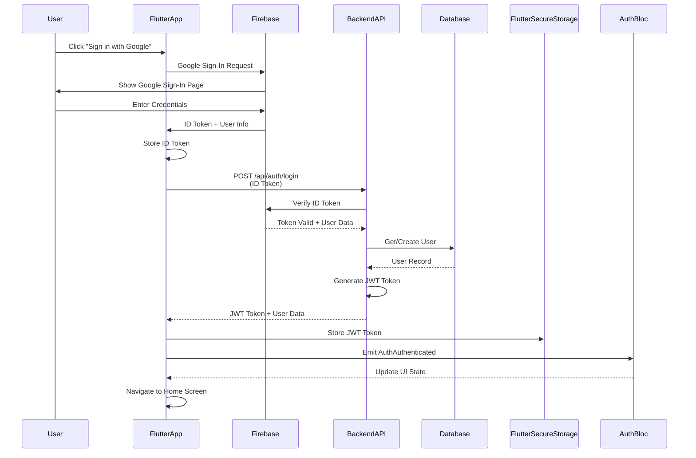

# Authentication Flow

กระบวนการยืนยันตัวตนด้วย Firebase และ JWT

Authentication process using Firebase and JWT.

## 🔄 Complete Authentication Sequence



## 🔑 Token Flow Details

### Firebase ID Token

**Purpose**: Verify user identity with Firebase

**Lifetime**: 1 hour

**Contains**:
- User email
- User name
- Firebase UID
- Provider ID

**Format**: JWT (signed by Firebase)

```json
{
  "iss": "https://securetoken.google.com/your-project-id",
  "name": "John Doe",
  "picture": "https://...",
  "aud": "your-project-id",
  "auth_time": 1234567890,
  "user_id": "firebase-uid",
  "sub": "firebase-uid",
  "iat": 1234567890,
  "exp": 1234571490,
  "email": "john@example.com",
  "email_verified": true,
  "firebase": {
    "identities": {
      "google.com": ["google-uid"]
    },
    "sign_in_provider": "google.com"
  }
}
```

### Backend JWT Token

**Purpose**: Authorize API requests

**Lifetime**: 24 hours (configurable)

**Contains**:
- User ID
- Email
- Role
- Issued at
- Expires at

**Format**: JWT (signed by backend secret)

```json
{
  "user_id": 1,
  "email": "john@example.com",
  "name": "John Doe",
  "role": "USER",
  "iat": 1234567890,
  "exp": 1234654290
}
```

## 📱 Flutter Implementation

### Authentication Flow in Flutter

**Files**: `PM_Mobile_Frontend/lib/features/auth/`

#### 1. Google Sign-In

```dart
// lib/features/auth/ui/pages/sign_in_page.dart
Future<void> _signInWithGoogle() async {
  final GoogleSignInAccount? googleUser = await GoogleSignIn().signIn();
  final GoogleSignInAuthentication googleAuth = await googleUser!.authentication;

  final credential = GoogleAuthProvider.credential(
    accessToken: googleAuth.accessToken,
    idToken: googleAuth.idToken,
  );

  await FirebaseAuth.instance.signInWithCredential(credential);
}
```

#### 2. Auth State Changes

```dart
// lib/main.dart
class AuthGate extends StatelessWidget {
  @override
  Widget build(BuildContext context) {
    return StreamBuilder<User?>(
      stream: FirebaseAuth.instance.authStateChanges(),
      builder: (context, snapshot) {
        if (snapshot.hasData) {
          return const HomePage();
        }
        return const SignInPage();
      },
    );
  }
}
```

#### 3. Backend Authentication

```dart
// lib/features/auth/data/auth_repository.dart
Future<String> login(String idToken) async {
  final response = await http.post(
    Uri.parse('$baseUrl/api/auth/login'),
    headers: {'Content-Type': 'application/json'},
    body: jsonEncode({'id_token': idToken}),
  );

  if (response.statusCode == 200) {
    final data = jsonDecode(response.body);
    return data['token']; // JWT token
  }
  throw Exception('Authentication failed');
}
```

#### 4. Token Storage

```dart
// lib/features/auth/data/token_storage.dart
class TokenStorage {
  static const _key = 'jwt_token';

  Future<void> saveToken(String token) async {
    final storage = FlutterSecureStorage();
    await storage.write(key: _key, value: token);
  }

  Future<String?> getToken() async {
    final storage = FlutterSecureStorage();
    return await storage.read(key: _key);
  }

  Future<void> deleteToken() async {
    final storage = FlutterSecureStorage();
    await storage.delete(key: _key);
  }
}
```

## 🔧 Go Backend Implementation

### Authentication Handlers

**Files**: `project-management-backend/internal/auth/`

#### 1. Login Handler

```go
// internal/auth/handler.go
func (h *AuthHandler) Login(c *fiber.Ctx) error {
    type LoginRequest struct {
        IDToken string `json:"id_token"`
    }

    req := new(LoginRequest)
    if err := c.BodyParser(req); err != nil {
        return c.Status(400).JSON(fiber.Map{"error": "Invalid request"})
    }

    // Verify Firebase token
    authClient, err := firebase.Auth(context.Background())
    if err != nil {
        return c.Status(500).JSON(fiber.Map{"error": "Firebase error"})
    }

    verifiedToken, err := authClient.VerifyIDToken(context.Background(), req.IDToken)
    if err != nil {
        return c.Status(401).JSON(fiber.Map{"error": "Invalid token"})
    }

    // Get or create user
    user, err := h.userService.GetOrCreateUser(verifiedToken)
    if err != nil {
        return c.Status(500).JSON(fiber.Map{"error": "Database error"})
    }

    // Generate JWT
    token, err := h.generateJWT(user)
    if err != nil {
        return c.Status(500).JSON(fiber.Map{"error": "Token generation failed"})
    }

    return c.JSON(fiber.Map{
        "token": token,
        "user":  user,
    })
}
```

#### 2. JWT Generation

```go
func (h *AuthHandler) generateJWT(user *User) (string, error) {
    claims := jwt.MapClaims{
        "user_id": user.ID,
        "email":   user.Email,
        "name":    user.Name,
        "role":    user.Role,
        "iat":     time.Now().Unix(),
        "exp":     time.Now().Add(24 * time.Hour).Unix(),
    }

    token := jwt.NewWithClaims(jwt.SigningMethodHS256, claims)
    return token.SignedString([]byte(os.Getenv("JWT_SECRET")))
}
```

#### 3. JWT Middleware

```go
// internal/middleware/jwt.go
func JWTMiddleware() fiber.Handler {
    return func(c *fiber.Ctx) error {
        authHeader := c.Get("Authorization")
        if authHeader == "" {
            return c.Status(401).JSON(fiber.Map{"error": "Missing token"})
        }

        tokenString := strings.Replace(authHeader, "Bearer ", "", 1)

        token, err := jwt.Parse(tokenString, func(token *jwt.Token) (interface{}, error) {
            return []byte(os.Getenv("JWT_SECRET")), nil
        })

        if err != nil || !token.Valid {
            return c.Status(401).JSON(fiber.Map{"error": "Invalid token"})
        }

        claims := token.Claims.(jwt.MapClaims)
        c.Locals("user_id", claims["user_id"])
        c.Locals("email", claims["email"])

        return c.Next()
    }
}
```

## 🔒 Security Considerations

### Firebase Token Verification

- ✅ Verify token signature
- ✅ Check token expiration
- ✅ Validate issuer (your project ID)
- ✅ Verify audience

### JWT Best Practices

- ✅ Use strong secret key
- ✅ Set appropriate expiration
- ✅ Include user ID in claims
- ✅ Validate token on every request
- ✅ Use HTTPS only

### Token Storage

- ✅ Use Flutter Secure Storage
- ✅ Never store in plain text
- ✅ Clear token on logout
- ✅ Implement token refresh

## 🧪 Testing Authentication

### Flutter Tests

```dart
testWidgets('Sign in with Google', (WidgetTester tester) async {
  // Mock Firebase auth
  mockFirebaseAuth.mockSignIn();

  await tester.pumpWidget(MyApp());
  await tester.tap(find.text('Sign in with Google'));
  await tester.pumpAndSet();

  expect(find.byType(HomePage), findsOneWidget);
});
```

### Backend Tests

```go
func TestLoginHandler(t *testing.T) {
    app := setupTestApp()

    req := httptest.NewRequest("POST", "/api/auth/login", strings.NewReader(`{
        "id_token": "valid_firebase_token"
    }`))

    resp, err := app.Test(req)
    assert.NoError(t, err)
    assert.Equal(t, 200, resp.StatusCode)
}
```

## 🐛 Troubleshooting

### Common Issues

**"Invalid token" error**:
- Verify Firebase project ID matches
- Check token hasn't expired
- Ensure Firebase SDK is initialized

**"Missing Authorization header"**:
- Add JWT token to API requests
- Format: `Authorization: Bearer <token>`

**"Firebase not initialized"**:
- Check `google-services.json` / `GoogleService-Info.plist`
- Verify Firebase configuration in `.env`

---

**Previous**: [Data Flows](./data-flows) | **Next**: [Device Registration Flow](./device-registration-flow) →
