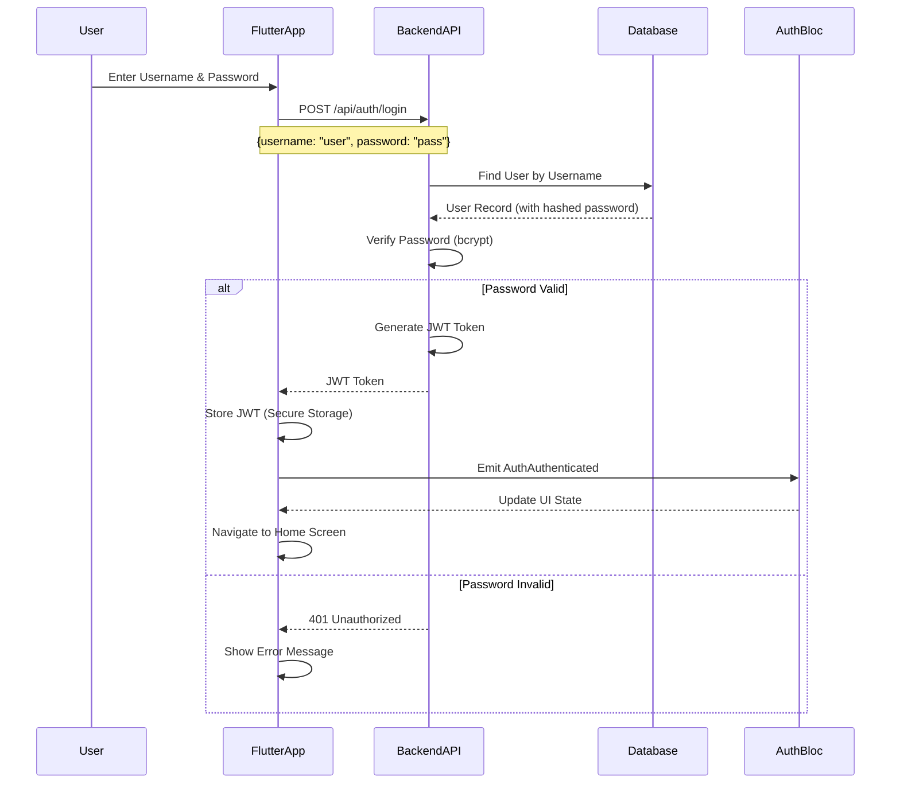

# Authentication Flow

กระบวนการยืนยันตัวตนด้วย Username/Password และ JWT

Authentication process using Username/Password and JWT.

## 🔄 Complete Authentication Sequence



## 🔑 Token Flow Details

### Login Request

**Endpoint:** `POST /api/auth/login`

**Request Body:**
```json
{
  "username": "john_doe",
  "password": "secure_password"
}
```

**Response (Success):**
```json
{
  "token": "eyJhbGciOiJIUzI1NiIs..."
}
```

**Response (Error):**
```json
{
  "error": "cannot parse JSON"
}
```

### Backend JWT Token

**Purpose**: Authorize API requests

**Lifetime**: 72 hours (configurable)

**Contains**:
- User ID
- Expiration time

**Format**: JWT (signed by backend secret)

```json
{
  "user_id": 1,
  "exp": 1234654290
}
```

## 📱 Flutter Implementation

### Authentication Flow in Flutter

**Files**: `PM_Mobile_Frontend/lib/features/auth/`

#### 1. Login Request

```dart
// lib/features/auth/data/auth_repository.dart
Future<String> login(String username, String password) async {
  final response = await http.post(
    Uri.parse('$baseUrl/api/auth/login'),
    headers: {'Content-Type': 'application/json'},
    body: jsonEncode({
      'username': username,
      'password': password,
    }),
  );

  if (response.statusCode == 200) {
    final data = jsonDecode(response.body);
    return data['token']; // JWT token
  }
  throw Exception('Authentication failed');
}
```

#### 2. Auth State Changes

```dart
// lib/main.dart
class AuthGate extends StatelessWidget {
  @override
  Widget build(BuildContext context) {
    return BlocBuilder<AuthBloc, AuthState>(
      builder: (context, state) {
        if (state is AuthAuthenticated) {
          return const HomePage();
        }
        return const SignInPage();
      },
    );
  }
}
```

#### 3. Token Storage

```dart
// lib/features/auth/data/token_storage.dart
class TokenStorage {
  static const _key = 'jwt_token';

  Future<void> saveToken(String token) async {
    final storage = FlutterSecureStorage();
    await storage.write(key: _key, value: token);
  }

  Future<String?> getToken() async {
    final storage = FlutterSecureStorage();
    return await storage.read(key: _key);
  }

  Future<void> deleteToken() async {
    final storage = FlutterSecureStorage();
    await storage.delete(key: _key);
  }
}
```

## 🔧 Go Backend Implementation

### Authentication Handlers

**Files**: `project-management-backend/internal/auth/`

#### 1. Login Handler

```go
// internal/auth/handler.go
func (h *AuthHandler) Login(c *fiber.Ctx) error {
    user := new(UserAccount)
    if err := c.BodyParser(user); err != nil {
        return c.Status(fiber.StatusBadRequest).JSON(fiber.Map{
            "error": "cannot parse JSON",
        })
    }
    
    token, err := h.authService.Login(user.Username, user.Password)
    if err != nil {
        return c.SendStatus(fiber.StatusUnauthorized)
    }

    return c.JSON(fiber.Map{
        "token": token,
    })
}
```

#### 2. Auth Service

```go
// internal/auth/service.go
func (s *AuthService) Login(username, password string) (string, error) {
    user, err := s.repo.getByUsername(username)
    if err != nil {
        return "", err
    }

    // Verify password with bcrypt
    if err := bcrypt.CompareHashAndPassword([]byte(user.Password), []byte(password)); err != nil {
        return "", err
    }

    // Generate JWT
    claims := jwt.MapClaims{
        "user_id": user.ID,
        "exp":     time.Now().Add(time.Hour * 72).Unix(),
    }
    token := jwt.NewWithClaims(jwt.SigningMethodHS256, claims)

    return token.SignedString([]byte(os.Getenv("JWT_SECRET")))
}
```

#### 3. User Registration

```go
// internal/auth/handler.go
func (h *AuthHandler) Register(c *fiber.Ctx) error {
    user := new(UserAccount)
    if err := c.BodyParser(user); err != nil {
        return c.Status(fiber.StatusBadRequest).JSON(fiber.Map{
            "error": "cannot parse JSON",
        })
    }
    
    err := h.authService.Register(user.Username, user.Password)
    if err != nil {
        return c.Status(fiber.StatusInternalServerError).JSON(fiber.Map{
            "error": "cannot register user",
        })
    }
    
    return c.SendStatus(fiber.StatusCreated)
}
```

```go
// internal/auth/service.go
func (s *AuthService) Register(username, password string) error {
    // Hash password with bcrypt
    hashedPassword, err := bcrypt.GenerateFromPassword([]byte(password), bcrypt.DefaultCost)
    if err != nil {
        return err
    }
    
    user := &UserAccount{
        Username: username,
        Password: string(hashedPassword),
    }
    return s.repo.createUser(user)
}
```

#### 4. JWT Middleware

```go
// internal/middleware/jwt_middleware.go
func JWTMiddleware() fiber.Handler {
    return func(c *fiber.Ctx) error {
        authHeader := c.Get("Authorization")
        if authHeader == "" {
            return c.Status(401).JSON(fiber.Map{"error": "Missing token"})
        }

        tokenString := strings.Replace(authHeader, "Bearer ", "", 1)

        token, err := jwt.Parse(tokenString, func(token *jwt.Token) (interface{}, error) {
            return []byte(os.Getenv("JWT_SECRET")), nil
        })

        if err != nil || !token.Valid {
            return c.Status(401).JSON(fiber.Map{"error": "Invalid token"})
        }

        claims := token.Claims.(jwt.MapClaims)
        c.Locals("user_id", claims["user_id"])

        return c.Next()
    }
}
```

### Models

```go
// internal/auth/model.go
type UserAccount struct {
    ID       uint   `gorm:"primaryKey"`
    Username string `gorm:"unique"`
    Password string
}
```

```go
// internal/core/domain/user.go
type User struct {
    Email string
    Name  string
    Role  UserRole
}

type UserRole string

const (
    RoleAdmin UserRole = "ADMIN"
    RoleUser  UserRole = "USER"
)
```

## 🔒 Security Considerations

### Password Security

- ✅ Passwords hashed with bcrypt (adaptive cost factor)
- ✅ Never store plain text passwords
- ✅ Unique username constraint

### JWT Best Practices

- ✅ Use strong secret key (from environment)
- ✅ Set appropriate expiration (72 hours)
- ✅ Include user ID in claims
- ✅ Validate token on every request
- ✅ Use HTTPS only

### Token Storage

- ✅ Use Flutter Secure Storage
- ✅ Never store in plain text
- ✅ Clear token on logout

## 🧪 Testing Authentication

### Flutter Tests

```dart
testWidgets('Login with username and password', (WidgetTester tester) async {
  // Mock auth repository
  when(mockAuthRepository.login('testuser', 'password'))
      .thenAnswer((_) async => 'jwt_token');

  await tester.pumpWidget(MyApp());
  await tester.enterText(find.byType(TextField).first, 'testuser');
  await tester.enterText(find.byType(TextField).last, 'password');
  await tester.tap(find.text('Login'));
  await tester.pumpAndSettle();

  expect(find.byType(HomePage), findsOneWidget);
});
```

### Backend Tests

```go
func TestLoginHandler(t *testing.T) {
    app := setupTestApp()

    req := httptest.NewRequest("POST", "/api/auth/login", strings.NewReader(`{
        "username": "testuser",
        "password": "testpass"
    }`))
    req.Header.Set("Content-Type", "application/json")

    resp, err := app.Test(req)
    assert.NoError(t, err)
    assert.Equal(t, 200, resp.StatusCode)
}
```

## 🐛 Troubleshooting

### Common Issues

**"Invalid credentials" error**:
- Verify username exists
- Check password is correct
- Ensure bcrypt hashing is working

**"Missing Authorization header"**:
- Add JWT token to API requests
- Format: `Authorization: Bearer <token>`

**"JWT token expired"**:
- Token expires after 72 hours
- Implement token refresh or re-login

---

**Previous**: [Data Flows](./data-flows) | **Next**: [Device Registration Flow](./device-registration-flow) →
