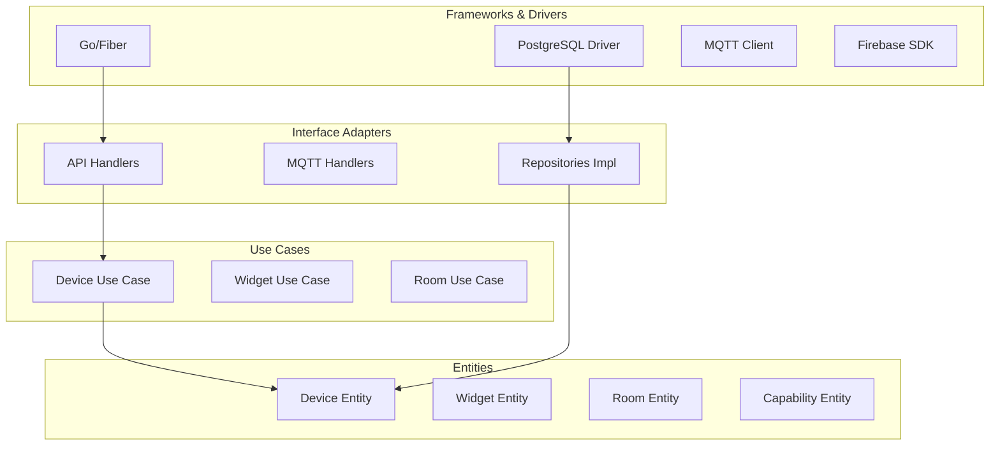
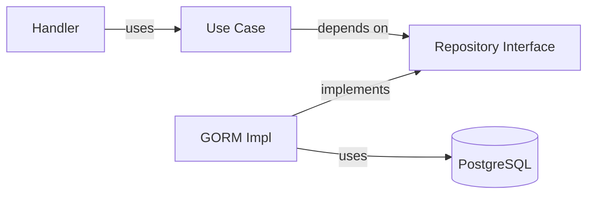
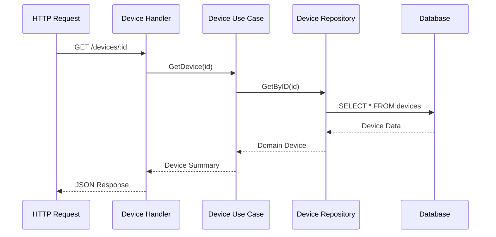

# Clean Architecture

สถาปัตยกรรมแบบ Clean Architecture ใน Go Backend

Clean Architecture implementation in Go backend.

## 🏛️ Layer Structure



## 📁 Directory Structure

```
internal/
├── auth/                    # Authentication module
│   ├── handler.go
│   ├── service.go
│   ├── repository.go
│   └── model.go
│
├── core/
│   ├── domain/              # Domain Layer (Entities)
│   │   ├── device.go
│   │   ├── widget.go
│   │   ├── room.go
│   │   ├── capability.go
│   │   ├── user.go
│   │   └── log.go
│   │
│   └── usecase/             # Application Layer (Use Cases)
│       ├── device_usecase.go
│       ├── widget_usecase.go
│       ├── room_usecase.go
│       ├── device_command_usecase.go
│       └── record_log_usecase.go
│
├── infrastructure/          # Interface Adapters
│   ├── gorm/                # Repository implementations
│   │   ├── device_repo.go
│   │   ├── widget_repo.go
│   │   ├── room_repo.go
│   │   ├── capability_repo.go
│   │   ├── user_repo.go
│   │   └── recorder_repo.go
│   │
│   ├── http/                # API handlers
│   │   ├── device_handler.go
│   │   ├── widget_handler.go
│   │   ├── room_handler.go
│   │   ├── user_handler.go
│   │   └── command_handler.go
│   │
│   └── mqtt/                # MQTT handlers
│       ├── device_handler.go
│       ├── sensor_handler.go
│       ├── sensor_subscriber.go
│       ├── device_commander.go
│       └── pair_commander.go
│
├── middleware/              # Cross-cutting concerns
│   └── jwt.go
│
└── provider/                # Dependency Injection providers
    └── provider.go
```

## 🎯 Domain Layer (Entities)

**Purpose**: Core business logic and enterprise rules

**Characteristics**:
- Framework-agnostic
- No dependencies on outer layers
- Contains business rules
- Defines repository interfaces

### Example: Device Entity

**File**: `internal/core/domain/device.go`

```go
package domain

import "time"

// Device represents an IoT device entity
type Device struct {
    DeviceID      string
    DeviceName    string
    DeviceType    string
    LastHeartbeat time.Time
    Widgets       []Widget
}

// DeviceSummary represents a device summary
type DeviceSummary struct {
    DeviceID      string
    LastHeartbeat time.Time
    DeviceName    string
    DeviceType    string
}

// DeviceCommand represents a command to send to device
type DeviceCommand struct {
    CapabilityType string
    ControlType    string
    Value          string
    ReplyTopic     string
}

// Validate validates device entity
func (d *Device) Validate() error {
    if d.DeviceID == "" {
        return fmt.Errorf("device id is required")
    }
    if d.DeviceName == "" {
        return fmt.Errorf("device name is required")
    }
    if d.DeviceType == "" {
        return fmt.Errorf("device type is required")
    }
    return nil
}

// DeviceRepository defines the interface for device data access
type DeviceRepository interface {
    CreateDevice(device *Device) error
    GetByID(id string) (*Device, error)
    GetAllSummaries() ([]*DeviceSummary, error)
    UpdateHeartbeat(id string) error
    UpdateDevice(id string, name string) error
    PairDevice(id string, roomID uint) error
    UnpairDevice(id string) error
    GetPairedDevice() ([]*DeviceSummary, error)
    GetUnpairDevice() ([]*DeviceSummary, error)
}
```

## 🔧 Use Case Layer (Application)

**Purpose**: Application-specific business rules

**Characteristics**:
- Orchestrates domain entities
- Uses repository interfaces
- Contains application logic
- Framework-agnostic

### Example: Device Use Case

**File**: `internal/core/usecase/device_usecase.go`

```go
package usecase

import (
    "fmt"
    "project-home-iot/internal/core/domain"
)

// DeviceUsecase defines the interface for device business logic
type DeviceUsecase interface {
    RegisterDevice(device *domain.Device) error
    ListDevices() ([]*domain.DeviceSummary, error)
    GetDevice(id string) (*domain.DeviceSummary, error)
    UpdateDevice(id string, name string) error
    PairDevice(id string, roomID uint) error
    UnpairDevice(id string) error
    UpdateHeartbeat(id string) error
    GetPairedDevice() ([]*domain.DeviceSummary, error)
    GetUnpairDevice() ([]*domain.DeviceSummary, error)
}

type deviceUsecase struct {
    repo          domain.DeviceRepository
    capabilityRepo domain.CapabilityRepository
    widgetRepo     domain.WidgetRepository
    pairCommander  domain.PairCommander
}

func NewDeviceUsecase(
    repo domain.DeviceRepository,
    cr domain.CapabilityRepository,
    wr domain.WidgetRepository,
    pc domain.PairCommander,
) DeviceUsecase {
    return &deviceUsecase{
        repo:           repo,
        capabilityRepo: cr,
        widgetRepo:     wr,
        pairCommander:  pc,
    }
}

func (u *deviceUsecase) RegisterDevice(device *domain.Device) error {
    // Validate device
    if err := device.Validate(); err != nil {
        return fmt.Errorf("validation failed: %w", err)
    }

    // Check if device exists
    existing, _ := u.repo.GetByID(device.DeviceID)
    if existing != nil {
        return fmt.Errorf("device already exists")
    }

    // Create device
    if err := u.repo.CreateDevice(device); err != nil {
        return fmt.Errorf("create device failed: %w", err)
    }

    // Auto-create widgets from capabilities
    capabilities, _ := u.capabilityRepo.FindAll()
    for _, cap := range capabilities {
        widget := &domain.Widget{
            DeviceID:     device.DeviceID,
            CapabilityID: cap.ID,
            WidgetStatus: "exclude",
            WidgetOrder:  0,
            Value:        "",
        }

        if err := u.widgetRepo.CreateWidget(widget); err != nil {
            return fmt.Errorf("failed to create widget: %w", err)
        }
    }

    return nil
}
```

## 🔌 Infrastructure Layer

**Purpose**: External concerns implementation

**Characteristics**:
- Implements repository interfaces
- Uses external frameworks (GORM, Fiber, MQTT)
- Adapters to external systems
- Contains framework-specific code

### Example: GORM Repository

**File**: `internal/infrastructure/gorm/device_repo.go`

```go
package gorm

import (
    "project-home-iot/internal/core/domain"
    "gorm.io/gorm"
)

type DeviceRepository struct {
    db *gorm.DB
}

func NewDeviceRepository(db *gorm.DB) *DeviceRepository {
    return &DeviceRepository{db: db}
}

func (r *DeviceRepository) CreateDevice(device *domain.Device) error {
    gormDevice := GormDevice{
        DeviceID:      device.DeviceID,
        DeviceName:    device.DeviceName,
        DeviceType:    device.DeviceType,
        LastHeartbeat: device.LastHeartbeat,
    }

    return r.db.Create(&gormDevice).Error
}

func (r *DeviceRepository) GetByID(id string) (*domain.Device, error) {
    var gormDevice GormDevice
    err := r.db.Where("device_id = ?", id).First(&gormDevice).Error
    if err != nil {
        return nil, err
    }

    return gormDevice.ToDomain(), nil
}

func (r *DeviceRepository) GetAllSummaries() ([]*domain.DeviceSummary, error) {
    var gormDevices []GormDevice
    err := r.db.Find(&gormDevices).Error
    if err != nil {
        return nil, err
    }

    summaries := make([]*domain.DeviceSummary, len(gormDevices))
    for i, d := range gormDevices {
        summaries[i] = &domain.DeviceSummary{
            DeviceID:      d.DeviceID,
            DeviceName:    d.DeviceName,
            DeviceType:    d.DeviceType,
            LastHeartbeat: d.LastHeartbeat,
        }
    }

    return summaries, nil
}

func (r *DeviceRepository) UpdateHeartbeat(id string) error {
    return r.db.Model(&GormDevice{}).
        Where("device_id = ?", id).
        Update("last_heartbeat", gorm.Expr("NOW()")).Error
}
```

### Example: HTTP Handler

**File**: `internal/infrastructure/http/device_handler.go`

```go
package http

import (
    "project-home-iot/internal/core/usecase"
    "github.com/gofiber/fiber/v2"
)

type DeviceHandler struct {
    usecase usecase.DeviceUsecase
}

func NewDeviceHandler(uc usecase.DeviceUsecase) *DeviceHandler {
    return &DeviceHandler{usecase: uc}
}

func (h *DeviceHandler) ListDevices(c *fiber.Ctx) error {
    devices, err := h.usecase.ListDevices()
    if err != nil {
        return c.Status(500).JSON(fiber.Map{"error": "Failed to list devices"})
    }

    return c.JSON(devices)
}

func (h *DeviceHandler) GetDevice(c *fiber.Ctx) error {
    deviceID := c.Params("device_id")

    device, err := h.usecase.GetDevice(deviceID)
    if err != nil {
        return c.Status(404).JSON(fiber.Map{"error": "Device not found"})
    }

    return c.JSON(device)
}

func (h *DeviceHandler) PairDevice(c *fiber.Ctx) error {
    deviceID := c.Params("device_id")

    type PairRequest struct {
        RoomID uint `json:"room_id"`
    }

    req := new(PairRequest)
    if err := c.BodyParser(req); err != nil {
        return c.Status(400).JSON(fiber.Map{"error": "Invalid request"})
    }

    if err := h.usecase.PairDevice(deviceID, req.RoomID); err != nil {
        return c.Status(500).JSON(fiber.Map{"error": "Failed to pair device"})
    }

    return c.JSON(fiber.Map{"status": "paired"})
}
```

## 🔗 Dependency Flow



**Key Rules**:
- Handlers depend on Use Cases
- Use Cases depend on Repository Interfaces
- GORM implements Repository Interfaces
- Dependencies point inward

## 🎯 Benefits of Clean Architecture

### 1. Independent of Frameworks

- Easy to swap Go frameworks (Fiber → Gin → Echo)
- No business logic in handlers
- Testable without HTTP server

### 2. Independent of Database

- Easy to swap databases (PostgreSQL → MySQL → MongoDB)
- Repository interface abstracts data access
- Business logic doesn't depend on SQL

### 3. Independent of UI

- API can be used by Flutter, React, or mobile apps
- Business logic not tied to HTTP
- Can add GraphQL or gRPC easily

### 4. Testable

- Mock repositories easily
- Test use cases in isolation
- Fast unit tests

## 🧪 Testing Example

```go
func TestDeviceUsecase_RegisterDevice(t *testing.T) {
    // Setup mocks
    mockRepo := new(MockDeviceRepository)
    mockCapRepo := new(MockCapabilityRepository)
    mockWidgetRepo := new(MockWidgetRepository)

    uc := NewDeviceUsecase(mockRepo, mockCapRepo, mockWidgetRepo, nil)

    // Test data
    device := &domain.Device{
        DeviceID:   "test-device",
        DeviceName: "Test Device",
        DeviceType: "sensor",
    }

    // Set up expectations
    mockRepo.On("GetByID", "test-device").Return(nil, nil)
    mockRepo.On("CreateDevice", device).Return(nil)
    mockCapRepo.On("FindAll").Return([]*domain.Capability{
        {ID: 1, CapabilityType: "temperature"},
    }, nil)
    mockWidgetRepo.On("CreateWidget", mock.Anything).Return(nil)

    // Execute
    err := uc.RegisterDevice(device)

    // Assert
    assert.NoError(t, err)
    mockRepo.AssertExpectations(t)
}
```

## 📊 Layer Responsibilities

| Layer | Responsibility | Dependencies |
|-------|---------------|--------------|
| **Domain** | Business entities, rules | None |
| **Use Case** | Application logic, orchestration | Domain interfaces |
| **Infrastructure** | External concerns | Use cases, Domain |
| **Application** | Bootstrapping, routing | All layers |

## 🔄 Data Flow Through Layers



---

**Previous**: [State Management](./state-management) | **Next**: [Repository Pattern](./repository-pattern) →
