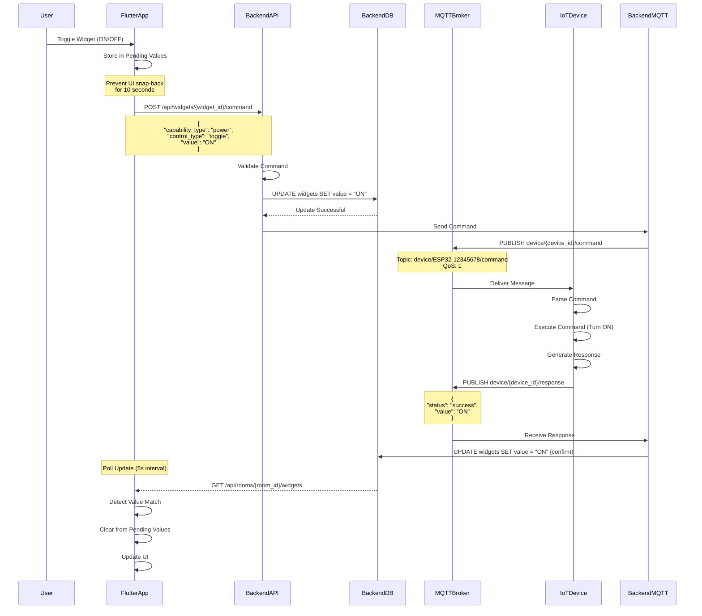
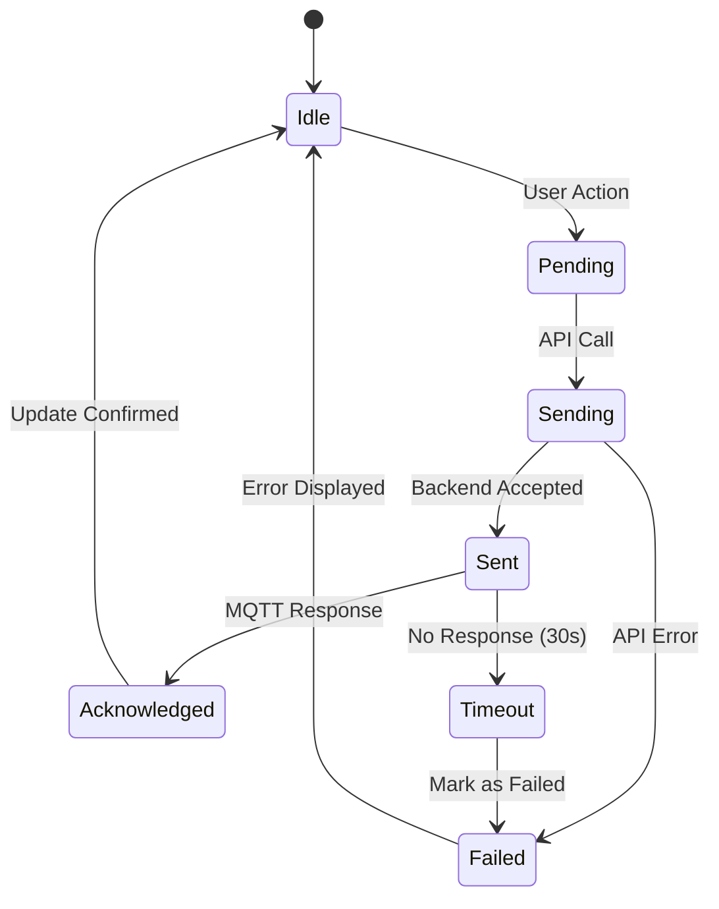
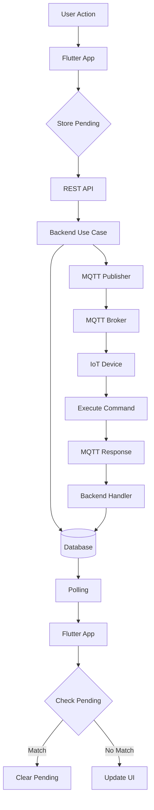

# Command Flow

กระบวนการส่งคำสั่งจากผู้ใช้ไปยังอุปกรณ์ IoT

Process of sending commands from user to IoT devices.

## 🔄 Command Sequence



## 📡 MQTT Protocol

### Command Topic Structure

```
device/{device_id}/command     # Send command to device
device/{device_id}/response    # Device response
```

### Command Payload Format

```json
{
  "widget_id": 123,
  "capability_type": "power",
  "control_type": "toggle",
  "value": "ON",
  "reply_topic": "device/ESP32-12345678/response",
  "timestamp": "2024-01-15T10:30:00Z",
  "transaction_id": "txn-123456"
}
```

### Response Payload Format

```json
{
  "status": "success",
  "value": "ON",
  "capability_type": "power",
  "control_type": "toggle",
  "timestamp": "2024-01-15T10:30:01Z",
  "transaction_id": "txn-123456"
}
```

## 🔧 Backend Implementation

### Command Handler

**File**: `project-management-backend/internal/infrastructure/http/command_handler.go`

```go
type CommandHandler struct {
    widgetUsecase usecase.WidgetUsecase
    mqttClient    mqtt.Client
}

func (h *CommandHandler) SendCommand(c *fiber.Ctx) error {
    widgetID, err := c.ParamsInt("widgetId")
    if err != nil {
        return c.Status(400).JSON(fiber.Map{"error": "Invalid widget ID"})
    }

    type CommandRequest struct {
        Value string `json:"value"`
    }

    req := new(CommandRequest)
    if err := c.BodyParser(req); err != nil {
        return c.Status(400).JSON(fiber.Map{"error": "Invalid request"})
    }

    // Get widget details
    widget, err := h.widgetUsecase.GetWidget(widgetID)
    if err != nil {
        return c.Status(404).JSON(fiber.Map{"error": "Widget not found"})
    }

    // Update widget value in database
    if err := h.widgetUsecase.UpdateValue(widgetID, req.Value); err != nil {
        return c.Status(500).JSON(fiber.Map{"error": "Failed to update widget"})
    }

    // Send MQTT command
    command := DeviceCommand{
        CapabilityType: widget.Capability.CapabilityType,
        ControlType:    widget.Capability.ControlType,
        Value:          req.Value,
        ReplyTopic:     fmt.Sprintf("device/%s/response", widget.DeviceID),
    }

    payload, _ := json.Marshal(command)
    topic := fmt.Sprintf("device/%s/command", widget.DeviceID)

    if token := h.mqttClient.Publish(topic, 1, false, string(payload)); token.Wait() && token.Error() != nil {
        return c.Status(500).JSON(fiber.Map{"error": "Failed to send command"})
    }

    return c.JSON(fiber.Map{
        "status": "command_sent",
        "widget_id": widgetID,
        "value": req.Value,
    })
}
```

### Device Commander

**File**: `project-management-backend/internal/infrastructure/mqtt/device_commander.go`

```go
type DeviceCommander struct {
    client mqtt.Client
}

func NewDeviceCommander(client mqtt.Client) *DeviceCommander {
    return &DeviceCommander{client: client}
}

func (c *DeviceCommander) SendCommand(deviceID string, command DeviceCommand) error {
    topic := fmt.Sprintf("device/%s/command", deviceID)

    payload, err := json.Marshal(command)
    if err != nil {
        return fmt.Errorf("failed to marshal command: %w", err)
    }

    token := c.client.Publish(topic, 1, false, string(payload))
    if token.Wait() && token.Error() != nil {
        return fmt.Errorf("failed to publish: %w", token.Error())
    }

    return nil
}

type DeviceCommand struct {
    CapabilityType string `json:"capability_type"`
    ControlType    string `json:"control_type"`
    Value          string `json:"value"`
    ReplyTopic     string `json:"reply_topic"`
}
```

## 📱 Flutter Implementation

### Widget Command Handling

**File**: `PM_Mobile_Frontend/lib/features/home/bloc/devices_bloc.dart`

```dart
Future<void> _onWidgetToggled(
  WidgetToggled event,
  Emitter<DevicesState> emit,
) async {
  final widget = state.widgets.firstWhere(
    (w) => w.widgetId == event.widgetId,
  );

  final newValue = widget.value == 'ON' ? 'OFF' : 'ON';

  // Store in pending values (prevent snap-back)
  _pendingValueByWidgetId[event.widgetId] = newValue;
  _pendingAtByWidgetId[event.widgetId] = DateTime.now();

  // Emit optimistic update
  emit(state.copyWith(
    widgetStates: Map.from(state.widgetStates)..[event.widgetId] = newValue,
  ));

  try {
    // Send command to backend
    await widgetRepo.sendCommand(event.widgetId, newValue);

    // Clear pending after successful send
    Future.delayed(const Duration(seconds: 2), () {
      _pendingValueByWidgetId.remove(event.widgetId);
    });
  } catch (e) {
    // Revert on error
    _pendingValueByWidgetId.remove(event.widgetId);
    emit(state.copyWith(
      widgetStates: Map.from(state.widgetStates)..[event.widgetId] = widget.value,
      errorMessage: 'Failed to send command: $e',
    ));
  }
}
```

### Repository Command Method

**File**: `PM_Mobile_Frontend/lib/features/home/data/widget_repository.dart`

```dart
class WidgetRepository {
  final String baseUrl;
  final http.Client httpClient;

  Future<void> sendCommand(int widgetId, String value) async {
    final response = await httpClient.post(
      Uri.parse('$baseUrl/api/widgets/$widgetId/command'),
      headers: {'Content-Type': 'application/json'},
      body: jsonEncode({'value': value}),
    );

    if (response.statusCode != 200) {
      throw Exception('Failed to send command');
    }
  }
}
```

## 🔌 Command Types

### Toggle Command

**Use Case**: ON/OFF control

```json
{
  "capability_type": "power",
  "control_type": "toggle",
  "value": "ON"  // or "OFF"
}
```

### Slider Command

**Use Case**: Variable control (0-100)

```json
{
  "capability_type": "brightness",
  "control_type": "slider",
  "value": "75"  // 0-100
}
```

### Mode Command

**Use Case**: Multiple options

```json
{
  "capability_type": "mode",
  "control_type": "mode",
  "value": "cool"  // cool, heat, auto, etc.
}
```

### Text Command

**Use Case**: Text input

```json
{
  "capability_type": "text",
  "control_type": "text",
  "value": "Hello World"
}
```

## 🔄 Command States



## 📊 Command Flow Diagram



## ⚙️ Configuration

### Backend Configuration

```env
# MQTT Command Settings
MQTT_COMMAND_TOPIC=device/{device_id}/command
MQTT_COMMAND_QOS=1
MQTT_COMMAND_TIMEOUT=30s

# Response Handling
MQTT_RESPONSE_TOPIC=device/{device_id}/response
MQTT_RESPONSE_TIMEOUT=30s
```

### Flutter Configuration

```dart
class CommandConfig {
  static const Duration pendingTtl = Duration(seconds: 10);
  static const Duration commandTimeout = Duration(seconds: 30);
  static const int maxRetries = 3;
}
```

## 🧪 Testing Commands

### Test Command via MQTT

```bash
# Send command
mosquitto_pub -h localhost -t "device/ESP32-12345678/command" -m '{
  "capability_type": "power",
  "control_type": "toggle",
  "value": "ON",
  "reply_topic": "device/ESP32-12345678/response"
}'

# Subscribe to response
mosquitto_sub -h localhost -t "device/ESP32-12345678/response"
```

### Test Command via API

```bash
curl -X POST http://localhost:3000/api/widgets/123/command \
  -H "Content-Type: application/json" \
  -d '{"value": "ON"}'
```

## 🐛 Troubleshooting

### Command Not Reaching Device

**Checklist**:
1. ✅ Backend receives API request
2. ✅ Backend publishes to MQTT
3. ✅ Device is subscribed to command topic
4. ✅ Device is online (heartbeat < 60s)
5. ✅ MQTT broker is running

### UI Not Updating

**Possible Causes**:
- Pending value not cleared
- Polling not fetching updated value
- Database update failed

**Solutions**:
- Check pending value TTL
- Verify polling is active
- Check database logs

### High Command Latency

**Possible Causes**:
- Network latency
- MQTT broker load
- Device processing time

**Solutions**:
- Use local MQTT broker
- Implement command queuing
- Optimize device firmware

---

**Previous**: [Sensor Data Flow](./sensor-data-flow) | **Next**: [Widget Management Flow](./widget-management-flow) →
