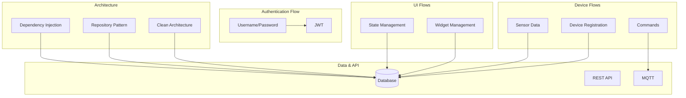
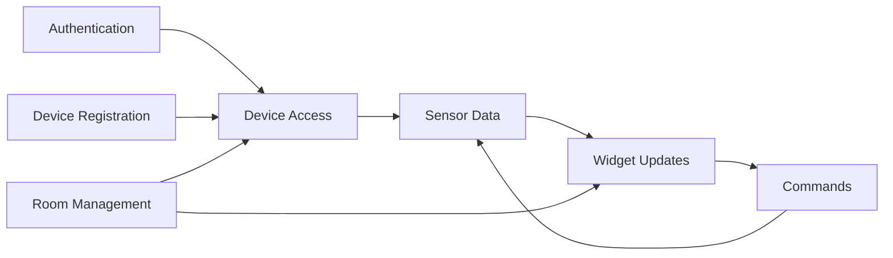
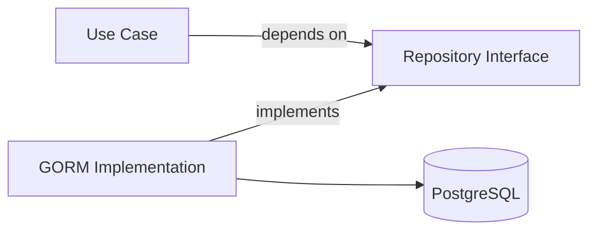
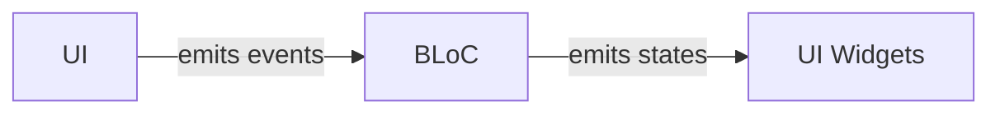
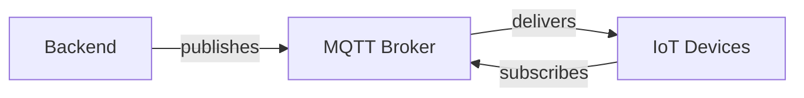
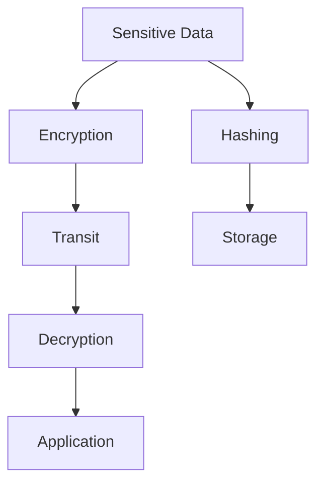

# Data Flows

ภาพรวม Data Flow ทั้งหมดในระบบ PM IoT

Complete overview of all data flows in the PM IoT System.

## 📊 Data Flow Summary

ระบบ PM IoT มี 12 Data Flows หลักที่เชื่อมโยงทุกส่วนของระบบเข้าด้วยกัน

The PM IoT System has 12 major data flows connecting all system components.



## 🔄 Complete Flow Map

| Flow | Source | Destination | Protocol | Frequency |
|------|--------|-------------|----------|-----------|
| Authentication | User → Backend | JWT Token | HTTPS | On login |
| Device Registration | IoT Device | Backend → DB | MQTT | On device start |
| Sensor Data | IoT Device | Backend → DB | MQTT | 1 second |
| Commands | User → Backend → IoT Device | Command execution | REST + MQTT | On user action |
| Widget Updates | Backend | Flutter App | REST Polling | 10 seconds |
| Widget Visibility | User | Backend → DB | REST | On change |
| Heartbeat | IoT Device | Backend | MQTT | 1 second |
| Device Status | Backend | Flutter App | REST Polling | 10 seconds |
| Room Management | User | Backend → DB | REST | On user action |
| API Requests | Flutter App | Backend → DB | REST | As needed |
| MQTT Messages | Backend | IoT Device | MQTT | As needed |
| Database Sync | Backend | PostgreSQL | TCP | Continuous |

## 📈 Flow Characteristics

### Real-time Flows

**Sensor Data Flow**:
- **Latency**: < 100ms
- **Frequency**: 1 second
- **Protocol**: MQTT
- **Reliability**: QoS 1 (at least once)

**Command Flow**:
- **Latency**: < 500ms (round trip)
- **Frequency**: On demand
- **Protocol**: REST + MQTT
- **Reliability**: QoS 1

### Polling Flows

**Widget State Polling**:
- **Frequency**: 10 seconds
- **Protocol**: REST
- **Data Size**: ~10-50KB
- **Optimization**: Pending value tracking

### Authentication Flows

**Initial Auth**:
- **Frequency**: Once per session
- **Protocol**: Username/Password + JWT
- **Token Lifetime**: 72 hours

## 🔗 Flow Interdependencies



## 📝 Flow Documentation

Detailed documentation for each flow:

1. **[Authentication Flow](./auth-flow)** - Username/Password + JWT integration
2. **[Device Registration Flow](./device-registration-flow)** - MQTT auto-discovery
3. **[Sensor Data Flow](./sensor-data-flow)** - Real-time data streaming
4. **[Command Flow](./command-flow)** - User commands to devices
5. **[Widget Management Flow](./widget-management-flow)** - Display customization
6. **[State Management Flow](./state-management)** - BLoC implementation

## 🎯 Design Patterns

### Repository Pattern



### Observer Pattern (BLoC)



### Pub/Sub Pattern (MQTT)



## 🔒 Data Security

### Secure Flows

- **Authentication**: Encrypted via TLS 1.3
- **JWT**: Signed with HS256
- **API**: HTTPS only
- **MQTT**: TLS support available
- **Database**: SSL connections

### Data Protection



## ⚡ Performance Optimization

### Caching Strategy

- **Widget State**: 10-second cache
- **User Sessions**: JWT tokens
- **Database Queries**: Connection pooling
- **API Responses**: Conditional requests

### Optimization Techniques

1. **Polling**: Adaptive intervals
2. **MQTT**: QoS levels for reliability
3. **Database**: Indexed queries
4. **API**: Pagination for large datasets

## 📊 Flow Monitoring

### Key Metrics

- **Flow Latency**: Measure each flow timing
- **Error Rates**: Track failures
- **Throughput**: Messages per second
- **Resource Usage**: CPU, Memory, Network

### Health Checks

```go
// Flow health check
type FlowHealth struct {
    Name      string
    Status    string
    Latency   time.Duration
    LastCheck time.Time
}
```

## 🔍 Troubleshooting

### Common Issues

**Flow Stalled**:
- Check network connectivity
- Verify MQTT broker status
- Review database connections

**High Latency**:
- Optimize database queries
- Check MQTT message queue
- Review polling frequency

**Data Inconsistency**:
- Verify transaction boundaries
- Check MQTT QoS settings
- Review cache invalidation

---

**Previous**: [Overview](./overview) | **Next**: [Authentication Flow](./auth-flow) →
