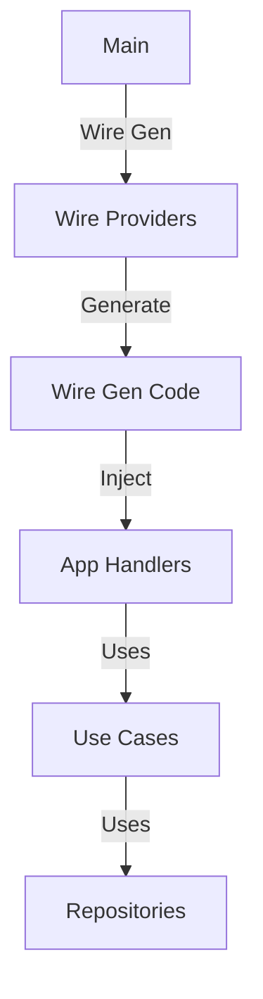
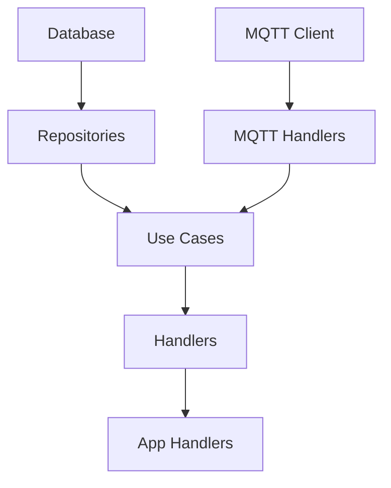
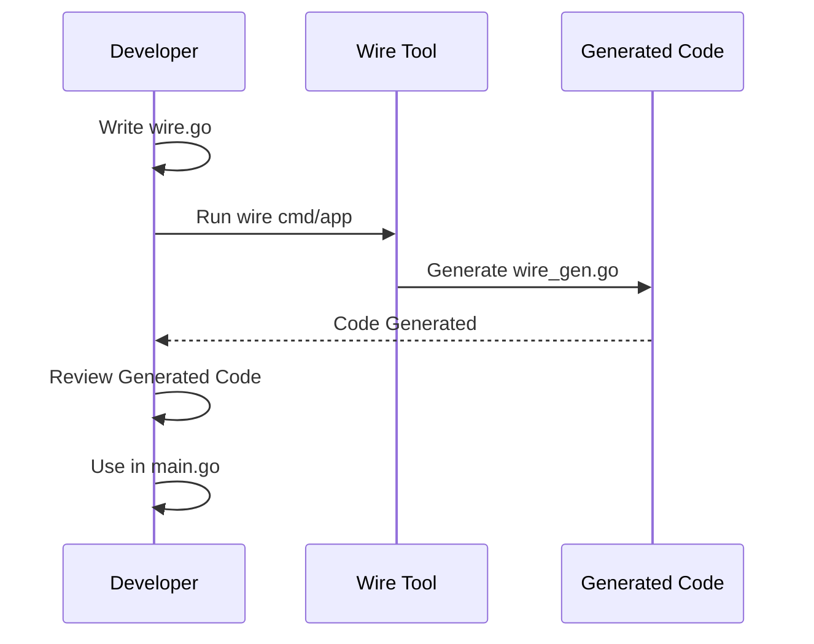

# Dependency Injection

การจัดการ Dependency Injection ด้วย Wire Framework

Dependency injection management using Wire framework.

## 🎯 Purpose

Dependency Injection (DI) is a technique to achieve Inversion of Control (IoC) between classes and their dependencies.



## 📦 Wire Framework

### What is Wire?

Wire is a code generation tool for Go that automates dependency injection. It analyzes your code and generates initialization code.

### Why Wire?

- **Type-safe**: Compile-time dependency checking
- **No runtime reflection**: Fast and efficient
- **Easy to refactor**: IDE friendly
- **Explicit**: Dependencies are visible in code

## 🏗️ Project Structure with Wire

```
cmd/app/
├── main.go           # Application entry point
├── wire.go           # Wire injector definition
├── wire_gen.go       # Generated code (don't edit)
└── router.go         # Route definitions

internal/
├── provider/         # Provider sets
│   └── provider.go   # Provider functions
├── auth/            # Providers
├── core/            # Use cases
└── infrastructure/  # Repositories, handlers
```

## 📋 Wire Configuration

### Wire Injector

**File**: `cmd/app/wire.go`

```go
//go:build wireinject
// +build wireinject

package main

import (
    "github.com/google/wire"
    "gorm.io/gorm"

    "project-home-iot/internal/auth"
    "project-home-iot/internal/core/domain"
    "project-home-iot/internal/core/usecase"
    gormRepo "project-home-iot/internal/infrastructure/gorm"
    httpHandler "project-home-iot/internal/infrastructure/http"
    mqttInfra "project-home-iot/internal/infrastructure/mqtt"
)

// AppHandlers holds all application handlers
type AppHandlers struct {
    Auth             *auth.AuthHandler
    Device           *httpHandler.DeviceHandler
    Command          *httpHandler.CommandHandler
    Room             *httpHandler.RoomHandler
    Widget           *httpHandler.WidgetHandler
    User             *httpHandler.UserHandler
    MQTT             *mqttInfra.MQTTHandler
    SensorSubscriber *mqttInfra.SensorSubscriber
    SensorHandler    *mqttInfra.SensorHandler
}

// InitializeApp initializes the application with all dependencies
func InitializeApp(db *gorm.DB, client mqtt.Client) *AppHandlers {
    wire.Build(
        // ==================== Providers ====================

        // Auth Module Providers
        auth.ProviderSet,

        // Repository Providers
        gormRepo.NewDeviceRepository,
        gormRepo.NewCapabilityRepository,
        gormRepo.NewWidgetRepository,
        gormRepo.NewRoomRepository,
        gormRepo.NewUserRepository,
        gormRepo.NewRecorderRepository,

        // ==================== Bindings ====================

        // Interface Bindings (GORM implementations to interfaces)
        wire.Bind(new(domain.DeviceRepository), new(*gormRepo.DeviceRepository)),
        wire.Bind(new(domain.CapabilityRepository), new(*gormRepo.CapabilityRepository)),
        wire.Bind(new(domain.WidgetRepository), new(*gormRepo.WidgetRepository)),
        wire.Bind(new(domain.RoomRepository), new(*gormRepo.RoomRepository)),
        wire.Bind(new(domain.UserRepository), new(*gormRepo.UserRepository)),
        wire.Bind(new(domain.Recorder), new(*gormRepo.RecorderRepository)),

        // ==================== Use Case Providers ====================

        usecase.NewDeviceUsecase,
        usecase.NewWidgetUsecase,
        usecase.NewRoomUsecase,
        usecase.NewUserUsecase,
        usecase.NewCommandUsecase,
        usecase.NewRecordLogUsecase,

        // ==================== Infrastructure Providers ====================

        // MQTT Infrastructure
        mqttInfra.NewMQTTDeviceCommander,
        mqttInfra.NewMQTTPairCommander,
        mqttInfra.NewSensorSubscriber,
        mqttInfra.NewSensorHandler,

        // ==================== Handler Providers ====================

        httpHandler.NewDeviceHandler,
        httpHandler.NewCommandHandler,
        httpHandler.NewRoomHandler,
        httpHandler.NewWidgetHandler,
        httpHandler.NewUserHandler,
        mqttInfra.NewMQTTHandler,

        // ==================== Final Struct ====================

        wire.Struct(new(AppHandlers), "*"),
    )

    return &AppHandlers{}
}
```

## 🔌 Provider Sets

### Auth Provider Set

**File**: `internal/auth/provider.go`

```go
package auth

var ProviderSet = wire.ProviderSet{
    NewService,
    NewRepository,
    NewHandler,
}
```

### Repository Providers

```go
// NewDeviceRepository creates a new device repository
func NewDeviceRepository(db *gorm.DB) *gormRepo.DeviceRepository {
    return gormRepo.NewDeviceRepository(db)
}

// NewWidgetRepository creates a new widget repository
func NewWidgetRepository(db *gorm.DB) *gormRepo.WidgetRepository {
    return gormRepo.NewWidgetRepository(db)
}

// NewRoomRepository creates a new room repository
func NewRoomRepository(db *gorm.DB) *gormRepo.RoomRepository {
    return gormRepo.NewRoomRepository(db)
}
```

## 🏭 Constructor Functions

### Use Case Constructors

```go
// NewDeviceUsecase creates a new device use case
func NewDeviceUsecase(
    repo domain.DeviceRepository,
    capRepo domain.CapabilityRepository,
    widgetRepo domain.WidgetRepository,
    pairCommander domain.PairCommander,
) usecase.DeviceUsecase {
    return usecase.NewDeviceUsecase(repo, capRepo, widgetRepo, pairCommander)
}

// NewWidgetUsecase creates a new widget use case
func NewWidgetUsecase(
    repo domain.WidgetRepository,
    deviceRepo domain.DeviceRepository,
) usecase.WidgetUsecase {
    return usecase.NewWidgetUsecase(repo, deviceRepo)
}
```

### Handler Constructors

```go
// NewDeviceHandler creates a new device HTTP handler
func NewDeviceHandler(uc usecase.DeviceUsecase) *httpHandler.DeviceHandler {
    return httpHandler.NewDeviceHandler(uc)
}

// NewMQTTHandler creates a new MQTT handler
func NewMQTTHandler(
    deviceUC usecase.DeviceUsecase,
    widgetUC usecase.WidgetUsecase,
) *mqttInfra.MQTTHandler {
    return mqttInfra.NewMQTTHandler(deviceUC, widgetUC)
}
```

## 🔄 Generation Process

### Step 1: Write Wire Injector

```bash
# cmd/app/wire.go (as shown above)
```

### Step 2: Generate Code

```bash
# Generate wire_gen.go
wire cmd/app
```

### Step 3: Review Generated Code

**File**: `cmd/app/wire_gen.go` (auto-generated)

```go
// Code generated by Wire. DO NOT EDIT.

func InitializeApp(db *gorm.DB, client mqtt.Client) *AppHandlers {
    gormDeviceRepository := gormRepo.NewDeviceRepository(db)
    gormCapabilityRepository := gormRepo.NewCapabilityRepository(db)
    gormWidgetRepository := gormRepo.NewWidgetRepository(db)
    gormRoomRepository := gormRepo.NewRoomRepository(db)
    gormUserRepository := gormRepo.NewUserRepository(db)
    gormRecorderRepository := gormRepo.NewRecorderRepository(db)

    deviceRepository_Interface := _wireDeviceRepositoryInterfaceValue(gormDeviceRepository)
    // ... more bindings

    deviceUsecase := usecase.NewDeviceUsecase(
        deviceRepository_Interface,
        capabilityRepository_Interface,
        widgetRepository_Interface,
        pairCommander_Interface,
    )

    deviceHandler := httpHandler.NewDeviceHandler(deviceUsecase)
    // ... more handlers

    appHandlers := &AppHandlers{
        Device: deviceHandler,
        // ... more fields
    }

    return appHandlers
}
```

### Step 4: Use Generated Code

```go
func main() {
    db := database.ConnectDB()

    // Setup MQTT
    opts := mqttlib.NewClientOptions().AddBroker("tcp://localhost:1883")
    client := mqttlib.NewClient(opts)
    client.Connect()

    // Initialize all dependencies via Wire
    handlers := InitializeApp(db, client)

    // Setup routes
    app := fiber.New()
    SetupRoutes(app, handlers)

    app.Listen(":3000")
}
```

## 📊 Dependency Graph



## 🎯 Benefits of Wire

### 1. Compile-Time Safety

```go
// ✅ Wire catches this at compile time
func NewDeviceUsecase(
    repo domain.DeviceRepository,
    wrongType string,  // ❌ Type error!
) usecase.DeviceUsecase {
    // Wire will fail to generate code
}
```

### 2. Refactor Friendly

```go
// Change constructor signature
func NewDeviceUsecase(
    repo domain.DeviceRepository,
    logger *Logger,  // ✅ Add parameter
) usecase.DeviceUsecase {
    // Wire detects the change
    // Re-run wire to regenerate
}
```

### 3. Explicit Dependencies

```go
// ✅ All dependencies visible in constructor
func NewDeviceHandler(uc usecase.DeviceUsecase) *DeviceHandler {
    return &DeviceHandler{usecase: uc}
}

// vs manual DI where dependencies are hidden
func NewDeviceHandler() *DeviceHandler {
    uc := // ... complex initialization hidden
    return &DeviceHandler{usecase: uc}
}
```

## 🧪 Testing with Wire

### Test Setup

```go
func TestDeviceHandler(t *testing.T) {
    // Setup test database
    db := setupTestDB()
    defer db.Close()

    // Use Wire to inject test dependencies
    handlers := InitializeApp(db, nil)

    // Test handlers
    handler := handlers.Device
    // ... test code
}
```

### Mock Injection

```go
func TestDeviceUsecase(t *testing.T) {
    // Use Wire Gen with mocks
    mockRepo := new(MockDeviceRepository)

    uc := usecase.NewDeviceUsecase(
        mockRepo,
        // ... other mocks
    )

    // Test use case
}
```

## ⚙️ Wire Tips

### 1. Provider Sets for Organization

```go
// ✅ Good - Organized by module
var ProviderSet = wire.ProviderSet{
    NewRepository,
    NewService,
    NewHandler,
}

// ❌ Bad - Everything in one place
wire.NewSet(NewRepo1, NewRepo2, ..., NewHandler50)
```

### 2. Interface Bindings

```go
// ✅ Bind interface to implementation
wire.Bind(new(domain.DeviceRepository), new(*gormRepo.DeviceRepository))

// ❌ Manual casting (not type-safe)
func NewUseCase(repo interface{}) UseCase {
    return &useCase{repo: repo.(*gormRepo.DeviceRepository)}
}
```

### 3. Struct Providers

```go
// ✅ Clean struct injection
wire.Struct(new(AppHandlers), "*")

// ❌ Manual field injection
func NewHandlers(
    deviceHandler *DeviceHandler,
    // ... many more
) *AppHandlers {
    return &AppHandlers{
        Device: deviceHandler,
        // ... many more fields
    }
}
```

## 🔄 Development Workflow



### Common Workflow

```bash
# 1. Make changes to dependencies
vim cmd/app/wire.go

# 2. Regenerate Wire code
wire cmd/app

# 3. Run the application
go run cmd/app/main.go

# 4. If errors, fix and repeat
```

## 🐛 Troubleshooting

### Wire Generation Errors

**"no provider found for domain.DeviceRepository"**

**Cause**: Interface binding missing

**Solution**:
```go
// Add binding
wire.Bind(new(domain.DeviceRepository), new(*gormRepo.DeviceRepository))
```

**"multiple providers for domain.DeviceRepository"**

**Cause**: Duplicate providers

**Solution**:
```go
// Remove duplicate providers
// or use provider set to avoid conflicts
```

### Runtime Errors

**"panic: runtime error: invalid memory address"**

**Cause**: Nil dependency

**Solution**:
```go
// Ensure all dependencies are provided
// Check Wire output for missing providers
```

## 📚 Best Practices

### 1. Keep Constructors Simple

```go
// ✅ Good - Simple constructor
func NewDeviceHandler(uc usecase.DeviceUsecase) *DeviceHandler {
    return &DeviceHandler{usecase: uc}
}

// ❌ Bad - Complex initialization
func NewDeviceHandler() *DeviceHandler {
    db := connectToDB()  // Hidden dependency!
    repo := NewRepo(db)
    uc := NewUseCase(repo)
    return &DeviceHandler{usecase: uc}
}
```

### 2. Use Interface Bindings

```go
// ✅ Always bind interfaces
wire.Bind(new(domain.DeviceRepository), new(*gormRepo.DeviceRepository))

// Benefits:
// - Type safety
// - Easy mocking
// - Clear dependencies
```

### 3. Organize Provider Sets

```go
// By module
auth.ProviderSet
device.ProviderSet
room.ProviderSet

// By layer
repositoryProviders
useCaseProviders
handlerProviders
```

### 4. Tag Providers

```go
// ✅ Tag for different environments
func NewProdDatabase() *gorm.DB {
    return gorm.Open(postgres.Open(prodDSN))
}

func NewTestDatabase() *gorm.DB {
    return gorm.Open(sqlite.Open(":memory:"))
}

// In wire.go
wire.Bind(new(*gorm.DB), NewProdDatabase)  // Production
```

---

**Previous**: [Repository Pattern](./repository-pattern) | **Next**: [Frontend Docs](../frontend/intro) →
