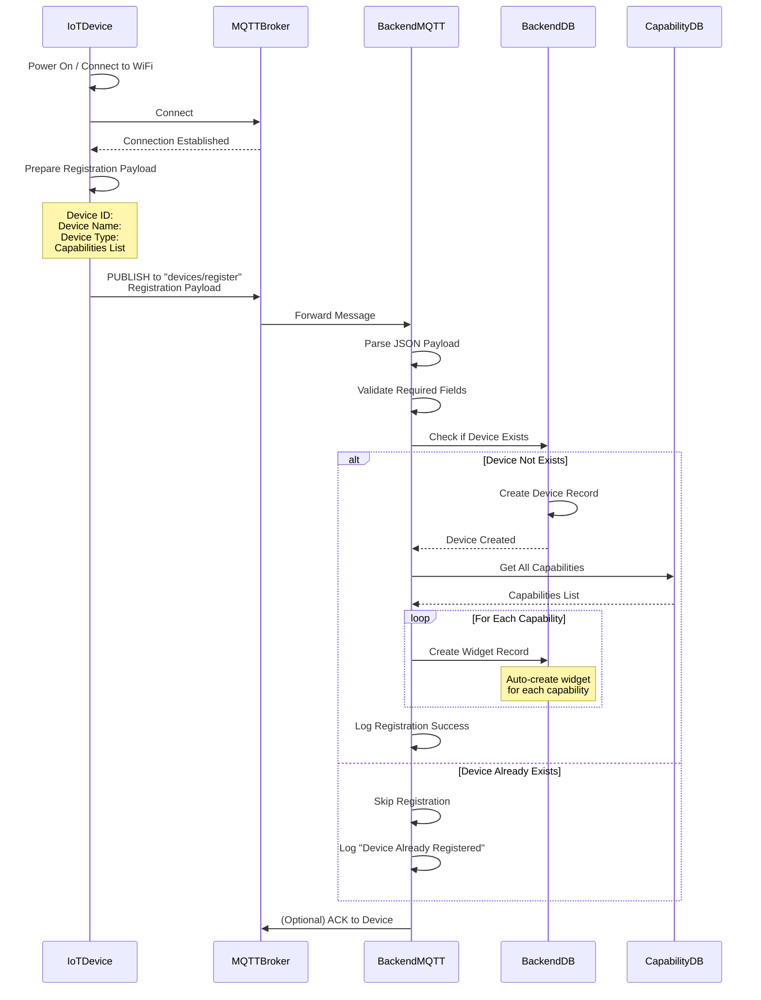
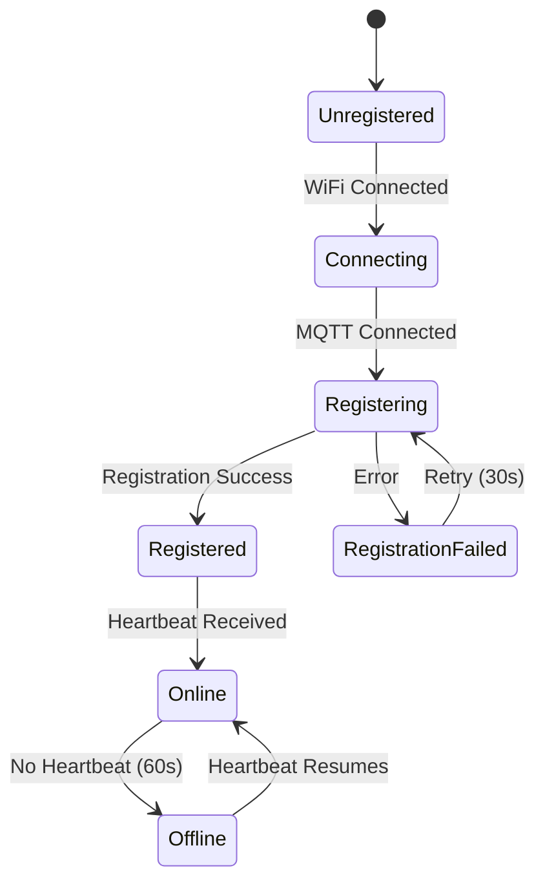

# Device Registration Flow

กระบวนการลงทะเบียนอุปกรณ์ IoT ผ่าน MQTT อัตโนมัติ

Automatic IoT device registration process via MQTT.

## 🔄 Device Registration Sequence



## 📡 MQTT Protocol

### Topic Structure

```
devices/register          # Device registration topic
devices/{device_id}/info  # Device info topic
```

### Registration Payload Format

```json
{
  "device_id": "ESP32-12345678",
  "device_name": "Living Room Light",
  "device_type": "smart_switch",
  "capabilities": [
    {
      "capability_type": "power",
      "control_type": "toggle"
    },
    {
      "capability_type": "brightness",
      "control_type": "slider"
    }
  ],
  "version": "1.0.0",
  "manufacturer": "Smart Home Inc."
}
```

### Response Payload (Optional)

```json
{
  "status": "registered",
  "device_id": "ESP32-12345678",
  "timestamp": "2024-01-15T10:30:00Z",
  "widgets_created": 2
}
```

## 🔧 Backend Implementation

### MQTT Handler

**File**: `project-management-backend/internal/infrastructure/mqtt/device_handler.go`

```go
type MQTTHandler struct {
    deviceUsecase usecase.DeviceUsecase
    widgetUsecase usecase.WidgetUsecase
}

func (h *MQTTHandler) SubscribeDeviceRegistration(client mqtt.Client) {
    topic := "devices/register"

    client.Subscribe(topic, 1, func(c mqtt.Client, m mqtt.Message) {
        var payload DevicePayload

        err := json.Unmarshal(m.Payload(), &payload)
        if err != nil {
            log.Printf("Failed to parse registration: %v", err)
            return
        }

        // Validate payload
        if err := h.validatePayload(&payload); err != nil {
            log.Printf("Invalid payload: %v", err)
            return
        }

        // Convert to domain model
        device := h.payloadToDomain(&payload)

        // Register device
        err = h.deviceUsecase.RegisterDevice(device)
        if err != nil {
            log.Printf("Registration failed: %v", err)
            return
        }

        log.Printf("Device registered: %s", payload.DeviceID)
    })
}

type DevicePayload struct {
    DeviceID      string                 `json:"device_id"`
    DeviceName    string                 `json:"device_name"`
    DeviceType    string                 `json:"device_type"`
    Capabilities  []CapabilityPayload    `json:"capabilities"`
    Version       string                 `json:"version"`
}

func (h *MQTTHandler) payloadToDomain(p *DevicePayload) *domain.Device {
    return &domain.Device{
        DeviceID:      p.DeviceID,
        DeviceName:    p.DeviceName,
        DeviceType:    p.DeviceType,
        LastHeartbeat: time.Now(),
    }
}
```

### Device Use Case

**File**: `project-management-backend/internal/core/usecase/device_usecase.go`

```go
func (u *deviceUsecase) RegisterDevice(device *domain.Device) error {
    // Validate device
    if err := device.Validate(); err != nil {
        return fmt.Errorf("validation failed: %w", err)
    }

    // Check if device exists
    existing, _ := u.repo.GetByID(device.DeviceID)
    if existing != nil {
        return fmt.Errorf("device already exists")
    }

    // Create device
    if err := u.repo.CreateDevice(device); err != nil {
        return fmt.Errorf("create device failed: %w", err)
    }

    // Auto-create widgets from capabilities
    capabilities, _ := u.capabilityRepo.FindAll()
    for _, cap := range capabilities {
        widget := &domain.Widget{
            DeviceID:     device.DeviceID,
            CapabilityID: cap.ID,
            WidgetStatus: "exclude", // Hidden by default
            WidgetOrder:  0,
            Value:        "",
        }

        if err := u.widgetRepo.CreateWidget(widget); err != nil {
            log.Printf("Failed to create widget: %v", err)
        }
    }

    return nil
}
```

## 📱 Device Firmware Example

### ESP32 Registration Code

```cpp
#include <WiFi.h>
#include <PubSubClient.h>
#include <ArduinoJson.h>

const char* mqtt_server = "your-mqtt-broker.com";
const char* device_id = "ESP32-" + String(ESP.getEfuseMac());
const char* device_name = "Living Room Light";
const char* device_type = "smart_switch";

WiFiClient espClient;
PubSubClient client(espClient);

void registerDevice() {
    StaticJsonDocument<512> doc;

    doc["device_id"] = device_id;
    doc["device_name"] = device_name;
    doc["device_type"] = device_type;
    doc["version"] = "1.0.0";

    JsonArray capabilities = doc.createNestedArray("capabilities");

    JsonObject cap1 = capabilities.createNestedObject();
    cap1["capability_type"] = "power";
    cap1["control_type"] = "toggle";

    JsonObject cap2 = capabilities.createNestedObject();
    cap2["capability_type"] = "brightness";
    cap2["control_type"] = "slider";

    String payload;
    serializeJson(doc, payload);

    client.publish("devices/register", payload.c_str());
    Serial.println("Device registration sent");
}

void setup() {
    Serial.begin(115200);

    // Connect to WiFi
    WiFi.begin("your-ssid", "your-password");
    while (WiFi.status() != WL_CONNECTED) {
        delay(500);
        Serial.print(".");
    }

    // Setup MQTT
    client.setServer(mqtt_server, 1883);

    while (!client.connected()) {
        if (client.connect(device_id)) {
            Serial.println("MQTT connected");
            registerDevice();
        } else {
            delay(5000);
        }
    }
}

void loop() {
    client.loop();
}
```

## 🔄 Registration States



## 📊 Registration Data Flow

### Payload Structure

```
┌─────────────────────────────────────┐
│      Registration Payload           │
├─────────────────────────────────────┤
│ Device ID (string, required)        │
│ Device Name (string, required)      │
│ Device Type (string, required)      │
│ Capabilities (array)                │
│  └─ Capability Type                 │
│  └─ Control Type                    │
│ Version (string, optional)          │
│ Manufacturer (string, optional)     │
└─────────────────────────────────────┘
```

### Database Tables Affected

1. **devices** - Device record created
2. **widgets** - One widget per capability created
3. **capabilities** - Referenced for widget creation

## ⚙️ Configuration

### Backend Configuration

```env
# MQTT Registration Settings
MQTT_REGISTRATION_TOPIC=devices/register
MQTT_REGISTRATION_QOS=1
MQTT_REGISTRATION_TIMEOUT=30s

# Auto-create Widgets
AUTO_CREATE_WIDGETS=true
DEFAULT_WIDGET_STATUS=exclude
```

### Device Configuration

```cpp
// Device settings
const int REGISTRATION_RETRY_INTERVAL = 30000;  // 30 seconds
const int REGISTRATION_MAX_RETRIES = 3;
const int HEARTBEAT_INTERVAL = 1000;            // 1 second
```

## 🔍 Validation Rules

### Required Fields

| Field | Type | Validation |
|-------|------|------------|
| device_id | string | Non-empty, unique |
| device_name | string | Non-empty, max 100 chars |
| device_type | string | Non-empty, enum |
| capabilities | array | At least one item |

### Device Types

- `smart_switch` - Light switches
- `smart_plug` - Smart plugs
- `sensor` - Sensors only
- `thermostat` - Temperature control
- `camera` - Security cameras
- `lock` - Smart locks

## 🐛 Troubleshooting

### Device Not Registering

**Checklist**:
1. ✅ MQTT broker is running
2. ✅ Device connects to WiFi
3. ✅ Device connects to MQTT broker
4. ✅ Backend is subscribed to `devices/register`
5. ✅ Payload format is correct
6. ✅ Database is accessible

### Common Issues

**"Device already exists"**:
- Device ID is unique
- Use different ID or delete existing device

**"Invalid payload"**:
- Check JSON syntax
- Verify required fields
- Check data types

**"Database error"**:
- Check database connection
- Verify database schema
- Check permissions

---

**Previous**: [Authentication Flow](./auth-flow) | **Next**: [Sensor Data Flow](./sensor-data-flow) →
