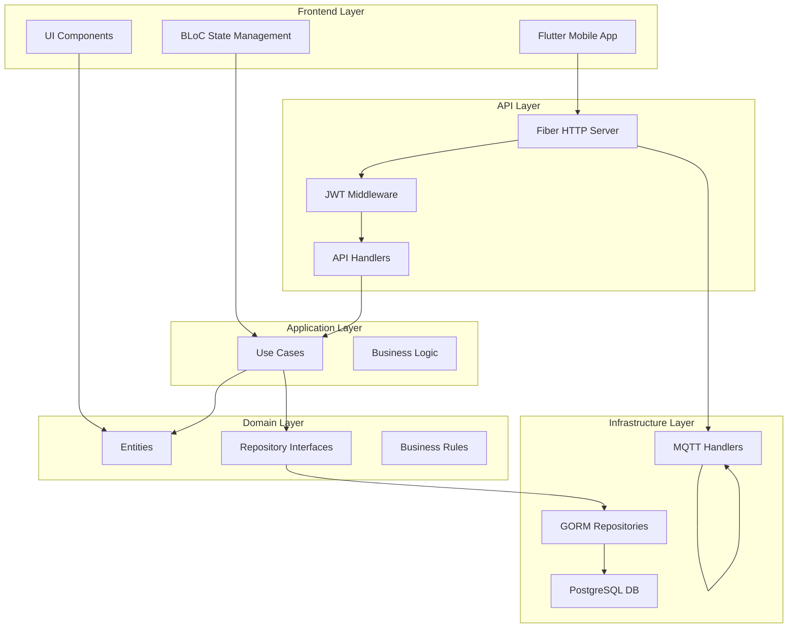
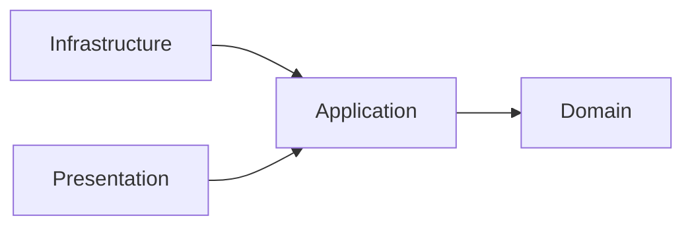
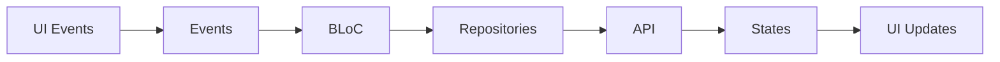
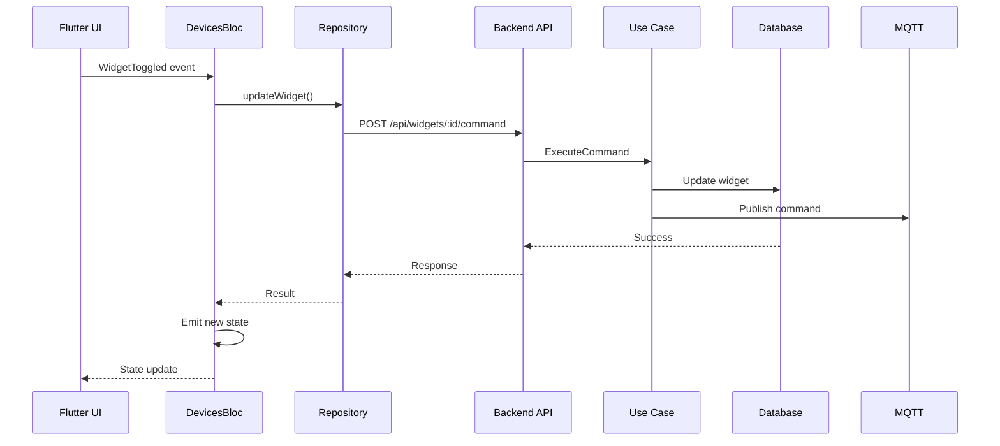
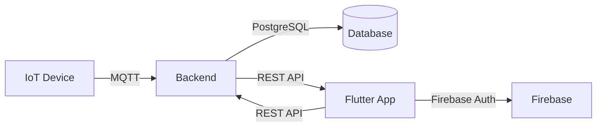
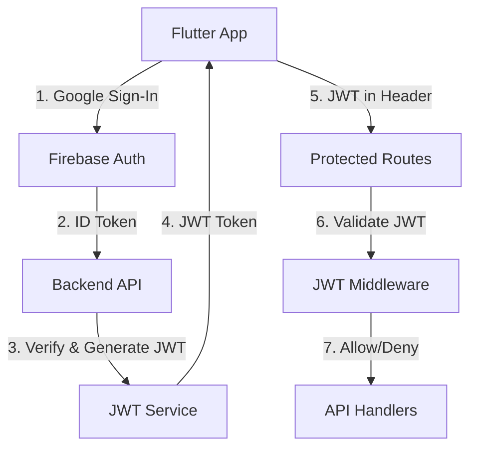

# Architecture Overview

ภาพรวมสถาปัตยกรรมของระบบ PM IoT ทั้งหมด

Complete architecture overview of the PM IoT System.

## 🏛️ System Architecture

ระบบ PM IoT ใช้ Clean Architecture ร่วมกับ Domain-Driven Design (DDD) เพื่อแยกส่วนต่างๆ ของระบบออกจากกันอย่างชัดเจน

The PM IoT System uses Clean Architecture with Domain-Driven Design (DDD) to separate concerns clearly.



## 📁 Project Structure

```
project-management-iot/
├── PM_Mobile_Frontend/              # Flutter Mobile Application
│   └── lib/
│       ├── main.dart
│       ├── data/                    # Repositories
│       └── features/                # Feature modules
│           ├── auth/               # Authentication
│           ├── home/               # Home screen
│           ├── device/             # Device management
│           └── room/               # Room management
│
├── project-management-backend/       # Go Backend API
│   └── cmd/app/                     # Application entry
│       ├── main.go
│       ├── router.go
│       └── wire.go                 # Dependency injection
│   └── internal/
│       ├── auth/                   # Authentication
│       ├── core/
│       │   ├── domain/             # Domain models
│       │   └── usecase/            # Business logic
│       ├── infrastructure/
│       │   ├── gorm/               # Data access
│       │   ├── http/               # API handlers
│       │   └── mqtt/               # MQTT handlers
│       └── middleware/             # HTTP middleware
│
└── docs/                           # Documentation
```

## 🎯 Design Principles

### 1. Separation of Concerns

แต่ละ layer มีความรับผิดชอบที่ชัดเจน:

Each layer has clear responsibilities:

- **Presentation Layer**: UI and user interaction
- **Application Layer**: Business logic and use cases
- **Domain Layer**: Core business rules and entities
- **Infrastructure Layer**: External dependencies

### 2. Dependency Inversion

Dependencies point inward:



High-level modules don't depend on low-level modules. Both depend on abstractions.

### 3. Single Responsibility

Each component has one reason to change:

- `AuthBloc` - Authentication state only
- `DeviceRepository` - Device data access only
- `DeviceUsecase` - Device business logic only

## 🔷 Clean Architecture Layers

### Domain Layer (`internal/core/domain/`)

**Purpose**: Core business logic and entities

**Contains**:
- Entities: User, Device, Room, Widget, Capability, Log
- Repository interfaces
- Value objects
- Domain services

**Example**:
```go
// Domain Entity
type Device struct {
    DeviceID      string
    DeviceName    string
    DeviceType    string
    LastHeartbeat time.Time
}

// Repository Interface
type DeviceRepository interface {
    CreateDevice(device *Device) error
    GetByID(id string) (*Device, error)
}
```

### Use Case Layer (`internal/core/usecase/`)

**Purpose**: Application business logic

**Contains**:
- Application use cases
- Business rules orchestration
- Transaction management

**Example**:
```go
type DeviceUsecase interface {
    RegisterDevice(device *Device) error
    PairDevice(id string, roomID uint) error
    UpdateHeartbeat(id string) error
}
```

### Infrastructure Layer (`internal/infrastructure/`)

**Purpose**: External concerns implementation

**Contains**:
- Repository implementations (GORM)
- MQTT handlers
- HTTP handlers
- Database connections

**Example**:
```go
type DeviceRepository struct {
    db *gorm.DB
}

func (r *DeviceRepository) CreateDevice(device *Device) error {
    return r.db.Create(device).Error
}
```

### Application Layer (`cmd/app/`)

**Purpose**: Application bootstrapping

**Contains**:
- `main.go` - Entry point
- `router.go` - HTTP routes
- `wire.go` - Dependency injection

## 📱 Frontend Architecture

### BLoC Pattern



**Key Components**:
- **Events**: User interactions (WidgetToggled, ValueChanged)
- **States**: UI representation (Loading, Loaded, Error)
- **BLoC**: Business logic & state transformation
- **Repositories**: Data access layer

### Feature-Based Structure

```
lib/features/
├── auth/
│   ├── bloc/           # AuthBloc, events, states
│   ├── data/           # AuthRepository, AuthApi
│   └── ui/             # SignInPage, widgets
├── home/
│   ├── bloc/           # DevicesBloc, events, states
│   ├── data/           # WidgetRepository
│   └── ui/             # HomePage, widgets
├── device/
│   └── ...             # Device management
└── room/
    └── ...             # Room management
```

## 🔗 Key Flows

### Request Flow



### Data Flow



## 🎨 Technology Stack

### Frontend

| Component | Technology |
|-----------|-----------|
| **Framework** | Flutter 3.7+ |
| **Language** | Dart 3.7+ |
| **State Management** | BLoC (flutter_bloc) |
| **Authentication** | Firebase Auth |
| **Local Storage** | Flutter Secure Storage |
| **UI** | Material Design 3 |

### Backend

| Component | Technology |
|-----------|-----------|
| **Framework** | Fiber 2.52+ |
| **Language** | Go 1.25+ |
| **Database** | PostgreSQL 13+ |
| **ORM** | GORM 1.31+ |
| **MQTT** | Paho MQTT 1.5+ |
| **DI** | Wire 0.7+ |
| **Auth** | JWT (golang-jwt/jwt) |

## 🔐 Security Architecture



## 📊 Scalability Considerations

### Horizontal Scaling

- **Stateless API servers** (can add more instances)
- **Load balancer** in front of API servers
- **Database connection pooling**
- **MQTT broker clustering**

### Vertical Scaling

- **Increase database resources**
- **Cache frequently accessed data**
- **Optimize database queries**
- **Add database indexes**

---

**Next**: [Data Flows](./data-flows) →
