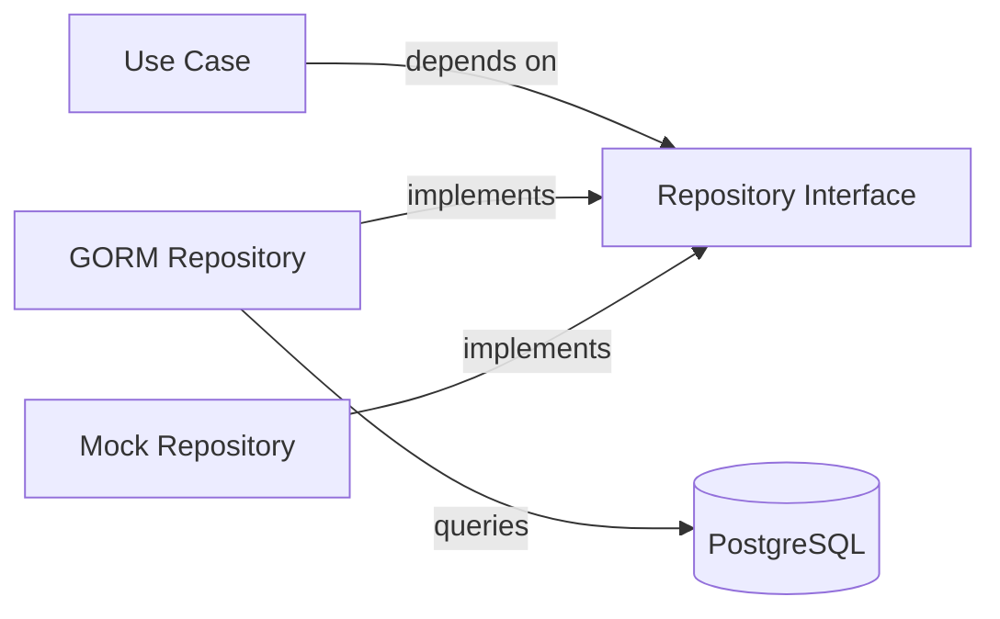
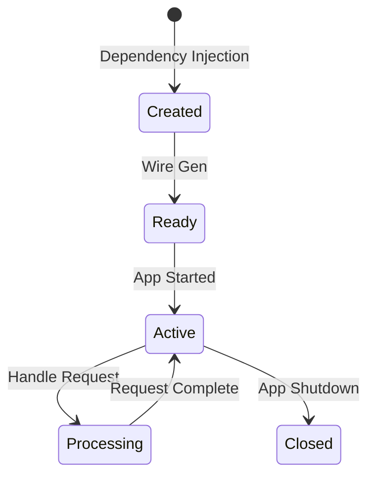

# Repository Pattern

รูปแบบ Repository สำหรับการจัดการ Data Access Layer

Repository pattern for data access layer management.

## 🎯 Purpose

The Repository pattern mediates between the domain and data mapping layers, acting like an in-memory domain object collection.



## 📋 Interface Definition

### Domain Layer Interfaces

**Location**: `internal/core/domain/{entity}.go`

```go
// DeviceRepository defines the contract for device data access
type DeviceRepository interface {
    CreateDevice(device *Device) error
    GetByID(id string) (*Device, error)
    GetAllSummaries() ([]*DeviceSummary, error)
    UpdateHeartbeat(id string) error
    UpdateDevice(id string, name string) error
    PairDevice(id string, roomID uint) error
    UnpairDevice(id string) error
    GetPairedDevice() ([]*DeviceSummary, error)
    GetUnpairDevice() ([]*DeviceSummary, error)
}

// WidgetRepository defines the contract for widget data access
type WidgetRepository interface {
    GetWidgetIdByDeviceAndCapability(deviceId string, capabilityId uint) *Widget
    CreateWidget(widget *Widget) error
    Update(widget *Widget) error
    Delete(id uint) error
    DeleteByDeviceId(deviceID string) error
    FindAll() ([]*Widget, error)
    FindByID(id uint) (*Widget, error)
    FindByRoomID(roomID uint) ([]*Widget, error)
    GetWidgetByStatus(status string) ([]*Widget, error)
    UpdateValue(widgetID uint, value string) error
    UpdateStatus(id uint, status string) error
    ChangeOrder(roomID uint, widgetOrders []uint) error
}

// RoomRepository defines the contract for room data access
type RoomRepository interface {
    Create(room *Room) error
    FindAll() ([]*Room, error)
    FindByID(id uint) (*Room, error)
    Update(room *Room) error
    Delete(id uint) error
    AddDevice(roomID uint, deviceID string) error
    ListDeviceSummaries(roomID uint) ([]*DeviceSummary, error)
}
```

## 🔧 Implementation

### GORM Repository

**File**: `internal/infrastructure/gorm/device_repo.go`

```go
package gorm

import (
    "fmt"
    "project-home-iot/internal/core/domain"
    "gorm.io/gorm"
)

type DeviceRepository struct {
    db *gorm.DB
}

func NewDeviceRepository(db *gorm.DB) *DeviceRepository {
    return &DeviceRepository{db: db}
}

// GORM Model
type GormDevice struct {
    DeviceID      string    `gorm:"primaryKey;column:device_id"`
    DeviceName    string    `gorm:"column:device_name"`
    DeviceType    string    `gorm:"column:device_type"`
    LastHeartbeat time.Time `gorm:"column:last_heartbeat"`
    RoomID        *uint     `gorm:"column:room_id"`
    Widgets       []GormWidget `gorm:"foreignKey:DeviceID"`
}

// TableName specifies the table name
func (GormDevice) TableName() string {
    return "devices"
}

// ToDomain converts GORM model to domain entity
func (g *GormDevice) ToDomain() *domain.Device {
    device := &domain.Device{
        DeviceID:      g.DeviceID,
        DeviceName:    g.DeviceName,
        DeviceType:    g.DeviceType,
        LastHeartbeat: g.LastHeartbeat,
        Widgets:       make([]domain.Widget, len(g.Widgets)),
    }

    for i, w := range g.Widgets {
        device.Widgets[i] = *w.ToDomain()
    }

    return device
}

// CreateDevice creates a new device
func (r *DeviceRepository) CreateDevice(device *domain.Device) error {
    gormDevice := GormDevice{
        DeviceID:      device.DeviceID,
        DeviceName:    device.DeviceName,
        DeviceType:    device.DeviceType,
        LastHeartbeat: device.LastHeartbeat,
    }

    return r.db.Create(&gormDevice).Error
}

// GetByID retrieves a device by ID
func (r *DeviceRepository) GetByID(id string) (*domain.Device, error) {
    var gormDevice GormDevice
    err := r.db.Preload("Widgets").Where("device_id = ?", id).First(&gormDevice).Error
    if err != nil {
        if err == gorm.ErrRecordNotFound {
            return nil, nil
        }
        return nil, fmt.Errorf("failed to get device: %w", err)
    }

    return gormDevice.ToDomain(), nil
}

// GetAllSummaries retrieves all device summaries
func (r *DeviceRepository) GetAllSummaries() ([]*domain.DeviceSummary, error) {
    var gormDevices []GormDevice
    err := r.db.Find(&gormDevices).Error
    if err != nil {
        return nil, fmt.Errorf("failed to list devices: %w", err)
    }

    summaries := make([]*domain.DeviceSummary, len(gormDevices))
    for i, d := range gormDevices {
        summaries[i] = &domain.DeviceSummary{
            DeviceID:      d.DeviceID,
            DeviceName:    d.DeviceName,
            DeviceType:    d.DeviceType,
            LastHeartbeat: d.LastHeartbeat,
        }
    }

    return summaries, nil
}

// UpdateHeartbeat updates device heartbeat timestamp
func (r *DeviceRepository) UpdateHeartbeat(id string) error {
    return r.db.Model(&GormDevice{}).
        Where("device_id = ?", id).
        Update("last_heartbeat", gorm.Expr("NOW()")).Error
}

// PairDevice pairs a device to a room
func (r *DeviceRepository) PairDevice(id string, roomID uint) error {
    return r.db.Model(&GormDevice{}).
        Where("device_id = ?", id).
        Update("room_id", roomID).Error
}

// UnpairDevice unpairs a device from any room
func (r *DeviceRepository) UnpairDevice(id string) error {
    return r.db.Model(&GormDevice{}).
        Where("device_id = ?", id).
        Update("room_id", nil).Error
}
```

## 🔗 Dependency Injection

### Wire Configuration

**File**: `cmd/app/wire.go`

```go
//go:build wireinject
// +build wireinject

package main

import (
    "project-home-iot/internal/core/domain"
    gormRepo "project-home-iot/internal/infrastructure/gorm"
    "github.com/google/wire"
    "gorm.io/gorm"
)

// InitializeApp initializes the application with all dependencies
func InitializeApp(db *gorm.DB) *AppHandlers {
    wire.Build(
        // Repository Providers
        gormRepo.NewDeviceRepository,
        gormRepo.NewWidgetRepository,
        gormRepo.NewRoomRepository,
        gormRepo.NewCapabilityRepository,
        gormRepo.NewUserRepository,
        gormRepo.NewRecorderRepository,

        // Interface Bindings
        wire.Bind(new(domain.DeviceRepository), new(*gormRepo.DeviceRepository)),
        wire.Bind(new(domain.WidgetRepository), new(*gormRepo.WidgetRepository)),
        wire.Bind(new(domain.RoomRepository), new(*gormRepo.RoomRepository)),
        wire.Bind(new(domain.CapabilityRepository), new(*gormRepo.CapabilityRepository)),
        wire.Bind(new(domain.UserRepository), new(*gormRepo.UserRepository)),
        wire.Bind(new(domain.Recorder), new(*gormRepo.RecorderRepository)),

        // Use Case Providers (depend on interfaces)
        usecase.NewDeviceUsecase,
        usecase.NewWidgetUsecase,
        usecase.NewRoomUsecase,
        usecase.NewCommandUsecase,
        usecase.NewRecordLogUsecase,

        // Handler Providers (depend on use cases)
        httpHandler.NewDeviceHandler,
        httpHandler.NewWidgetHandler,
        httpHandler.NewRoomHandler,

        wire.Struct(new(AppHandlers), "*"),
    )
    return &AppHandlers{}
}
```

## 🎨 Repository Features

### CRUD Operations

```go
// Create
func (r *DeviceRepository) CreateDevice(device *domain.Device) error

// Read
func (r *DeviceRepository) GetByID(id string) (*domain.Device, error)
func (r *DeviceRepository) GetAllSummaries() ([]*domain.DeviceSummary, error)

// Update
func (r *DeviceRepository) UpdateHeartbeat(id string) error
func (r *DeviceRepository) UpdateDevice(id string, name string) error

// Delete
func (r *DeviceRepository) Delete(id string) error
```

### Query Methods

```go
// Find by criteria
func (r *DeviceRepository) FindByRoom(roomID uint) ([]*domain.Device, error)
func (r *DeviceRepository) FindPaired() ([]*domain.Device, error)
func (r *DeviceRepository) FindUnpaired() ([]*domain.Device, error)

// Filter and sort
func (r *DeviceRepository) FindWithType(deviceType string) ([]*domain.Device, error)
func (r *DeviceRepository) FindActive() ([]*domain.Device, error)
```

### Transaction Support

```go
func (r *DeviceRepository) Transaction(fn func(*gorm.DB) error) error {
    return r.db.Transaction(fn)
}

// Usage
err := repo.Transaction(func(tx *gorm.DB) error {
    // Multiple operations in single transaction
    if err := tx.Create(&device).Error; err != nil {
        return err
    }
    if err := tx.Create(&widget).Error; err != nil {
        return err
    }
    return nil
})
```

## 🧪 Testing with Mocks

### Mock Repository

```go
// Mock for testing
type MockDeviceRepository struct {
    mock.Mock
}

func (m *MockDeviceRepository) CreateDevice(device *domain.Device) error {
    args := m.Called(device)
    return args.Error(0)
}

func (m *MockDeviceRepository) GetByID(id string) (*domain.Device, error) {
    args := m.Called(id)
    if args.Get(0) == nil {
        return nil, args.Error(1)
    }
    return args.Get(0).(*domain.Device), args.Error(1)
}

// Test Example
func TestDeviceUseCase_RegisterDevice(t *testing.T) {
    mockRepo := new(MockDeviceRepository)
    uc := NewDeviceUsecase(mockRepo, ...)

    device := &domain.Device{DeviceID: "test"}

    mockRepo.On("GetByID", "test").Return(nil, nil)
    mockRepo.On("CreateDevice", device).Return(nil)

    err := uc.RegisterDevice(device)

    assert.NoError(t, err)
    mockRepo.AssertExpectations(t)
}
```

## 📊 Repository vs Direct Database Access

| Aspect | Repository Pattern | Direct Database Access |
|--------|-------------------|----------------------|
| **Testability** | Easy to mock | Hard to test |
| **Abstraction** | High abstraction | Low abstraction |
| **Flexibility** | Easy to swap DB | Tied to DB |
| **Maintainability** | Centralized logic | Scattered logic |
| **Performance** | Slightly slower | Slightly faster |

## 🔄 Repository Lifecycle



## 🎯 Best Practices

### 1. Interface in Domain

```go
// ✅ Good - Interface in domain package
package domain

type DeviceRepository interface {
    Create(device *Device) error
}

// ❌ Bad - Interface in infrastructure
package gorm

type DeviceRepository interface {
    Create(device *GormDevice) error
}
```

### 2. Return Domain Entities

```go
// ✅ Good - Returns domain entity
func (r *DeviceRepository) GetByID(id string) (*domain.Device, error) {
    // Convert GORM model to domain entity
    return gormDevice.ToDomain(), nil
}

// ❌ Bad - Returns GORM model
func (r *DeviceRepository) GetByID(id string) (*GormDevice, error) {
    return &gormDevice, nil
}
```

### 3. Handle Errors Properly

```go
// ✅ Good - Proper error handling
func (r *DeviceRepository) GetByID(id string) (*domain.Device, error) {
    var device GormDevice
    err := r.db.Where("device_id = ?", id).First(&device).Error
    if err != nil {
        if err == gorm.ErrRecordNotFound {
            return nil, nil // Not found is not an error
        }
        return nil, fmt.Errorf("failed to get device: %w", err)
    }
    return device.ToDomain(), nil
}
```

### 4. Use Transactions for Multiple Operations

```go
// ✅ Good - Transactional
func (r *WidgetRepository) ChangeOrder(roomID uint, orders []uint) error {
    return r.db.Transaction(func(tx *gorm.DB) error {
        for i, widgetID := range orders {
            if err := tx.Model(&Widget{}).
                Where("id = ? AND room_id = ?", widgetID, roomID).
                Update("widget_order", i).Error; err != nil {
                return err
            }
        }
        return nil
    })
}
```

## 📈 Performance Optimization

### Connection Pooling

```go
func NewDeviceRepository(db *gorm.DB) *DeviceRepository {
    sqlDB, _ := db.DB()

    // Connection pool settings
    sqlDB.SetMaxIdleConns(10)
    sqlDB.SetMaxOpenConns(100)
    sqlDB.SetConnMaxLifetime(time.Hour)

    return &DeviceRepository{db: db}
}
```

### Eager Loading

```go
// ✅ Good - Eager load relationships
func (r *DeviceRepository) GetByID(id string) (*domain.Device, error) {
    var device GormDevice
    err := r.db.Preload("Widgets").Preload("Widgets.Capability").
        Where("device_id = ?", id).
        First(&device).Error
    // ...
}

// ❌ Bad - N+1 query problem
func (r *DeviceRepository) GetByID(id string) (*domain.Device, error) {
    var device GormDevice
    r.db.Where("device_id = ?", id).First(&device)

    // N+1 queries!
    for _, widget := range device.Widgets {
        r.db.First(&widget.Capability) // Separate query per widget
    }
}
```

### Indexing

```sql
-- Add indexes for common queries
CREATE INDEX idx_devices_room ON devices(room_id);
CREATE INDEX idx_widgets_room_status ON widgets(room_id, widget_status);
CREATE INDEX idx_widgets_order ON widgets(room_id, widget_order);
CREATE INDEX idx_logs_widget_timestamp ON logs(widget_id, created_at);
```

---

**Previous**: [Clean Architecture](./clean-architecture) | **Next**: [Dependency Injection](./dependency-injection) →
