# Sensor Data Flow

กระบวนการส่งข้อมูลเซนเซอร์แบบเรียลไทม์จากอุปกรณ์ IoT

Real-time sensor data transmission process from IoT devices.

## 🔄 Sensor Data Sequence

```mermaid
sequenceDiagram
    participant IoTDevice
    participant MQTTBroker
    participant BackendMQTT
    participant BackendDB
    participant FlutterApp

    loop Every 1 Second
        IoTDevice->>IoTDevice: Read Sensor Data
        Note over IoTDevice: Temperature: 25°C<br/>Humidity: 60%<br/>Status: online

        IoTDevice->>MQTTBroker: PUBLISH device/{device_id}/sensor
        MQTTBroker->>BackendMQTT: Forward Message

        alt Heartbeat Message
            BackendMQTT->>BackendMQTT: Detect "status" + "heartbeat"
            BackendMQTT->>BackendDB: UPDATE devices SET last_heartbeat = NOW()
        else Sensor Data
            BackendMQTT->>BackendMQTT: Parse Sensor Data
            BackendMQTT->>BackendMQTT: Find Widget by Capability
            BackendMQTT->>BackendDB: UPDATE widgets SET value = {value}
            BackendMQTT->>BackendDB: INSERT INTO logs (widget_id, value, timestamp)
        end
    end

    loop Every 5 Seconds
        FlutterApp->>BackendMQTT: GET /api/rooms/{room_id}/widgets
        BackendMQTT->>BackendDB: SELECT widgets WHERE room_id = {room_id} AND status = 'include'
        BackendDB-->>BackendMQTT: Widget Data
        BackendMQTT-->>FlutterApp: JSON Response

        alt New Value Detected
            FlutterApp->>FlutterApp: Compare with Pending Values
            alt Not in Pending List
                FlutterApp->>FlutterApp: Update DevicesBloc State
                FlutterApp->>FlutterApp: Trigger UI Rebuild
            else In Pending List
                FlutterApp->>FlutterApp: Skip Update (User Action in Progress)
            end
        end
    end
```



## 📡 MQTT Protocol

### Topic Structure

```
device/{device_id}/sensor         # Sensor data publish
device/{device_id}/heartbeat      # Heartbeat publish
```

### Sensor Data Payload

```json
{
  "device_id": "ESP32-12345678",
  "timestamp": "2024-01-15T10:30:00Z",
  "readings": [
    {
      "capability_type": "temperature",
      "control_type": "sensor",
      "value": "25.5",
      "unit": "°C"
    },
    {
      "capability_type": "humidity",
      "control_type": "sensor",
      "value": "60",
      "unit": "%"
    },
    {
      "capability_type": "status",
      "control_type": "heartbeat",
      "value": "online"
    }
  ]
}
```

### Heartbeat Payload

```json
{
  "device_id": "ESP32-12345678",
  "capability_type": "status",
  "control_type": "heartbeat",
  "value": "online",
  "timestamp": "2024-01-15T10:30:00Z"
}
```

## 🔧 Backend Implementation

### Sensor Handler

**File**: `project-management-backend/internal/infrastructure/mqtt/sensor_handler.go`

```go
type SensorHandler struct {
    recordLogUC usecase.RecordLogUsecase
    deviceUC    usecase.DeviceUsecase
}

func (h *SensorHandler) HandleSensorMessage(c mqtt.Client, m mqtt.Message) {
    topic := m.Topic()
    parts := strings.Split(topic, "/")

    if len(parts) < 3 {
        return
    }

    deviceID := parts[1]

    var payload SensorPayload
    if err := json.Unmarshal(m.Payload(), &payload); err != nil {
        log.Printf("Failed to parse sensor payload: %v", err)
        return
    }

    // Handle heartbeat
    if payload.CapabilityType == "status" && payload.ControlType == "heartbeat" {
        if err := h.deviceUC.UpdateHeartbeat(deviceID); err != nil {
            log.Printf("Failed to update heartbeat: %v", err)
        }
        return
    }

    // Handle sensor data
    err := h.recordLogUC.Execute(
        deviceID,
        payload.CapabilityType,
        payload.ControlType,
        "sensor",
        payload.Value,
    )

    if err != nil {
        log.Printf("Failed to record sensor data: %v", err)
    }
}

type SensorPayload struct {
    DeviceID        string            `json:"device_id"`
    Timestamp       time.Time         `json:"timestamp"`
    Readings        []ReadingPayload  `json:"readings"`
}

type ReadingPayload struct {
    CapabilityType string `json:"capability_type"`
    ControlType    string `json:"control_type"`
    Value          string `json:"value"`
    Unit           string `json:"unit"`
}
```

### Record Log Use Case

**File**: `project-management-backend/internal/core/usecase/record_log_usecase.go`

```go
func (uc *recordLogUsecase) Execute(
    deviceID string,
    capabilityType string,
    controlType string,
    eventType string,
    value string,
) error {
    // Find widget by device and capability
    widget, err := uc.widgetRepo.GetWidgetByDeviceAndCapability(
        deviceID,
        capabilityType,
    )
    if err != nil {
        return fmt.Errorf("widget not found: %w", err)
    }

    // Update widget value
    if err := uc.widgetRepo.UpdateValue(widget.ID, value); err != nil {
        return fmt.Errorf("failed to update widget: %w", err)
    }

    // Record log
    log := &domain.Log{
        WidgetID:  widget.ID,
        Actor:     "sensor",
        Value:     value,
        EventType: eventType,
        CreatedAt: time.Now(),
    }

    if err := uc.recorder.RecordLog(log); err != nil {
        return fmt.Errorf("failed to record log: %w", err)
    }

    return nil
}
```

## 📱 Flutter Implementation

### DevicesBloc Polling

**File**: `PM_Mobile_Frontend/lib/features/home/bloc/devices_bloc.dart`

```dart
class DevicesBloc extends Bloc<DevicesEvent, DevicesState> {
  final WidgetRepository widgetRepo;
  final RoomRepository roomRepo;
  final DeviceRepository deviceRepo;

  Timer? _sensorPollTimer;
  Timer? _fullPollTimer;

  Duration _sensorInterval = const Duration(seconds: 1);
  Duration _fullInterval = const Duration(seconds: 5);

  // Prevent snap-back during user interaction
  final Map<int, String> _pendingValueByWidgetId = {};
  final Map<int, DateTime> _pendingAtByWidgetId = {};
  static const _pendingTtl = Duration(seconds: 10);

  DevicesBloc({
    required this.widgetRepo,
    required this.roomRepo,
    required this.deviceRepo,
  }) : super(const DevicesState()) {
    on<WidgetsPollingStarted>(_onWidgetsPollingStarted);
    on<WidgetsPollingStopped>(_onWidgetsPollingStopped);
    on<WidgetValueChanged>(_onWidgetValueChanged);
  }

  Future<void> _onWidgetsPollingStarted(
    WidgetsPollingStarted event,
    Emitter<DevicesState> emit,
  ) async {
    _pollRoomId = event.roomId;

    // Full widget polling (5 seconds)
    _fullPollTimer?.cancel();
    _fullPollTimer = Timer.periodic(_fullInterval, (timer) {
      if (!_fullPollInFlight) {
        add(DevicesRequested(roomId: _pollRoomId));
      }
    });
  }

  Future<void> _onWidgetValueChanged(
    WidgetValueChanged event,
    Emitter<DevicesState> emit,
  ) async {
    // Store pending value
    _pendingValueByWidgetId[event.widgetId] = event.value;
    _pendingAtByWidgetId[event.widgetId] = DateTime.now();

    // Send command
    try {
      await widgetRepo.sendCommand(event.widgetId, event.value);
      emit(state.copyWith(
        widgetStates: Map.from(state.widgetStates)..[event.widgetId] = event.value,
      ));
    } catch (e) {
      emit(state.copyWith(
        status: DevicesStatus.error,
        errorMessage: 'Failed to send command: $e',
      ));
    }
  }

  void _cleanExpiredPendingValues() {
    final now = DateTime.now();
    _pendingValueByWidgetId.removeWhere((widgetId, timestamp) {
      final createdAt = _pendingAtByWidgetId[widgetId];
      if (createdAt == null) return true;
      return now.difference(createdAt) > _pendingTtl;
    });
  }
}
```

### Widget Fetching

```dart
Future<void> _onDevicesRequested(
  DevicesRequested event,
  Emitter<DevicesState> emit,
) async {
  _fullPollInFlight = true;

  try {
    final widgets = await widgetRepo.fetchWidgets(roomId: event.roomId);

    // Filter out pending values
    final filteredWidgets = widgets.map((widget) {
      final pendingValue = _pendingValueByWidgetId[widget.widgetId];
      return pendingValue != null
          ? widget.copyWith(value: pendingValue)
          : widget;
    }).toList();

    _cleanExpiredPendingValues();

    emit(state.copyWith(
      status: DevicesStatus.loaded,
      widgets: filteredWidgets,
      widgetStates: Map.fromEntries(
        filteredWidgets.map((w) => MapEntry(w.widgetId, w.value)),
      ),
    ));
  } catch (e) {
    emit(state.copyWith(
      status: DevicesStatus.error,
      errorMessage: 'Failed to load widgets: $e',
    ));
  } finally {
    _fullPollInFlight = false;
  }
}
```

## 📊 Data Flow Diagram


## ⚙️ Polling Strategy

### Polling Intervals

| Type | Interval | Purpose | Data Size |
|------|----------|---------|-----------|
| Sensor MQTT | 1 second | Real-time updates | ~200 bytes |
| Widget Polling | 5 seconds | Full state sync | ~10-50 KB |
| Heartbeat | 1 second | Device health | ~50 bytes |

### Optimization Techniques

**1. Pending Value Tracking**
- Prevents UI "snap-back" during user interaction
- Stores user-initiated changes for 10 seconds
- Filters polling updates for pending widgets

**2. Conditional Updates**
- Only update UI if value changed
- Skip redundant updates
- Minimize rebuilds

**3. Room-based Polling**
- Only fetch widgets for current room
- Reduces data transfer
- Improves performance

## 🔄 Database Updates

### Tables Affected

1. **widgets** - Real-time value updates
2. **logs** - Historical sensor data
3. **devices** - Heartbeat tracking

### Update Frequency

- **widgets**: 1 second (per sensor)
- **logs**: 1 second (per sensor reading)
- **devices**: 1 second (heartbeat)

## 🧪 Testing Sensor Flow

### MQTT Test

```bash
# Subscribe to sensor topic
mosquitto_sub -h localhost -t "device/ESP32-12345678/sensor"

# Publish sensor data
mosquitto_pub -h localhost -t "device/ESP32-12345678/sensor" -m '{
  "capability_type": "temperature",
  "control_type": "sensor",
  "value": "25.5"
}'
```

### API Test

```bash
# Fetch widgets for room
curl http://localhost:3000/api/rooms/1/widgets

# Response
{
  "widgets": [
    {
      "widget_id": 1,
      "value": "25.5",
      "capability": {
        "capability_type": "temperature"
      }
    }
  ]
}
```

## 🐛 Troubleshooting

### Sensor Data Not Updating

**Checklist**:
1. ✅ Device is sending MQTT messages
2. ✅ Backend is subscribed to sensor topic
3. ✅ Backend database connection is active
4. ✅ Flutter app is polling
5. ✅ Room ID matches

### High Latency

**Possible Causes**:
- Database query optimization needed
- Network latency between MQTT broker and backend
- Too many sensors polling at once

**Solutions**:
- Add database indexes
- Implement sensor data batching
- Adjust polling intervals

---

**Previous**: [Device Registration Flow](./device-registration-flow) | **Next**: [Command Flow](./command-flow) →
