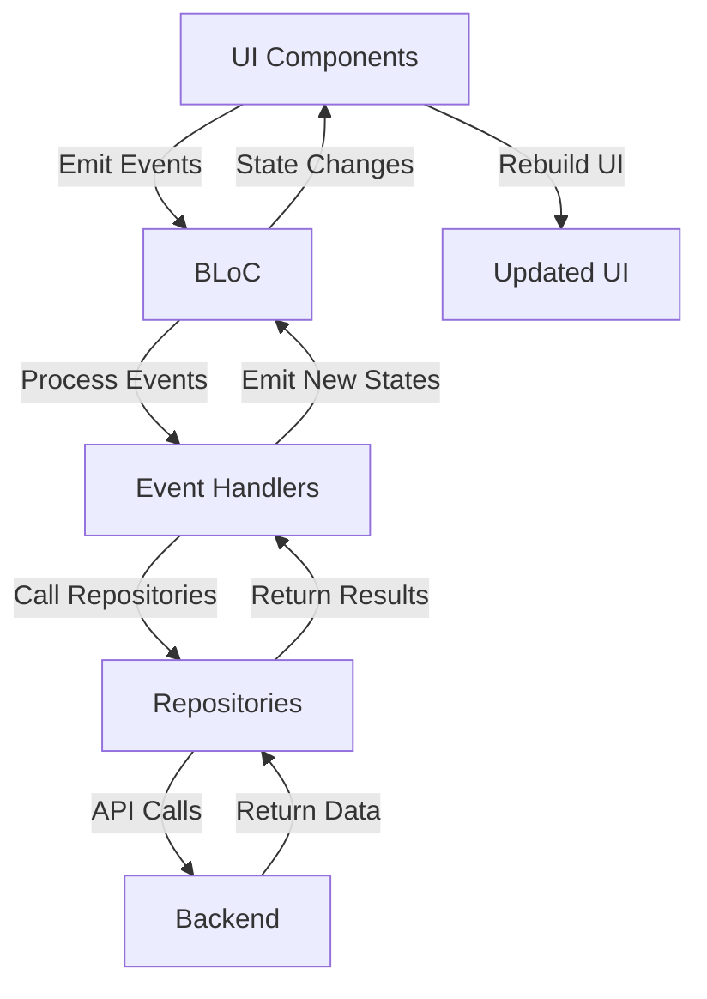
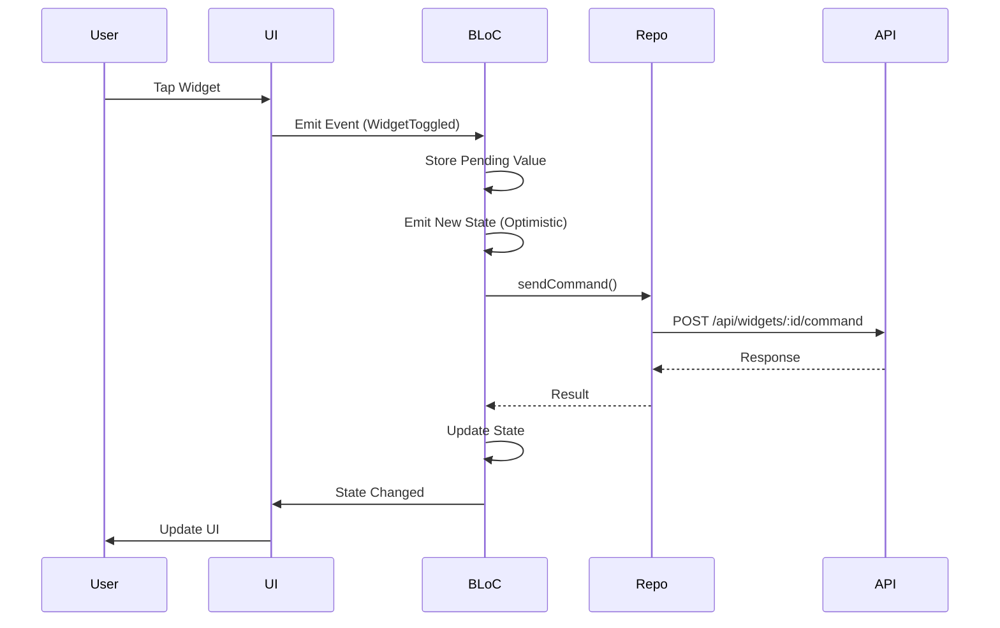
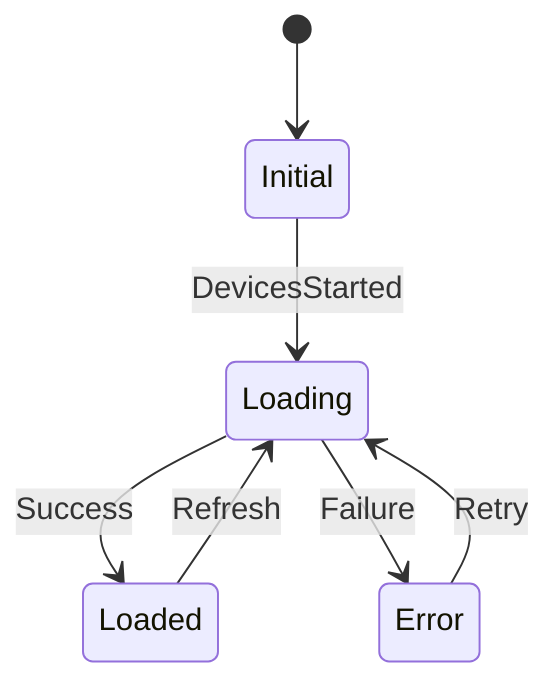
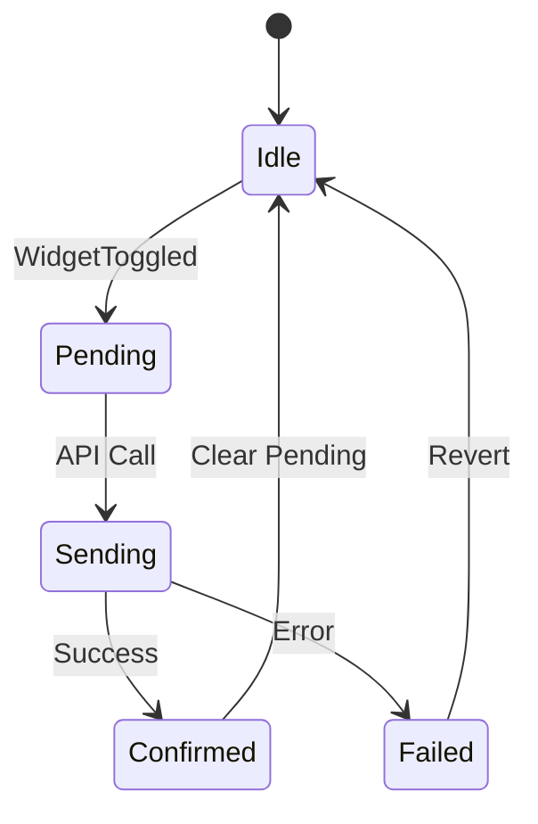

# State Management

การจัดการ State ด้วย BLoC Pattern ใน Flutter Application

State management using BLoC Pattern in Flutter application.

## 🏗️ BLoC Architecture



## 📦 BLoC Pattern Components

### 1. Events

**Purpose**: Represent user interactions or system events

**Location**: `lib/features/{feature}/bloc/{feature}_event.dart`

```dart
// Base event class
abstract class DevicesEvent {}

// Specific events
class DevicesStarted extends DevicesEvent {
  final int? roomId;
  final Duration interval;

  const DevicesStarted({this.roomId, this.interval});
}

class WidgetToggled extends DevicesEvent {
  final int widgetId;

  const WidgetToggled(this.widgetId);
}

class WidgetValueChanged extends DevicesEvent {
  final int widgetId;
  final String value;

  const WidgetValueChanged(this.widgetId, this.value);
}

class DevicesRequested extends DevicesEvent {
  final int? roomId;

  const DevicesRequested({this.roomId});
}

class WidgetsPollingStarted extends DevicesEvent {
  final int? roomId;
  final Duration interval;

  const WidgetsPollingStarted({this.roomId, required this.interval});
}

class WidgetsPollingStopped extends DevicesEvent {}
```

### 2. States

**Purpose**: Represent UI state

**Location**: `lib/features/{feature}/bloc/{feature}_state.dart`

```dart
// Base state class
abstract class DevicesState {
  final DevicesStatus status;
  final List<DeviceWidget> widgets;
  final Map<int, String> widgetStates;
  final String? errorMessage;

  const DevicesState({
    this.status = DevicesStatus.initial,
    this.widgets = const [],
    this.widgetStates = const {},
    this.errorMessage,
  });

  DevicesState copyWith({
    DevicesStatus? status,
    List<DeviceWidget>? widgets,
    Map<int, String>? widgetStates,
    String? errorMessage,
  }) {
    return DevicesState(
      status: status ?? this.status,
      widgets: widgets ?? this.widgets,
      widgetStates: widgetStates ?? this.widgetStates,
      errorMessage: errorMessage ?? this.errorMessage,
    );
  }
}

enum DevicesStatus {
  initial,
  loading,
  loaded,
  error,
}
```

### 3. BLoC

**Purpose**: Business logic and state transformation

**Location**: `lib/features/{feature}/bloc/{feature}_bloc.dart`

```dart
class DevicesBloc extends Bloc<DevicesEvent, DevicesState> {
  final WidgetRepository widgetRepo;
  final RoomRepository roomRepo;
  final DeviceRepository deviceRepo;

  Timer? _sensorPollTimer;
  Timer? _fullPollTimer;

  // Prevent snap-back during user interaction
  final Map<int, String> _pendingValueByWidgetId = {};
  final Map<int, DateTime> _pendingAtByWidgetId = {};
  static const _pendingTtl = Duration(seconds: 10);

  DevicesBloc({
    required this.widgetRepo,
    required this.roomRepo,
    required this.deviceRepo,
  }) : super(const DevicesState()) {
    // Register event handlers
    on<DevicesStarted>(_onStarted);
    on<DevicesRequested>(_onDevicesRequested);
    on<WidgetToggled>(_onWidgetToggled);
    on<WidgetValueChanged>(_onWidgetValueChanged);
    on<WidgetsPollingStarted>(_onWidgetsPollingStarted);
    on<WidgetsPollingStopped>(_onWidgetsPollingStopped);
  }

  @override
  Future<void> close() {
    _sensorPollTimer?.cancel();
    _fullPollTimer?.cancel();
    return super.close();
  }
}
```

### 4. Event Handlers

```dart
Future<void> _onStarted(
  DevicesStarted event,
  Emitter<DevicesState> emit,
) async {
  emit(state.copyWith(status: DevicesStatus.loading));

  try {
    final rooms = await roomRepo.fetchRooms();
    final devices = await deviceRepo.fetchDevices();

    emit(state.copyWith(
      status: DevicesStatus.loaded,
      rooms: rooms,
      devices: devices,
    ));

    // Start polling
    add(WidgetsPollingStarted(
      roomId: event.roomId,
      interval: event.interval,
    ));
  } catch (e) {
    emit(state.copyWith(
      status: DevicesStatus.error,
      errorMessage: 'Failed to load data: $e',
    ));
  }
}

Future<void> _onDevicesRequested(
  DevicesRequested event,
  Emitter<DevicesState> emit,
) async {
  try {
    final widgets = await widgetRepo.fetchWidgets(roomId: event.roomId);

    // Filter out pending values
    final filteredWidgets = widgets.map((widget) {
      final pendingValue = _pendingValueByWidgetId[widget.widgetId];
      return pendingValue != null
          ? widget.copyWith(value: pendingValue)
          : widget;
    }).toList();

    _cleanExpiredPendingValues();

    emit(state.copyWith(
      status: DevicesStatus.loaded,
      widgets: filteredWidgets,
      widgetStates: Map.fromEntries(
        filteredWidgets.map((w) => MapEntry(w.widgetId, w.value)),
      ),
    ));
  } catch (e) {
    emit(state.copyWith(
      status: DevicesStatus.error,
      errorMessage: 'Failed to load widgets: $e',
    ));
  }
}

void _cleanExpiredPendingValues() {
  final now = DateTime.now();
  _pendingValueByWidgetId.removeWhere((widgetId, timestamp) {
    final createdAt = _pendingAtByWidgetId[widgetId];
    if (createdAt == null) return true;
    return now.difference(createdAt) > _pendingTtl;
  });
}
```

## 🔗 BLoC Provider Setup

### Main App Configuration

**File**: `lib/main.dart`

```dart
void main() async {
  WidgetsFlutterBinding.ensureInitialized();
  await dotenv.load(fileName: '.env');
  await Firebase.initializeApp();

  runApp(const MyApp());
}

class MyApp extends StatelessWidget {
  const MyApp({super.key});

  @override
  Widget build(BuildContext context) {
    final baseUrl = dotenv.get('BACKEND_API_URL');

    // Create repositories
    final authRepo = AuthRepository(
      api: AuthApi(baseUrl: baseUrl),
      storage: const TokenStorage(),
    );

    return MultiRepositoryProvider(
      providers: [
        RepositoryProvider<AuthRepository>.value(value: authRepo),
        RepositoryProvider<WidgetRepository>(
          create: (_) => WidgetRepository(baseUrl: baseUrl),
        ),
        RepositoryProvider<RoomRepository>(
          create: (_) => RoomRepository(baseUrl: baseUrl),
        ),
        RepositoryProvider<DeviceRepository>(
          create: (_) => DeviceRepository(baseUrl: baseUrl),
        ),
      ],
      child: MultiBlocProvider(
        providers: [
          // Auth BLoC
          BlocProvider<AuthBloc>(
            create: (ctx) => AuthBloc(repo: ctx.read<AuthRepository>())
              ..add(const AuthStarted()),
          ),

          // Devices BLoC
          BlocProvider<DevicesBloc>(
            create: (ctx) => DevicesBloc(
              widgetRepo: ctx.read<WidgetRepository>(),
              roomRepo: ctx.read<RoomRepository>(),
              deviceRepo: ctx.read<DeviceRepository>(),
            )..add(const DevicesStarted()),
          ),

          // Rooms BLoC
          BlocProvider<RoomsBloc>(
            create: (ctx) => RoomsBloc(
              roomRepo: ctx.read<RoomRepository>(),
            )..add(const RoomsStarted()),
          ),
        ],
        child: MaterialApp(
          debugShowCheckedModeBanner: false,
          theme: ThemeData(
            useMaterial3: true,
            colorScheme: ColorScheme.fromSeed(seedColor: Colors.blue),
          ),
          home: const AuthGate(),
        ),
      ),
    );
  }
}
```

## 🎯 State Management Flow



## 📊 Key BLoCs

### AuthBloc

**Purpose**: Manage authentication state

```dart
class AuthBloc extends Bloc<AuthEvent, AuthState> {
  final AuthRepository _repo;

  AuthBloc({required AuthRepository repo})
      : _repo = repo,
        super(const AuthUnknown()) {
    on<AuthStarted>(_onStarted);
    on<AuthLoggedIn>(_onLoggedIn);
    on<AuthLogoutRequested>(_onLogoutRequested);
}

enum AuthStatus { unknown, authenticated, unauthenticated }
```

### DevicesBloc

**Purpose**: Manage device and widget state

```dart
class DevicesBloc extends Bloc<DevicesEvent, DevicesState> {
  // Manages widgets, polling, pending values
  // Handles commands and updates
}
```

### RoomsBloc

**Purpose**: Manage room list

```dart
class RoomsBloc extends Bloc<RoomsEvent, RoomsState> {
  final RoomRepository roomRepo;

  RoomsBloc({required this.roomRepo}) : super(const RoomsInitial()) {
    on<RoomsStarted>(_onStarted);
    on<RoomSelected>(_onRoomSelected);
    on<CreateRoom>(_onCreateRoom);
  }
}
```

## 🔄 State Transitions

### Initial Loading



### Widget Interaction



## 🎨 UI Integration

### BLoCBuilder

```dart
BlocBuilder<DevicesBloc, DevicesState>(
  builder: (context, state) {
    if (state.status == DevicesStatus.loading) {
      return CircularProgressIndicator();
    }

    if (state.status == DevicesStatus.error) {
      return Text('Error: ${state.errorMessage}');
    }

    if (state.status == DevicesStatus.loaded) {
      return WidgetGrid(widgets: state.widgets);
    }

    return SizedBox.shrink();
  },
)
```

### BlocListener

```dart
BlocListener<DevicesBloc, DevicesState>(
  listener: (context, state) {
    if (state.status == DevicesStatus.error) {
      ScaffoldMessenger.of(context).showSnackBar(
        SnackBar(content: Text(state.errorMessage!)),
      );
    }
  },
  child: /* Your UI */,
)
```

### BlocConsumer

```dart
BlocConsumer<DevicesBloc, DevicesState>(
  listener: (context, state) {
    // Handle side effects (show errors, navigate, etc.)
    if (state.status == DevicesStatus.error) {
      showError(state.errorMessage);
    }
  },
  builder: (context, state) {
    // Build UI based on state
    return YourWidget(state: state);
  },
)
```

## ⚡ Performance Optimization

### State Updates Debouncing

```dart
Timer? _debounceTimer;

void _onSearchChanged(String query) {
  _debounceTimer?.cancel();
  _debounceTimer = Timer(Duration(milliseconds: 500), () {
    add(PerformSearch(query));
  });
}
```

### Selective Rebuilds

```dart
// Only rebuild when specific value changes
BlocBuilder<DevicesBloc, DevicesState>(
  buildWhen: (previous, current) {
    return previous.widgetStates.length != current.widgetStates.length;
  },
  builder: (context, state) {
    return WidgetCount(count: state.widgetStates.length);
  },
)
```

### Memoization

```dart
class WidgetCard extends StatelessWidget {
  final DeviceWidget widget;

  const WidgetCard({super.key, required this.widget});

  @override
  Widget build(BuildContext context) {
    return Card(
      key: ValueKey(widget.widgetId), // Prevent unnecessary rebuilds
      child: /* Widget content */,
    );
  }
}
```

## 🧪 Testing BLoC

### Unit Test Example

```dart
void main() {
  late DevicesBloc devicesBloc;
  late MockWidgetRepository mockWidgetRepo;

  setUp(() {
    mockWidgetRepo = MockWidgetRepository();
    devicesBloc = DevicesBloc(
      widgetRepo: mockWidgetRepo,
      roomRepo: mockRoomRepo,
      deviceRepo: mockDeviceRepo,
    );
  });

  tearDown(() {
    devicesBloc.close();
  });

  test('emits loaded state when devices are fetched successfully', () async {
    // Arrange
    final widgets = [testWidget1, testWidget2];
    when(mockWidgetRepo.fetchWidgets(roomId: 1))
        .thenAnswer((_) async => widgets);

    // Act
    devicesBloc.add(DevicesRequested(roomId: 1));

    // Assert
    expectLater(
      devicesBloc.stream,
      emitsInOrder([
        DevicesState(status: DevicesStatus.loading),
        DevicesState(
          status: DevicesStatus.loaded,
          widgets: widgets,
        ),
      ]),
    );
  });
}
```

## 🐛 Common Issues

### State Not Updating

**Possible Causes**:
- Event not being emitted
- Event handler not registered
- State not emitted

**Solutions**:
- Check BlocProvider is above widget
- Verify event is registered in `on<>`
- Ensure state is emitted, not just modified

### UI Not Rebuilding

**Possible Causes**:
- Wrong buildWhen condition
- State equality issue
- Not using BlocBuilder/BlocListener

**Solutions**:
- Check buildWhen logic
- Ensure state is immutable
- Use proper Bloc widgets

### Memory Leaks

**Possible Causes**:
- BLoC not closed
- Timers not cancelled
- Streams not cancelled

**Solutions**:
- Always call `bloc.close()` in dispose
- Cancel timers in close()
- Cancel subscriptions properly

---

**Previous**: [Widget Management Flow](./widget-management-flow) | **Next**: [Clean Architecture](./clean-architecture) →
