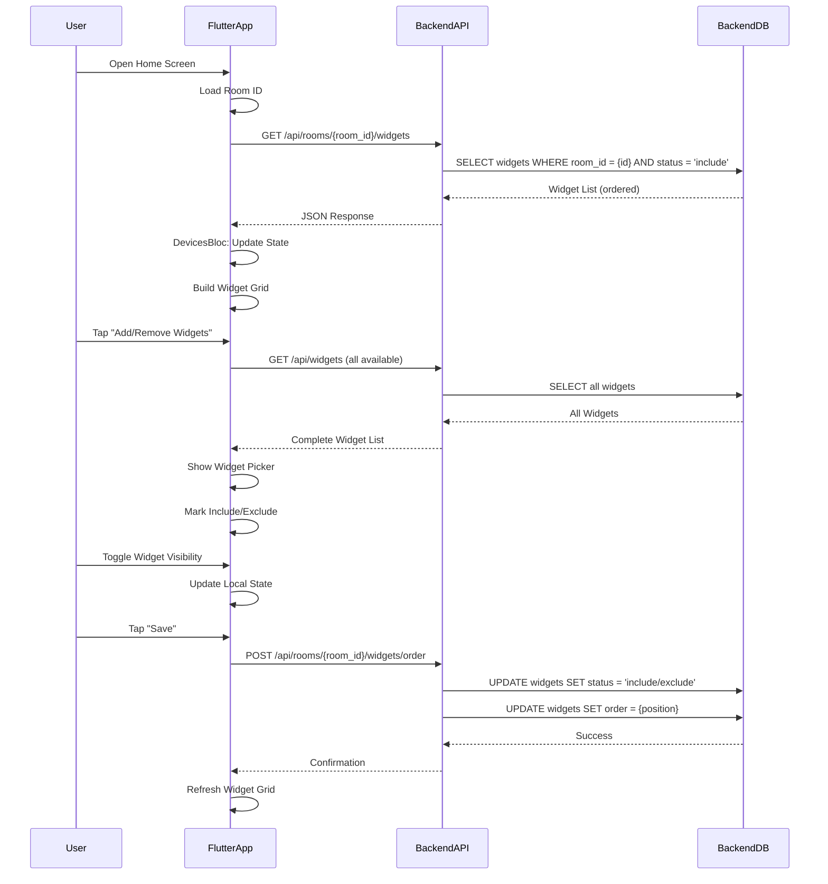
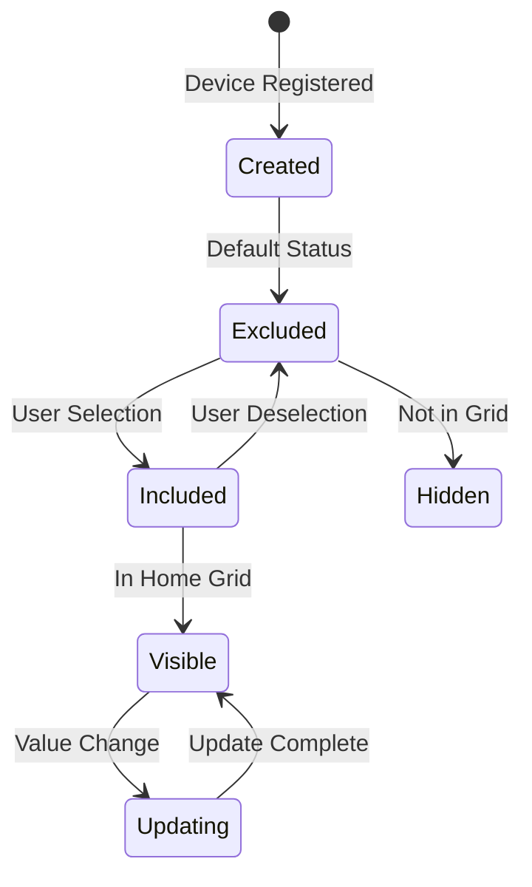

# Widget Management Flow

กระบวนการจัดการและแสดงผล Widget บนหน้าจอ

Widget display and management process on home screen.

## 🔄 Widget Management Sequence



## 📊 Widget Data Model

### Widget Entity

```dart
class DeviceWidget {
  final int widgetId;
  final Device device;
  final Capability capability;
  final String status;      // 'include' or 'exclude'
  final int order;          // Display position
  final String value;        // Current value

  bool get included => status.toLowerCase() == 'include';

  DeviceWidget copyWith({
    int? widgetId,
    Device? device,
    Capability? capability,
    String? status,
    int? order,
    String? value,
  }) {
    return DeviceWidget(
      widgetId: widgetId ?? this.widgetId,
      device: device ?? this.device,
      capability: capability ?? this.capability,
      status: status ?? this.status,
      order: order ?? this.order,
      value: value ?? this.value,
    );
  }
}
```

### Database Schema

```sql
CREATE TABLE widgets (
    id SERIAL PRIMARY KEY,
    widget_order INTEGER NOT NULL DEFAULT 0,
    widget_status VARCHAR(20) NOT NULL DEFAULT 'exclude',
    value TEXT,
    device_id VARCHAR(255) NOT NULL,
    capability_id INTEGER NOT NULL,
    room_id INTEGER,
    FOREIGN KEY (device_id) REFERENCES devices(device_id),
    FOREIGN KEY (capability_id) REFERENCES capabilities(id),
    FOREIGN KEY (room_id) REFERENCES rooms(id)
);

CREATE INDEX idx_widgets_room_status ON widgets(room_id, widget_status);
CREATE INDEX idx_widgets_order ON widgets(room_id, widget_order);
```

## 🔧 Backend Implementation

### Widget Handler

**File**: `project-management-backend/internal/infrastructure/http/widget_handler.go`

```go
type WidgetHandler struct {
    usecase usecase.WidgetUsecase
}

func (h *WidgetHandler) ListByRoom(c *fiber.Ctx) error {
    roomID, err := c.ParamsInt("room_id")
    if err != nil {
        return c.Status(400).JSON(fiber.Map{"error": "Invalid room ID"})
    }

    widgets, err := h.usecase.GetWidgetsByRoom(roomID)
    if err != nil {
        return c.Status(500).JSON(fiber.Map{"error": "Failed to fetch widgets"})
    }

    // Filter only included widgets, ordered
    var includedWidgets []*domain.Widget
    for _, widget := range widgets {
        if widget.WidgetStatus == "include" {
            includedWidgets = append(includedWidgets, widget)
        }
    }

    return c.JSON(includedWidgets)
}

func (h *WidgetHandler) ChangeOrder(c *fiber.Ctx) error {
    roomID, err := c.ParamsInt("room_id")
    if err != nil {
        return c.Status(400).JSON(fiber.Map{"error": "Invalid room ID"})
    }

    type OrderRequest struct {
        WidgetOrders []int `json:"widget_orders"` // Array of widget IDs in order
    }

    req := new(OrderRequest)
    if err := c.BodyParser(req); err != nil {
        return c.Status(400).JSON(fiber.Map{"error": "Invalid request"})
    }

    if err := h.usecase.ChangeOrder(roomID, req.WidgetOrders); err != nil {
        return c.Status(500).JSON(fiber.Map{"error": "Failed to update order"})
    }

    return c.JSON(fiber.Map{"status": "success"})
}
```

### Widget Use Case

**File**: `project-management-backend/internal/core/usecase/widget_usecase.go`

```go
func (u *widgetUsecase) ChangeOrder(roomID uint, widgetOrders []uint) error {
    return u.repo.ChangeOrder(roomID, widgetOrders)
}
```

### Repository Implementation

**File**: `project-management-backend/internal/infrastructure/gorm/widget_repo.go`

```go
func (r *WidgetRepository) ChangeOrder(roomID uint, widgetOrders []uint) error {
    return r.db.Transaction(func(tx *gorm.DB) error {
        for i, widgetID := range widgetOrders {
            if err := tx.Model(&Widget{}).
                Where("id = ? AND room_id = ?", widgetID, roomID).
                Update("widget_order", i).Error; err != nil {
                return err
            }
        }
        return nil
    })
}

func (r *WidgetRepository) UpdateStatus(id uint, status string) error {
    return r.db.Model(&Widget{}).
        Where("id = ?", id).
        Update("widget_status", status).Error
}
```

## 📱 Flutter Implementation

### Widget Picker

**File**: `PM_Mobile_Frontend/lib/features/home/ui/widgets/bottom_sheets/widget_picker_sheet.dart`

```dart
class WidgetPickerSheet extends StatefulWidget {
  final List<DeviceWidget> allWidgets;
  final List<int> initiallyIncluded;

  @override
  Widget build(BuildContext context) {
    return Container(
      height: MediaQuery.of(context).size.height * 0.7,
      child: Column(
        children: [
          // Header
          Padding(
            padding: const EdgeInsets.all(16),
            child: Text(
              'Manage Widgets',
              style: TextStyle(fontSize: 20, fontWeight: FontWeight.bold),
            ),
          ),

          // Widget List
          Expanded(
            child: ListView.builder(
              itemCount: allWidgets.length,
              itemBuilder: (context, index) {
                final widget = allWidgets[index];
                final isIncluded = initiallyIncluded.contains(widget.widgetId);

                return CheckboxListTile(
                  title: Text(widget.capability.name),
                  subtitle: Text(widget.device.deviceName),
                  value: isIncluded,
                  onChanged: (bool? value) {
                    setState(() {
                      if (value == true) {
                        initiallyIncluded.add(widget.widgetId);
                      } else {
                        initiallyIncluded.remove(widget.widgetId);
                      }
                    });
                  },
                );
              },
            ),
          ),

          // Save Button
          Padding(
            padding: const EdgeInsets.all(16),
            child: ElevatedButton(
              onPressed: () {
                context.read<DevicesBloc>().add(
                  WidgetSelectionSaved(
                    roomId: currentRoomId,
                    includedWidgetIds: initiallyIncluded,
                  ),
                );
                Navigator.pop(context);
              },
              child: Text('Save Selection'),
            ),
          ),
        ],
      ),
    );
  }
}
```

### BLoC Event Handling

**File**: `PM_Mobile_Frontend/lib/features/home/bloc/devices_bloc.dart`

```dart
Future<void> _onWidgetSelectionSaved(
  WidgetSelectionSaved event,
  Emitter<DevicesState> emit,
) async {
  emit(state.copyWith(status: DevicesStatus.loading));

  try {
    // Get all widgets for this room
    final allWidgets = await widgetRepo.fetchWidgets(roomId: event.roomId);

    // Determine include/exclude
    final updates = allWidgets.map((widget) {
      final included = event.includedWidgetIds.contains(widget.widgetId);
      return WidgetUpdate(
        widgetId: widget.widgetId,
        status: included ? 'include' : 'exclude',
      );
    }).toList();

    // Send to backend
    await widgetRepo.updateWidgetVisibility(
      roomId: event.roomId,
      updates: updates,
    );

    // Refresh widget list
    add(DevicesRequested(roomId: event.roomId));
  } catch (e) {
    emit(state.copyWith(
      status: DevicesStatus.error,
      errorMessage: 'Failed to save selection: $e',
    ));
  }
}
```

### Repository Method

```dart
class WidgetRepository {
  Future<void> updateWidgetVisibility({
    required int roomId,
    required List<WidgetUpdate> updates,
  }) async {
    final response = await httpClient.post(
      Uri.parse('$baseUrl/api/rooms/$roomId/widgets/order'),
      headers: {'Content-Type': 'application/json'},
      body: jsonEncode({'widget_orders': updates}),
    );

    if (response.statusCode != 200) {
      throw Exception('Failed to update visibility');
    }
  }
}
```

## 🎨 Widget Display

### Widget Grid Layout

```dart
class WidgetGrid extends StatelessWidget {
  final List<DeviceWidget> widgets;

  @override
  Widget build(BuildContext context) {
    return GridView.builder(
      gridDelegate: SliverGridDelegateWithFixedCrossAxisCount(
        crossAxisCount: 2,
        childAspectRatio: 1.5,
        crossAxisSpacing: 16,
        mainAxisSpacing: 16,
      ),
      itemCount: widgets.length,
      itemBuilder: (context, index) {
        return WidgetCard(widget: widgets[index]);
      },
    );
  }
}
```

### Widget Types

| Widget Type | Control Type | UI Component | Value Range |
|-------------|--------------|--------------|-------------|
| Toggle | toggle | Switch | ON/OFF |
| Slider | slider | Slider | 0-100 |
| Mode | mode | Dropdown | Multiple options |
| Text | text | TextField | Any text |
| Sensor | sensor | Display | Read-only |

## 🔄 Visibility Management

### Status Values

- **`include`**: Widget shown on home screen
- **`exclude`**: Widget hidden from home screen

### Order Management

```sql
-- Widgets are ordered by widget_order within each room
SELECT * FROM widgets
WHERE room_id = 1 AND widget_status = 'include'
ORDER BY widget_order ASC;
```

## 📊 Widget Lifecycle



## ⚙️ Configuration

### Backend Settings

```env
# Widget Configuration
DEFAULT_WIDGET_STATUS=exclude
MAX_WIDGETS_PER_ROOM=50
WIDGET_GRID_COLUMNS=2
```

### Flutter Settings

```dart
class WidgetConfig {
  static const int maxWidgetsPerRow = 2;
  static const double widgetAspectRatio = 1.5;
  static const double widgetSpacing = 16.0;
}
```

## 🧪 Testing Widget Management

### Test Widget Visibility

```dart
testWidgets('Toggle widget visibility', (WidgetTester tester) async {
  // Build widget picker
  await tester.pumpWidget(MaterialApp(
    home: WidgetPickerSheet(
      allWidgets: testWidgets,
      initiallyIncluded: [],
    ),
  ));

  // Tap first widget
  await tester.tap(find.byType(CheckboxListTile).first);
  await tester.pump();

  // Tap save
  await tester.tap(find.text('Save Selection'));
  await tester.pump();

  // Verify API call
  verify(mockWidgetRepo.updateWidgetVisibility(
    roomId: anyNamed('roomId'),
    updates: argThat(isA<List<WidgetUpdate>>()),
  ));
});
```

## 🐛 Troubleshooting

### Widgets Not Showing

**Checklist**:
1. ✅ Widget status is 'include'
2. ✅ Room ID matches
3. ✅ Database query correct
4. ✅ Flutter app polling

### Order Not Saving

**Checklist**:
1. ✅ API request successful
2. ✅ Database update committed
3. ✅ Frontend refreshes after save

### Performance Issues

**Possible Causes**:
- Too many widgets in one room
- Inefficient database queries
- Excessive polling frequency

**Solutions**:
- Limit widgets per room
- Add database indexes
- Implement pagination or virtual scrolling

---

**Previous**: [Command Flow](./command-flow) | **Next**: [State Management](./state-management) →
