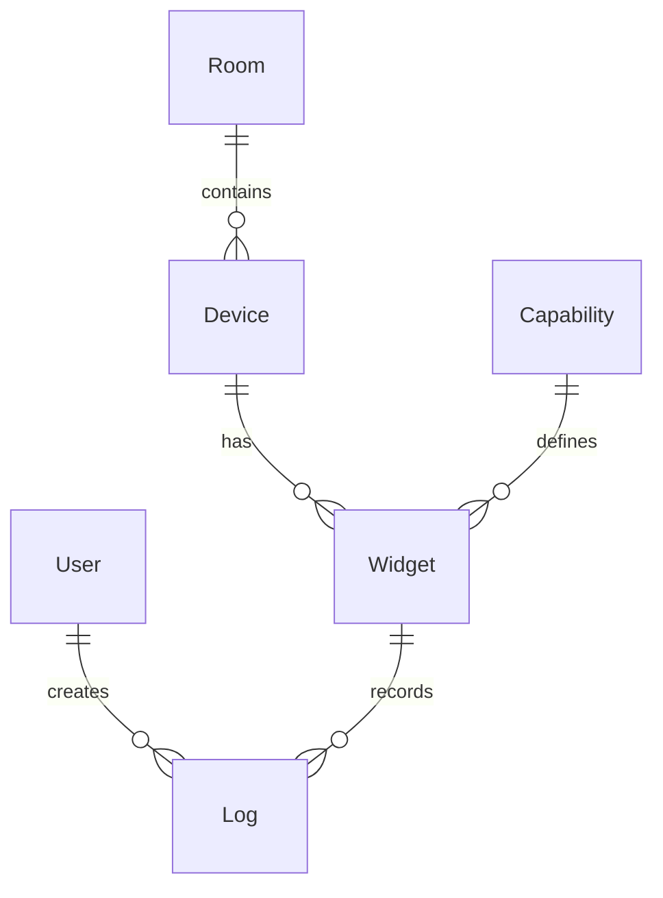

# Database Schema

Complete database schema and relationships based on GORM models.

## Entity Relationships



## Tables

### users

**Primary Key**: `email` (string, no auto-increment)

```go
type User struct {
    Email       string `gorm:"primaryKey;autoIncrement:false"`
    Name        string
    Role        string
}
```

**Fields**:
- `email` (PK) - User's email address
- `name` - User's full name
- `role` - User role (admin, user, etc.)

**Relationships**:
- Has many Logs (as Actor)

---

### rooms

**Primary Key**: `id` (uint, auto-increment)

```go
type Room struct {
    ID      uint   `gorm:"primaryKey"`
    Name    string `gorm:"column:room_name"`
    Devices []Device `gorm:"foreignKey:RoomID"`
}
```

**Fields**:
- `id` (PK) - Auto-increment ID
- `room_name` - Room name

**Relationships**:
- Has many Devices (CASCADE on update, SET NULL on delete)

---

### devices

**Primary Key**: `device_id` (string, no auto-increment)

```go
type Device struct {
    DeviceID      string    `gorm:"primaryKey;autoIncrement:false"`
    DeviceName    string
    DeviceType    string
    RoomID        *uint
    Room          *Room     `gorm:"constraint:OnUpdate:CASCADE,OnDelete:SET NULL;"`
    LastHeartbeat time.Time
    Widgets       []Widget  `gorm:"foreignKey:DeviceID"`
}
```

**Fields**:
- `device_id` (PK) - Unique device identifier (string, e.g., "ESP32-12345678")
- `device_name` - Device name
- `device_type` - Device type (e.g., "smart_switch")
- `room_id` (FK, nullable) - Room ID
- `last_heartbeat` - Timestamp of last heartbeat

**Relationships**:
- Belongs to Room (optional)
- Has many Widgets

---

### capabilities

**Primary Key**: `id` (uint, auto-increment via gorm.Model)

```go
type Capability struct {
    gorm.Model
    CapabilityType string
    ControlType    string
    Widgets        []Widget `gorm:"foreignKey:CapabilityID"`
}
```

**gorm.Model includes**:
- `id` (PK) - Auto-increment
- `created_at` - Creation timestamp
- `updated_at` - Last update timestamp
- `deleted_at` - Soft delete timestamp

**Fields**:
- `capability_type` - Type (e.g., "power", "temperature", "status")
- `control_type` - Control type (e.g., "toggle", "sensor", "heartbeat")

**Relationships**:
- Has many Widgets

---

### widgets

**Primary Key**: `id` (uint, auto-increment via gorm.Model)

```go
type Widget struct {
    gorm.Model
    WidgetStatus   string
    Value          string
    WidgetOrder    uint       `gorm:"column:widget_order"`
    CapabilityID   uint       `gorm:"not null"`
    Capability     Capability `gorm:"foreignKey:CapabilityID;references:ID"`
    DeviceID       string     `gorm:"not null"`
    Device         Device     `gorm:"constraint:OnUpdate:CASCADE,OnDelete:CASCADE;"`
}
```

**Fields**:
- `id` (PK) - Auto-increment
- `widget_status` - Status (e.g., "include", "exclude")
- `value` - Current value as string
- `widget_order` - Display order
- `capability_id` (FK, not null) - Capability reference
- `device_id` (FK, not null) - Device reference

**Relationships**:
- Belongs to Capability
- Belongs to Device (CASCADE on update and delete)
- Has many Logs

---

### logs

**Primary Key**: `id` (uint, auto-increment via gorm.Model)

```go
type Log struct {
    gorm.Model
    Value     string
    EventType string
    Actor     string
    User      User   `gorm:"foreignKey:Actor;references:Email"`
    WidgetID  uint   `gorm:"not null"`
    Widget    Widget `gorm:"foreignKey:WidgetID;references:ID;constraint:OnUpdate:CASCADE,OnDelete:CASCADE;"`
}
```

**Fields**:
- `id` (PK) - Auto-increment
- `value` - Log value (as string)
- `event_type` - Event type
- `actor` (FK) - User email who created the log
- `widget_id` (FK, not null) - Widget reference

**Relationships**:
- Belongs to User (via Actor → Email)
- Belongs to Widget (CASCADE on update and delete)

---

## Key Constraints

### Foreign Key Constraints

| Table | Foreign Key | References | On Update | On Delete |
|-------|-------------|------------|-----------|-----------|
| devices | room_id | rooms.id | CASCADE | SET NULL |
| widgets | device_id | devices.device_id | CASCADE | CASCADE |
| widgets | capability_id | capabilities.id | - | - |
| logs | actor | users.email | - | - |
| logs | widget_id | widgets.id | CASCADE | CASCADE |

### Important Notes

1. **Device ID** is a string, not auto-increment
2. **User Email** is the primary key, not an integer ID
3. **Soft Deletes** enabled via `gorm.Model` (Capabilities, Widgets, Logs)
4. **NULL Room**: Devices can exist without being assigned to a room
5. **Cascade Delete**: Deleting a device deletes all its widgets
6. **Cascade Delete**: Deleting a widget deletes all its logs

---

**Previous**: [Clean Architecture](./clean-architecture) | **Next**: [MQTT Integration](./mqtt) →
