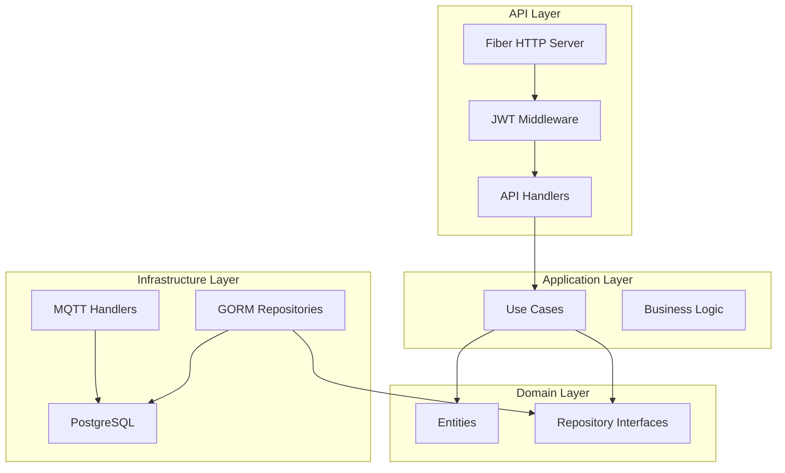
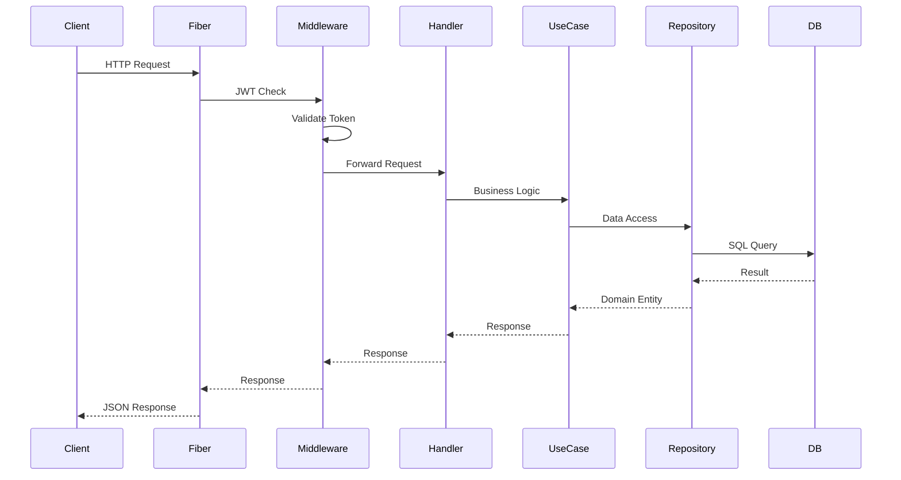

# Backend Overview

ภาพรวม Go Backend API ของระบบ PM IoT

Overview of the PM IoT Go Backend API.

## 🏗️ System Architecture



## 📁 Project Structure

```
project-management-backend/
├── cmd/app/                        # Application entry point
│   ├── main.go                      # Main application
│   ├── router.go                    # Route definitions
│   ├── wire.go                      # Wire DI injector
│   └── wire_gen.go                  # Generated code
│
├── internal/                        # Private application code
│   ├── auth/                        # Authentication module
│   │   ├── handler.go                # Auth HTTP handlers
│   │   ├── service.go                # Auth business logic
│   │   ├── repository.go             # Auth data access
│   │   └── model.go                  # Auth models
│   │
│   ├── core/                        # Core business logic
│   │   ├── domain/                   # Domain entities
│   │   │   ├── user.go               # User entity
│   │   │   ├── device.go             # Device entity
│   │   │   ├── room.go               # Room entity
│   │   │   ├── widget.go             # Widget entity
│   │   │   ├── capability.go         # Capability entity
│   │   │   └── log.go                # Log entity
│   │   │
│   │   └── usecase/                  # Use cases
│   │       ├── device_usecase.go     # Device operations
│   │       ├── widget_usecase.go     # Widget operations
│   │       ├── room_usecase.go       # Room operations
│   │       ├── device_command_usecase.go
│   │       └── record_log_usecase.go
│   │
│   ├── infrastructure/               # Infrastructure implementations
│   │   ├── gorm/                     # GORM repositories
│   │   │   ├── device_repo.go
│   │   │   ├── widget_repo.go
│   │   │   ├── room_repo.go
│   │   │   ├── capability_repo.go
│   │   │   ├── user_repo.go
│   │   │   └── recorder_repo.go
│   │   │
│   │   ├── http/                     # HTTP handlers
│   │   │   ├── device_handler.go
│   │   │   ├── widget_handler.go
│   │   │   ├── room_handler.go
│   │   │   ├── user_handler.go
│   │   │   └── command_handler.go
│   │   │
│   │   └── mqtt/                     # MQTT handlers
│   │       ├── device_handler.go     # Device registration
│   │       ├── sensor_handler.go     # Sensor data
│   │       ├── sensor_subscriber.go
│   │       ├── device_commander.go   # Command sender
│   │       └── pair_commander.go     # Device pairing
│   │
│   ├── middleware/                   # HTTP middleware
│   │   └── jwt.go                    # JWT authentication
│   │
│   └── provider/                     # Provider sets
│       └── provider.go               # Wire providers
│
├── migrations/                       # Database migrations (optional)
├── .env                              # Environment variables
├── go.mod                            # Go modules
└── go.sum                            # Dependencies
```

## 🔑 Key Technologies

### Core Framework

| Technology | Version | Purpose |
|------------|---------|---------|
| **Go** | 1.25+ | Programming Language |
| **Fiber** | 2.52+ | Web Framework |

### Database

| Technology | Version | Purpose |
|------------|---------|---------|
| **PostgreSQL** | 13+ | Primary Database |
| **GORM** | 1.31+ | ORM Framework |

### Messaging

| Technology | Version | Purpose |
|------------|---------|---------|
| **Eclipse Paho MQTT** | 1.5+ | MQTT Client |

### Authentication

| Technology | Version | Purpose |
|------------|---------|---------|
| **JWT (golang-jwt/jwt)** | 5.3+ | Token Generation |
| **Firebase Admin SDK** | Latest | Firebase Token Verification |

### Development Tools

| Technology | Purpose |
|------------|---------|
| **Wire** | 0.7+ | Dependency Injection |
| **Godotenv** | 1.5+ | Environment Variables |
| **Crypto** | Latest | Password Hashing |

## 🎯 API Endpoints

### Authentication

```
POST /api/auth/register    - Register new user
POST /api/auth/login       - Login with Firebase token
GET  /api/secret/data      - Protected endpoint
```

### Devices

```
GET    /api/devices              - List all devices
GET    /api/devices/:id          - Get device details
PUT    /api/devices/:id          - Update device
POST   /api/devices/:id/pair     - Pair to room
POST   /api/devices/:id/unpair   - Unpair from room
```

### Rooms

```
GET    /api/rooms                - List all rooms
POST   /api/rooms                - Create room
GET    /api/rooms/:id            - Get room details
PUT    /api/rooms/:id            - Update room
DELETE /api/rooms/:id            - Delete room
POST   /api/rooms/:id/devices    - Add device to room
GET    /api/rooms/:id/devices    - List room devices
POST   /api/rooms/:id/widgets/order  - Update widget order
GET    /api/rooms/:id/widgets    - Get room widgets
```

### Widgets

```
GET    /api/widgets              - List all widgets
GET    /api/widgets/:id          - Get widget details
GET    /api/widgets/:id/logs     - Get widget history
POST   /api/widgets              - Create widget
PUT    /api/widgets/:id          - Update widget
PATCH  /api/widgets/:id/status   - Change widget status
DELETE /api/widgets/:id          - Delete widget
POST   /api/widgets/:id/command  - Send command to device
```

### Users

```
GET    /api/users                - List users
POST   /api/users                - Create user
GET    /api/users/:id            - Get user details
DELETE /api/users/:id            - Delete user
POST   /api/users/:id/upload-profile  - Upload profile image
```

## 🔐 Security

### JWT Authentication

```go
// JWT Middleware
func JWTMiddleware() fiber.Handler {
    return func(c *fiber.Ctx) error {
        authHeader := c.Get("Authorization")
        token := strings.TrimPrefix(authHeader, "Bearer ")

        claims, err := jwt.Parse(token, func(token *jwt.Token) (interface{}, error) {
            return []byte(os.Getenv("JWT_SECRET")), nil
        })

        if err != nil || !token.Valid {
            return c.Status(401).JSON(fiber.Map{"error": "Invalid token"})
        }

        c.Locals("user_id", claims.(jwt.MapClaims)["user_id"])
        return c.Next()
    }
}
```

### CORS Configuration

```go
app.Use(cors.New(cors.Config{
    AllowOrigins:     strings.Split(os.Getenv("CORS_ALLOWED_ORIGINS"), ","),
    AllowHeaders:     []string{"Origin", "Content-Type", "Authorization"},
    AllowMethods:     []string{"GET", "POST", "PUT", "DELETE", "PATCH"},
    AllowCredentials: true,
    MaxAge:          12 * time.Hour,
}))
```

## 📊 Database Schema

### Entity Relationships

```sql
users (id, email, name, role, password_hash, profile_path)
  |
  +-- rooms (id, name, user_id)
       |
       +-- devices (device_id, device_name, device_type, last_heartbeat, room_id)
              |
              +-- widgets (id, widget_order, widget_status, value, device_id, capability_id, room_id)
              |
              +-- capabilities (id, capability_type, control_type)
              |
              +-- logs (id, widget_id, actor, value, event_type, created_at)
```

## 🔄 Request/Response Flow



## ⚙️ Configuration

### Environment Variables

```env
# Server
SERVER_PORT=3000
SERVER_HOST=0.0.0.0

# Database
DB_HOST=localhost
DB_PORT=5432
DB_USER=pm_user
DB_PASSWORD=pm_password
DB_NAME=pm_iot
DB_SSLMODE=disable

# MQTT
MQTT_BROKER=tcp://localhost:1883
MQTT_CLIENT_ID=go-backend-server

# JWT
JWT_SECRET=your_secret_key_here
JWT_EXPIRATION=24h

# Firebase
FIREBASE_PROJECT_ID=your_project_id

# CORS
CORS_ALLOWED_ORIGINS=http://localhost:3000,http://localhost:8080
```

## 🚀 Running the Application

### Development

```bash
# Install dependencies
go mod download

# Run application
go run cmd/app/main.go

# Run with specific environment
go run cmd/app/main.go --env .env.development
```

### Production

```bash
# Build binary
go build -o pm-api cmd/app/main.go

# Run binary
./pm-api

# Or with environment
./pm-api --env .env.production
```

### Docker

```bash
# Build image
docker build -t pm-backend .

# Run container
docker run -p 3000:3000 pm-backend
```

## 🧪 Testing

### Unit Tests

```bash
# Run all tests
go test ./...

# Run with coverage
go test -cover ./...

# Run specific package
go test ./internal/core/usecase/
```

### Integration Tests

```bash
# Run integration tests
go test -tags=integration ./...
```

## 📚 Next Steps

- **[Clean Architecture](./clean-architecture)** - Architecture details
- **[Domain Layer](./domain-layer)** - Entities and interfaces
- **[Use Case Layer](./usecase-layer)** - Business logic
- **[Infrastructure Layer](./infrastructure-layer)** - Implementations
- **[Database](./database)** - Database schema and migrations
- **[MQTT Integration](./mqtt)** - MQTT handlers
- **[JWT Authentication](./jwt-authentication)** - Auth system

---

**Previous**: [Frontend Docs](../frontend/intro) | **Next**: [Clean Architecture](./clean-architecture) →
