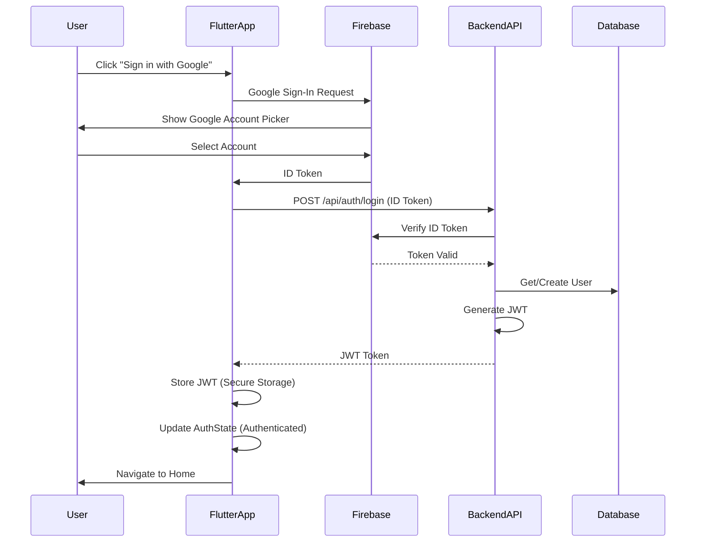

# Authentication Feature

Authentication feature documentation for Firebase + Google Sign-In integration.

## Firebase + Google Sign-In Flow



## Authentication Components

### 1. Firebase Authentication
- **Provider**: Google Sign-In
- **SDK**: firebase_auth, google_sign_in
- **Purpose**: User authentication and identity management

### 2. Backend JWT Token
- **Purpose**: API request authentication
- **Storage**: Flutter Secure Storage
- **Format**: Bearer token

### 3. Auth State Management
- **Pattern**: BLoC (Business Logic Component)
- **States**: Unknown, Authenticated, Unauthenticated

## Files

### Frontend Files
- `lib/features/auth/bloc/auth_bloc.dart` - Auth state management
- `lib/features/auth/bloc/auth_event.dart` - Auth events (Started, LoggedIn, Logout)
- `lib/features/auth/bloc/auth_state.dart` - Auth states
- `lib/features/auth/data/auth_api.dart` - Backend API communication
- `lib/features/auth/data/auth_repository.dart` - Repository pattern
- `lib/features/auth/data/token_storage.dart` - Secure token storage
- `lib/features/auth/ui/pages/sign_in_page.dart` - Google Sign-In UI

### Backend Files
- `internal/auth/handler.go` - Auth HTTP handlers
- `internal/auth/service.go` - Auth business logic
- `internal/auth/model.go` - Auth models
- `internal/middleware/jwt.go` - JWT middleware

## Auth Repository

```dart
// lib/features/auth/data/auth_repository.dart
class AuthRepository {
  final AuthApi _api;
  final TokenStorage _storage;

  Future<String> loginWithGoogle(String idToken) async {
    // Send Firebase ID token to backend
    final response = await _api.login(idToken);

    if (response.token != null) {
      // Store JWT token securely
      await _storage.saveToken(response.token!);
      return response.token!;
    }
    throw Exception('Login failed');
  }

  Future<void> signOut() async {
    // Sign out from Firebase
    await FirebaseAuth.instance.signOut();
    // Clear JWT token
    await _storage.clearToken();
  }

  Future<String?> getSavedToken() async {
    return await _storage.getToken();
  }
}
```

## Sign In Page

```dart
// lib/features/auth/ui/pages/sign_in_page.dart
class SignInPage extends StatelessWidget {
  @override
  Widget build(BuildContext context) {
    return Scaffold(
      body: Center(
        child: Column(
          mainAxisAlignment: MainAxisAlignment.center,
          children: [
            // App Logo/Title
            const Text(
              'PM IoT',
              style: TextStyle(fontSize: 32, fontWeight: FontWeight.bold),
            ),
            const SizedBox(height: 48),

            // Google Sign-In Button
            SignInButton(
              Buttons.Google,
              text: "Sign in with Google",
              onPressed: () async {
                // Trigger Google Sign-In
                final GoogleSignInAccount? googleUser =
                    await GoogleSignIn().signIn();

                if (googleUser != null) {
                  // Get authentication details
                  final GoogleSignInAuthentication googleAuth =
                      await googleUser.authentication;

                  // Send ID token to backend
                  context.read<AuthBloc>().add(
                    AuthLoggedIn(googleAuth.idToken ?? ''),
                  );
                }
              },
            ),
          ],
        ),
      ),
    );
  }
}
```

## Backend Auth Handler

```go
// internal/auth/handler.go
func (h *AuthHandler) Login(c *fiber.Ctx) error {
    var req LoginRequest
    if err := c.BodyParser(&req); err != nil {
        return c.Status(400).JSON(fiber.Map{"error": "Invalid request"})
    }

    // Verify Firebase ID token
    verifiedToken, err := h.firebaseClient.VerifyIDToken(context.Background(), req.IDToken)
    if err != nil {
        return c.Status(401).JSON(fiber.Map{"error": "Invalid token"})
    }

    // Get or create user
    user, err := h.service.GetOrCreateUser(verifiedToken.UID)
    if err != nil {
        return c.Status(500).JSON(fiber.Map{"error": "Server error"})
    }

    // Generate JWT
    token, err := h.generateJWT(user)
    if err != nil {
        return c.Status(500).JSON(fiber.Map{"error": "Token generation failed"})
    }

    return c.JSON(fiber.Map{
        "status": "success",
        "token": token,
        "user": user,
    })
}
```

## Auth States

```dart
// lib/features/auth/bloc/auth_state.dart
abstract class AuthState {}

class AuthUnknown extends AuthState {}

class AuthAuthenticated extends AuthState {
  final String token;
  AuthAuthenticated(this.token);
}

class AuthUnauthenticated extends AuthState {}
```

## Security Features

### 1. Firebase Token Verification
- Backend validates Firebase ID tokens
- Prevents token tampering
- Ensures user identity

### 2. JWT Token Storage
- Secure storage on device
- Auto-login on app restart
- Token expiration handling

### 3. API Request Protection
- JWT middleware validates tokens
- Protected routes require valid token
- Automatic token refresh

## Environment Configuration

```env
# .env file in PM_Mobile_Frontend
BACKEND_API_URL=http://localhost:3000

# Firebase configuration (in firebase_options.dart)
FIREBASE_API_KEY=your_api_key
FIREBASE_AUTH_DOMAIN=your_project.firebaseapp.com
FIREBASE_PROJECT_ID=your_project_id
FIREBASE_STORAGE_BUCKET=your_project.appspot.com
FIREBASE_MESSAGING_SENDER_ID=your_sender_id
FIREBASE_APP_ID=your_app_id
```

---

**Previous**: [Frontend Docs](../frontend/intro) | **Next**: [Home Screen](./home-screen) →
