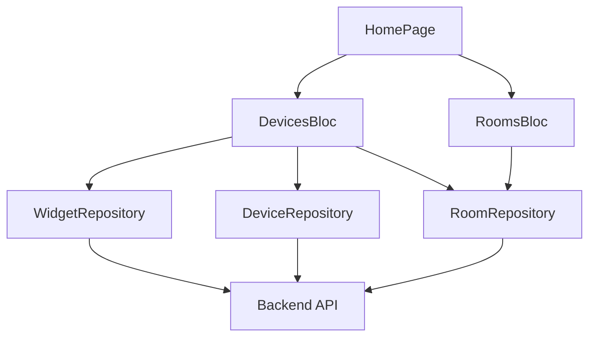
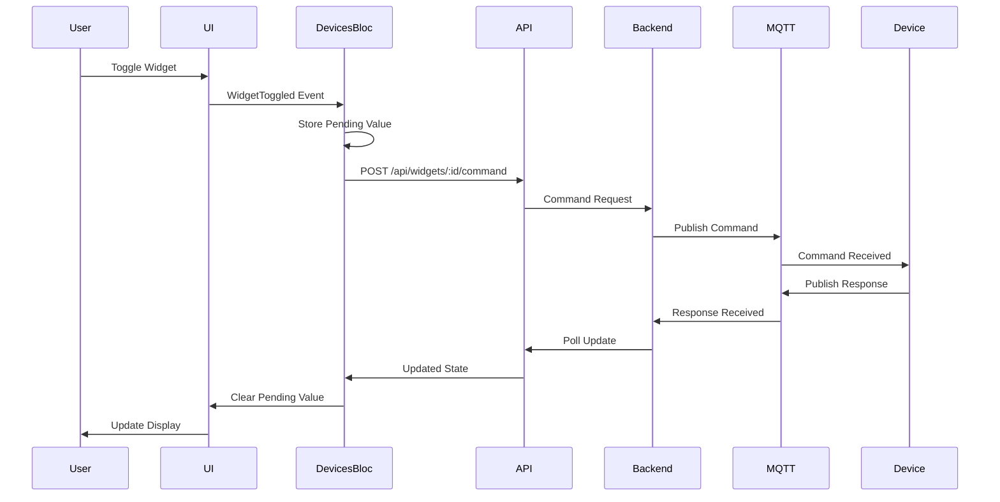

# Home Screen

Home screen feature documentation for the PM IoT Flutter application.

## Overview

The home screen is the main interface of the application, displaying a customizable grid of widgets that allow users to monitor and control their IoT devices in real-time.

## Key Features

- **Widget Grid**: Customizable grid of device controls
- **Room Management**: Switch between different rooms
- **Real-time Updates**: Polling-based updates for device states
- **Widget Customization**: Include/exclude widgets and reorder them
- **Multiple Control Types**: Toggle, slider, mode, text, and button controls
- **Sensor Visualization**: Charts and historical data

## Architecture



## Components

### 1. Widget Grid
The main display area showing device controls in a grid layout.

```dart
// lib/features/home/ui/widgets/components/home_widget_grid.dart
class HomeWidgetGrid extends StatelessWidget {
  final List<DeviceWidget> widgets;
  final Function(DeviceWidget) onToggle;
  final Function(DeviceWidget, String) onValueChange;

  @override
  Widget build(BuildContext context) {
    return GridView.builder(
      gridDelegate: SliverGridDelegateWithFixedCrossAxisCount(
        crossAxisCount: 2,
        childAspectRatio: 1.2,
      ),
      itemCount: widgets.length,
      itemBuilder: (context, index) {
        return WidgetCard(
          widget: widgets[index],
          onToggle: onToggle,
          onValueChange: onValueChange,
        );
      },
    );
  }
}
```

### 2. Room Selector
Allows switching between different rooms.

```dart
// lib/features/home/ui/widgets/components/room_selector.dart
class RoomSelector extends StatelessWidget {
  final List<Room> rooms;
  final int? selectedRoomId;
  final Function(int?) onRoomChanged;

  @override
  Widget build(BuildContext context) {
    return DropdownButton<int?>(
      value: selectedRoomId,
      items: rooms.map((room) {
        return DropdownMenuItem(
          value: room.id,
          child: Text(room.name),
        );
      }).toList(),
      onChanged: (value) => onRoomChanged(value),
    );
  }
}
```

### 3. Widget Cards
Individual widget displays based on control type.

- **Toggle Card**: On/off switches
- **Slider Card**: Value adjustment (0-100)
- **Mode Card**: Multiple option selection
- **Text Card**: Command input
- **Sensor Card**: Real-time sensor data

## State Management (DevicesBloc)

The DevicesBloc manages all device and widget state for the home screen.

### Events

```dart
// lib/features/home/bloc/devices_event.dart
abstract class DevicesEvent {}

class DevicesStarted extends DevicesEvent {}
class DevicesRoomChanged extends DevicesEvent {
  final int roomId;
  DevicesRoomChanged(this.roomId);
}
class WidgetToggled extends DevicesEvent {
  final int widgetId;
  final String currentValue;
  WidgetToggled(this.widgetId, this.currentValue);
}
class WidgetValueChanged extends DevicesEvent {
  final int widgetId;
  final String value;
  WidgetValueChanged(this.widgetId, this.value);
}
class WidgetsPollingStarted extends DevicesEvent {}
class WidgetsPollingStopped extends DevicesEvent {}
class WidgetSelectionLoaded extends DevicesEvent {}
class WidgetIncludeToggled extends DevicesEvent {}
class WidgetSelectionSaved extends DevicesEvent {}
```

### States

```dart
// lib/features/home/bloc/devices_state.dart
class DevicesState {
  final List<DeviceWidget> widgets;
  final List<Room> rooms;
  final int? selectedRoomId;
  final bool isLoading;
  final String? errorMessage;
  final Map<int, String> pendingValues;
}
```

### Polling Strategy

The app uses a dual polling strategy:

1. **Sensor Data Polling** (1 second interval)
   - Updates sensor values
   - Prevents UI lag during rapid updates

2. **Full State Polling** (10 second interval)
   - Updates all widget states
   - Ensures data consistency

```dart
// lib/features/home/bloc/devices_bloc.dart
Duration _sensorInterval = const Duration(seconds: 1);
Duration _fullInterval = const Duration(seconds: 10);

void _startPolling(int roomId) {
  // Sensor data polling
  _sensorPollTimer = Timer.periodic(_sensorInterval, (_) {
    if (!_sensorPollInFlight) {
      add(DevicesRequested());
    }
  });

  // Full state polling
  _fullPollTimer = Timer.periodic(_fullInterval, (_) {
    if (!_fullPollInFlight) {
      add(DevicesRequested());
    }
  });
}
```

## Widget Management

### Widget Picker

Allows users to customize which widgets appear on their home screen.

```dart
// lib/features/home/ui/widgets/bottom_sheets/widget_picker_sheet.dart
class WidgetPickerSheet extends StatefulWidget {
  final List<DeviceWidget> allWidgets;
  final Set<int> includedWidgetIds;

  @override
  Widget build(BuildContext context) {
    return Container(
      child: ListView(
        children: allWidgets.map((widget) {
          return CheckboxListTile(
            title: Text(widget.name),
            value: includedWidgetIds.contains(widget.id),
            onChanged: (bool? value) {
              // Toggle widget inclusion
            },
          );
        }).toList(),
      ),
    );
  }
}
```

### Reorder Mode

Users can reorder widgets by pressing and holding.

```dart
// lib/features/home/bloc/devices_bloc.dart
on<ReorderModeChanged>((event, emit) {
  emit(state.copyWith(isReorderMode: event.isEnabled));
});

on<WidgetsOrderChanged>((event, emit) {
  emit(state.copyWith(widgets: event.widgets));
});

on<CommitReorderPressed>((event, emit) async {
  try {
    await widgetRepo.updateWidgetOrder(
      state.selectedRoomId,
      state.widgets,
    );
    emit(state.copyWith(isReorderMode: false));
  } catch (e) {
    emit(state.copyWith(errorMessage: 'Failed to save order'));
  }
});
```

## Command Flow

When a user interacts with a widget:



## Files

### Core Files
- `lib/features/home/ui/pages/home_page.dart` - Main home page
- `lib/features/home/bloc/devices_bloc.dart` - State management
- `lib/features/home/bloc/devices_event.dart` - Events
- `lib/features/home/bloc/devices_state.dart` - States
- `lib/features/home/data/widget_repository.dart` - Widget data access
- `lib/features/home/data/device_repository.dart` - Device data access

### UI Components
- `lib/features/home/ui/widgets/components/home_widget_grid.dart` - Widget grid
- `lib/features/home/ui/widgets/components/room_selector.dart` - Room selector
- `lib/features/home/ui/widgets/components/top_tabs.dart` - Top navigation tabs
- `lib/features/home/ui/widgets/cards/widget_card.dart` - Generic widget card
- `lib/features/home/ui/widgets/cards/sensor_card.dart` - Sensor display card
- `lib/features/home/ui/widgets/bottom_sheets/widget_picker_sheet.dart` - Widget picker
- `lib/features/home/ui/widgets/bottom_sheets/mode_picker_sheet.dart` - Mode picker
- `lib/features/home/ui/widgets/dialogs/text_command_dialog.dart` - Text input dialog

### Additional Pages
- `lib/features/home/ui/pages/sensor_detail_page.dart` - Sensor detail with history
- `lib/features/home/ui/pages/add_device_page.dart` - Add new device

## Data Models

```dart
// lib/features/home/models/device_widget.dart
class DeviceWidget {
  final int id;
  final String name;
  final String value;
  final String status; // 'include' or 'exclude'
  final Capability capability;
  final int? deviceId;
  final int? roomId;
}

// lib/features/home/models/capability.dart
class Capability {
  final int id;
  final String type; // 'sensor' or 'control'
  final String controlType; // 'toggle', 'slider', 'mode', 'text', 'button'
}

// lib/features/home/models/room.dart
class Room {
  final int id;
  final String name;
}
```

## Error Handling

The home screen includes comprehensive error handling:

```dart
// Error states in DevicesBloc
if (state.errorMessage != null) {
  showErrorSnackBar(context, state.errorMessage!);
}

// Network error handling
try {
  await widgetRepo.sendCommand(widgetId, command);
} catch (e) {
  emit(state.copyWith(
    errorMessage: 'Failed to send command',
  ));
}
```

## Performance Optimizations

1. **Pending Value Tracking**: Prevents snap-back during user interaction
2. **Debouncing**: Reduces unnecessary API calls
3. **Lazy Loading**: Loads widgets only for selected room
4. **Caching**: Stores frequently accessed data

---

**Previous**: [Authentication](./authentication) | **Next**: [Device Management](./device-management) →
