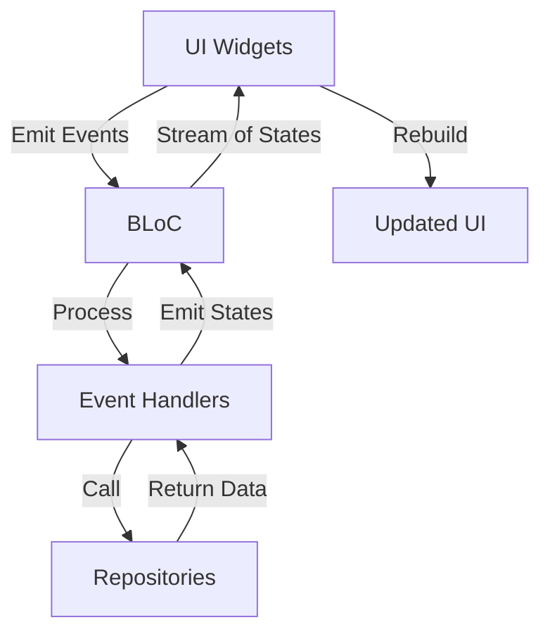
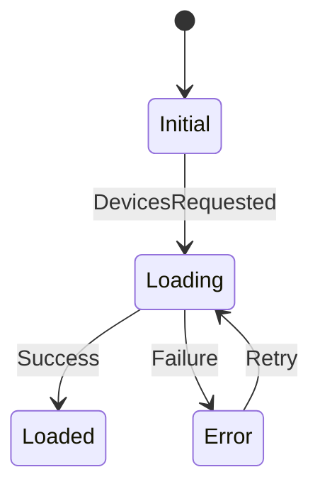
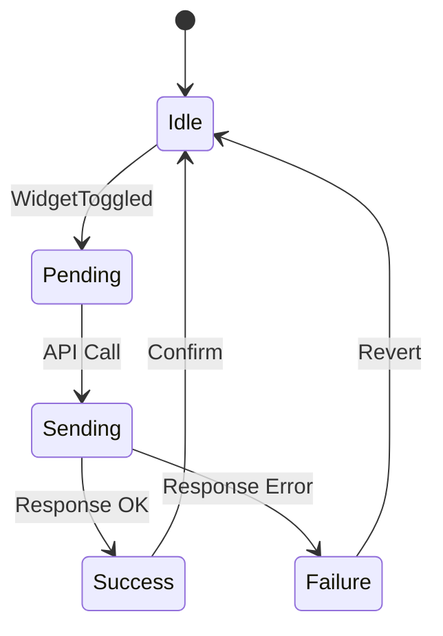
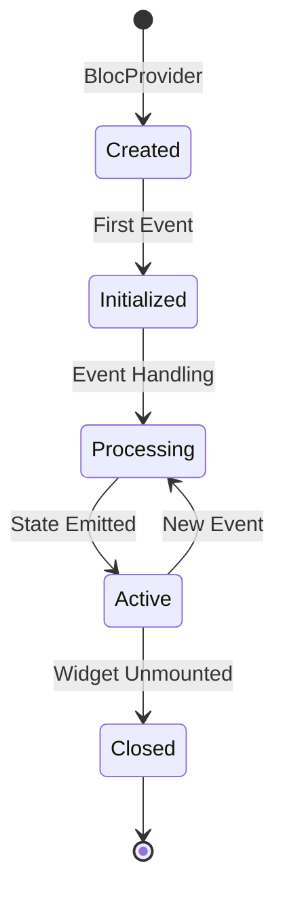

# BLoC Pattern

การใช้งาน BLoC (Business Logic Component Pattern) สำหรับ State Management ใน Flutter

Using BLoC (Business Logic Component) pattern for state management in Flutter.

## 🎯 What is BLoC?

BLoC separates business logic from presentation, making code:
- **Testable** - Easy to unit test
- **Reusable** - Logic can be reused across widgets
- **Maintainable** - Clear separation of concerns

## 🏗️ BLoC Architecture



## 📦 Core Components

### 1. Events

**Purpose**: Represent things that can happen in the app

**Location**: `lib/features/{feature}/bloc/{feature}_event.dart`

```dart
/// Base event class
abstract class DevicesEvent {}

/// Events should be immutable
class DevicesStarted extends DevicesEvent {
  final int? roomId;
  final Duration interval;

  const DevicesStarted({
    this.roomId,
    this.interval = const Duration(seconds: 5),
  });

  @override
  List<Object?> get props => [roomId, interval];
}

class WidgetToggled extends DevicesEvent {
  final int widgetId;

  const WidgetToggled(this.widgetId);

  @override
  List<Object?> get props => [widgetId];
}

class WidgetValueChanged extends DevicesEvent {
  final int widgetId;
  final String value;

  const WidgetValueChanged(this.widgetId, this.value);

  @override
  List<Object?> get props => [widgetId, value];
}
```

### 2. States

**Purpose**: Represent the state of the UI

**Location**: `lib/features/{feature}/bloc/{feature}_state.dart`

```dart
/// Base state class
class DevicesState {
  final DevicesStatus status;
  final List<DeviceWidget> widgets;
  final Map<int, String> widgetStates;
  final String? errorMessage;

  const DevicesState({
    this.status = DevicesStatus.initial,
    this.widgets = const [],
    this.widgetStates = const {},
    this.errorMessage,
  });

  /// CopyWith for immutable state updates
  DevicesState copyWith({
    DevicesStatus? status,
    List<DeviceWidget>? widgets,
    Map<int, String>? widgetStates,
    String? errorMessage,
  }) {
    return DevicesState(
      status: status ?? this.status,
      widgets: widgets ?? this.widgets,
      widgetStates: widgetStates ?? this.widgetStates,
      errorMessage: errorMessage ?? this.errorMessage,
    );
  }

  @override
  List<Object?> get props => [status, widgets, widgetStates, errorMessage];
}

enum DevicesStatus {
  initial,
  loading,
  loaded,
  error,
}
```

### 3. BLoC

**Purpose**: Business logic and event handling

**Location**: `lib/features/{feature}/bloc/{feature}_bloc.dart`

```dart
class DevicesBloc extends Bloc<DevicesEvent, DevicesState> {
  final WidgetRepository widgetRepo;
  final RoomRepository roomRepo;
  final DeviceRepository deviceRepo;

  // Pending value tracking (prevents snap-back)
  final Map<int, String> _pendingValueByWidgetId = {};
  final Map<int, DateTime> _pendingAtByWidgetId = {};
  static const _pendingTtl = Duration(seconds: 10);

  Timer? _pollTimer;
  Timer? _fullPollTimer;

  DevicesBloc({
    required this.widgetRepo,
    required this.roomRepo,
    required this.deviceRepo,
  }) : super(const DevicesState()) {
    // Register event handlers
    on<DevicesStarted>(_onStarted);
    on<WidgetToggled>(_onWidgetToggled);
    on<WidgetValueChanged>(_onWidgetValueChanged);
    on<DevicesRequested>(_onDevicesRequested);

    // Cleanup timers when closed
    on<Close>(_onClose);
  }

  /// Event Handlers
  Future<void> _onStarted(
    DevicesStarted event,
    Emitter<DevicesState> emit,
  ) async {
    emit(state.copyWith(status: DevicesStatus.loading));

    try {
      // Start polling
      _startPolling(event.roomId, event.interval);

      // Load initial data
      add(DevicesRequested(roomId: event.roomId));
    } catch (e) {
      emit(state.copyWith(
        status: DevicesStatus.error,
        errorMessage: 'Failed to start: $e',
      ));
    }
  }

  Future<void> _onWidgetToggled(
    WidgetToggled event,
    Emitter<DevicesState> emit,
  ) async {
    final widget = state.widgets.firstWhere(
      (w) => w.widgetId == event.widgetId,
    );

    final newValue = widget.value == 'ON' ? 'OFF' : 'ON';

    // Store pending value
    _pendingValueByWidgetId[event.widgetId] = newValue;
    _pendingAtByWidgetId[event.widgetId] = DateTime.now();

    // Optimistic update
    emit(state.copyWith(
      widgetStates: Map.from(state.widgetStates)..[event.widgetId] = newValue,
    ));

    try {
      await widgetRepo.sendCommand(event.widgetId, newValue);

      // Clear pending after success
      Future.delayed(const Duration(seconds: 2), () {
        _pendingValueByWidgetId.remove(event.widgetId);
      });
    } catch (e) {
      // Revert on error
      _pendingValueByWidgetId.remove(event.widgetId);
      emit(state.copyWith(
        widgetStates: Map.from(state.widgetStates)..[event.widgetId] = widget.value,
        errorMessage: 'Failed to toggle: $e',
      ));
    }
  }

  Future<void> _onClose(
    Close event,
    Emitter<DevicesState> emit,
  ) async {
    _pollTimer?.cancel();
    _fullPollTimer?.cancel();
    return super.close();
  }

  void _cleanExpiredPendingValues() {
    final now = DateTime.now();
    _pendingValueByWidgetId.removeWhere((widgetId, timestamp) {
      final createdAt = _pendingAtByWidgetId[widgetId];
      if (createdAt == null) return true;
      return now.difference(createdAt) > _pendingTtl;
    });
  }
}
```

## 🔌 UI Integration

### BlocProvider

```dart
// Provide BLoC to widget tree
BlocProvider<DevicesBloc>(
  create: (context) => DevicesBloc(
    widgetRepo: context.read<WidgetRepository>(),
    roomRepo: context.read<RoomRepository>(),
    deviceRepo: context.read<DeviceRepository>(),
  )..add(const DevicesStarted()),
  child: HomePage(),
);
```

### BlocBuilder

```dart
// Rebuild UI when state changes
BlocBuilder<DevicesBloc, DevicesState>(
  builder: (context, state) {
    switch (state.status) {
      case DevicesStatus.loading:
        return CircularProgressIndicator();
      case DevicesStatus.error:
        return Text('Error: ${state.errorMessage}');
      case DevicesStatus.loaded:
        return WidgetGrid(widgets: state.widgets);
      default:
        return SizedBox.shrink();
    }
  },
)
```

### BlocListener

```dart
// Listen for state changes without rebuilding
BlocListener<DevicesBloc, DevicesState>(
  listener: (context, state) {
    if (state.status == DevicesStatus.error) {
      ScaffoldMessenger.of(context).showSnackBar(
        SnackBar(content: Text(state.errorMessage!)),
      );
    }
  },
  child: /* UI that won't rebuild */,
)
```

### BlocConsumer

```dart
// Both listener and builder
BlocConsumer<DevicesBloc, DevicesState>(
  listener: (context, state) {
    // Handle side effects
    if (state.status == DevicesStatus.error) {
      showError(state.errorMessage);
    }
  },
  builder: (context, state) {
    // Build UI
    return YourWidget(state: state);
  },
)
```

## 🔄 State Transition Examples

### Loading Data



### User Interaction



## 📊 BLoC Providers

### MultiBlocProvider

```dart
MultiBlocProvider(
  providers: [
    // Auth BLoC
    BlocProvider<AuthBloc>(
      create: (ctx) => AuthBloc(
        repo: ctx.read<AuthRepository>(),
      )..add(const AuthStarted()),
    ),

    // Devices BLoC
    BlocProvider<DevicesBloc>(
      create: (ctx) => DevicesBloc(
        widgetRepo: ctx.read<WidgetRepository>(),
        roomRepo: ctx.read<RoomRepository>(),
        deviceRepo: ctx.read<DeviceRepository>(),
      )..add(const DevicesStarted()),
    ),

    // Rooms BLoC
    BlocProvider<RoomsBloc>(
      create: (ctx) => RoomsBloc(
        roomRepo: ctx.read<RoomRepository>(),
      )..add(const RoomsStarted()),
    ),
  ],
  child: MaterialApp(...),
)
```

### RepositoryProvider

```dart
MultiRepositoryProvider(
  providers: [
    RepositoryProvider<WidgetRepository>(
      create: (_) => WidgetRepository(baseUrl: baseUrl),
    ),
    RepositoryProvider<RoomRepository>(
      create: (_) => RoomRepository(baseUrl: baseUrl),
    ),
    RepositoryProvider<DeviceRepository>(
      create: (_) => DeviceRepository(baseUrl: baseUrl),
    ),
  ],
  child: MultiBlocProvider(...),
)
```

## 🧪 Testing BLoCs

### Unit Test Setup

```dart
void main() {
  late DevicesBloc devicesBloc;
  late MockWidgetRepository mockWidgetRepo;

  setUp(() {
    mockWidgetRepo = MockWidgetRepository();
    devicesBloc = DevicesBloc(
      widgetRepo: mockWidgetRepo,
      roomRepo: mockRoomRepo,
      deviceRepo: mockDeviceRepo,
    );
  });

  tearDown(() {
    devicesBloc.close();
  });
}
```

### Test Example

```dart
test('emits loaded state when widgets are fetched', () {
  // Arrange
  final widgets = [testWidget1, testWidget2];
  when(mockWidgetRepo.fetchWidgets(roomId: 1))
      .thenAnswer((_) async => widgets);

  // Act
  devicesBloc.add(DevicesRequested(roomId: 1));

  // Assert
  expectLater(
    devicesBloc.stream,
    emitsInOrder([
      DevicesState(status: DevicesStatus.loading),
      DevicesState(
        status: DevicesStatus.loaded,
        widgets: widgets,
      ),
    ]),
  );
});
```

## ⚡ Performance Optimization

### 1. Conditional Rebuilds

```dart
BlocBuilder<DevicesBloc, DevicesState>(
  buildWhen: (previous, current) {
    // Only rebuild when widgets change
    return previous.widgets != current.widgets;
  },
  builder: (context, state) {
    return WidgetGrid(widgets: state.widgets);
  },
)
```

### 2. State Equality

```dart
class DevicesState extends Equatable {
  @override
  List<Object?> get props => [status, widgets, widgetStates];
}
```

### 3. Event Debouncing

```dart
Timer? _debounceTimer;

void onSearchChanged(String query) {
  _debounceTimer?.cancel();
  _debounceTimer = Timer(Duration(milliseconds: 500), () {
    add(PerformSearch(query));
  });
}
```

## 🎯 Best Practices

### 1. Keep BLoC Focused

```dart
// ✅ Good - Single responsibility
class DevicesBloc extends Bloc<DevicesEvent, DevicesState> {
  // Only device/widget logic
}

// ❌ Bad - Too many responsibilities
class AppBloc extends Bloc<AppEvent, AppState> {
  // Devices, rooms, auth, settings... too much!
}
```

### 2. Use Repository Pattern

```dart
// ✅ Good - BLoC uses repository
class DevicesBloc extends Bloc<DevicesEvent, DevicesState> {
  final WidgetRepository _repo;
}

// ❌ Bad - BLoC directly calls HTTP
class DevicesBloc extends Bloc<DevicesEvent, DevicesState> {
  final HttpClient _http;
}
```

### 3. Emit States Immediately

```dart
// ✅ Good - Emit loading state immediately
Future<void> _onLoad(...) async {
  emit(state.copyWith(status: DevicesStatus.loading));
  try {
    final data = await repo.fetch();
    emit(state.copyWith(status: DevicesStatus.loaded, data: data));
  } catch (e) {
    emit(state.copyWith(status: DevicesStatus.error, error: e));
  }
}

// ❌ Bad - Don't emit loading state
Future<void> _onLoad(...) async {
  try {
    final data = await repo.fetch();
    emit(state.copyWith(status: DevicesStatus.loaded, data: data));
  } catch (e) {
    emit(state.copyWith(status: DevicesStatus.error, error: e));
  }
}
```

## 🔄 BLoC Lifecycle



---

**Previous**: [Project Structure](./project-structure) | **Next**: [Auth BLoC](./auth-bloc) →
