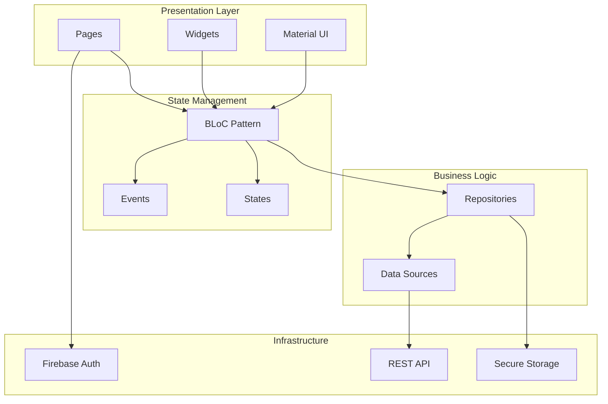
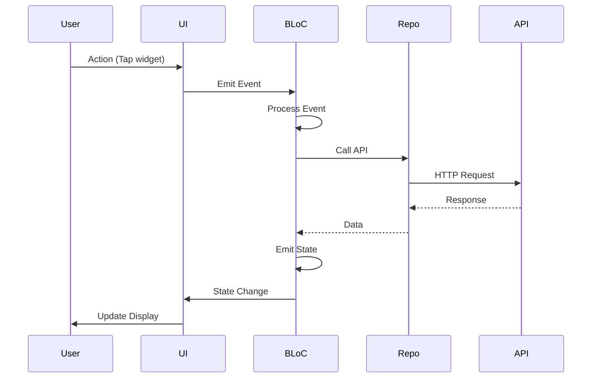
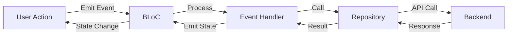

# Frontend Overview

ภาพรวม Flutter Frontend Application ของระบบ PM IoT

Overview of the PM IoT Flutter Frontend Application.

## 📱 Application Architecture



## 🏗️ Project Structure

```
PM_Mobile_Frontend/
├── lib/
│   ├── main.dart                    # App entry point
│   │
│   ├── data/                        # Global repositories
│   │   ├── device_repository.dart
│   │   ├── room_repository.dart
│   │   └── widget_repository.dart
│   │
│   └── features/                    # Feature modules
│       ├── auth/                    # Authentication feature
│       │   ├── bloc/
│       │   │   ├── auth_bloc.dart
│       │   │   ├── auth_event.dart
│       │   │   └── auth_state.dart
│       │   ├── data/
│       │   │   ├── auth_api.dart
│       │   │   ├── auth_repository.dart
│       │   │   └── token_storage.dart
│       │   └── ui/
│       │       ├── pages/
│       │       │   └── sign_in_page.dart
│       │       └── widgets/
│       │           ├── auth_background.dart
│       │           └── pill_text_field.dart
│       │
│       ├── home/                    # Home screen feature
│       │   ├── bloc/
│       │   │   ├── devices_bloc.dart
│       │   │   ├── devices_event.dart
│       │   │   └── devices_state.dart
│       │   ├── data/
│       │   │   └── widget_repository.dart
│       │   ├── models/
│       │   │   ├── device.dart
│       │   │   ├── device_widget.dart
│       │   │   ├── room.dart
│       │   │   ├── capability.dart
│       │   │   └── sensor_history.dart
│       │   └── ui/
│       │       ├── pages/
│       │       │   ├── home_page.dart
│       │       │   ├── add_device_page.dart
│       │       │   └── sensor_detail_page.dart
│       │       ├── widgets/
│       │       │   ├── components/
│       │       │   │   ├── home_widget_grid.dart
│       │       │   │   ├── room_selector.dart
│       │       │   │   └── top_tabs.dart
│       │       │   ├── cards/
│       │       │   │   ├── device_card.dart
│       │       │   │   ├── sensor_card.dart
│       │       │   │   └── widget_card.dart
│       │       │   ├── bottom_sheets/
│       │       │   │   ├── home_actions_sheet.dart
│       │       │   │   ├── widget_picker_sheet.dart
│       │       │   │   └── mode_picker_sheet.dart
│       │       │   └── dialogs/
│       │       │       └── text_command_dialog.dart
│       │       └── view_models/
│       │           └── home_view_model.dart
│       │
│       ├── device/                  # Device management
│       │   ├── device_setup_page.dart
│       │   └── manage_devices_page.dart
│       │
│       ├── room/                   # Room management
│       │   ├── bloc/
│       │   │   ├── rooms_bloc.dart
│       │   │   ├── rooms_event.dart
│       │   │   └── rooms_state.dart
│       │   ├── data/
│       │   │   └── room_repository.dart
│       │   └── ui/
│       │       └── pages/
│       │           └── manage_homes_page.dart
│       │
│       └── me/                     # User profile
│           └── me_page.dart
│
├── .env                             # Environment variables
├── pubspec.yaml                     # Dependencies
└── firebase_options.dart            # Firebase config
```

## 🔑 Key Technologies

### Core Framework

| Technology | Version | Purpose |
|------------|---------|---------|
| **Flutter** | 3.7.0+ | UI Framework |
| **Dart** | 3.7.0+ | Programming Language |

### State Management

| Library | Purpose |
|---------|---------|
| **flutter_bloc** | BLoC state management |
| **equatable** | Value equality |

### Authentication

| Library | Purpose |
|---------|---------|
| **firebase_core** | Firebase initialization |
| **firebase_auth** | Authentication services |
| **firebase_ui_auth** | Auth UI components |
| **firebase_ui_oauth_google** | Google Sign-In |
| **google_sign_in** | Google OAuth |
| **flutter_secure_storage** | Secure token storage |

### UI Components

| Library | Purpose |
|---------|---------|
| **flutter_svg** | SVG image support |
| **reorderables** | Drag-and-drop reordering |

### Utilities

| Library | Purpose |
|---------|---------|
| **flutter_dotenv** | Environment configuration |
| **http** | HTTP requests (or dio) |

## 🎨 UI Design

### Design System

**Theme**: Material Design 3

**Colors**:
```dart
static const Color primaryBlue = Color(0xFF3AA7FF);
static const Color textGrey = Color(0xFF7A7A7A);
```

**Typography**:
```dart
TextTheme(
  headlineLarge: TextStyle(fontSize: 32, fontWeight: FontWeight.bold),
  bodyMedium: TextStyle(fontSize: 14, color: textGrey),
)
```

### Key Screens

1. **Sign In Page**: Google authentication
2. **Home Page**: Widget grid with room selection
3. **Device Management**: Add/manage devices
4. **Room Management**: Create/edit rooms
5. **Sensor Detail**: Historical sensor data

## 🔄 Data Flow



## 📊 State Management Flow



## 🎯 Key Features

### Authentication
- Google Sign-In with Firebase
- JWT token management
- Secure token storage
- Auto-login on app start

### Device Management
- View all devices
- Add/remove devices
- Pair/unpair to rooms
- Real-time status

### Widget System
- Customizable widget grid
- Include/exclude widgets
- Drag-and-drop reordering
- Real-time value updates

### Room Management
- Create/edit/delete rooms
- Add devices to rooms
- Switch between rooms

### Sensor Monitoring
- Real-time sensor data
- Historical charts
- Data export (future)

## 🔧 Configuration

### Environment Variables

```env
# Backend API
BACKEND_API_URL=http://localhost:3000

# Firebase
FIREBASE_API_KEY=your_api_key
FIREBASE_AUTH_DOMAIN=your_project.firebaseapp.com
FIREBASE_PROJECT_ID=your_project_id
FIREBASE_STORAGE_BUCKET=your_project.appspot.com
FIREBASE_MESSAGING_SENDER_ID=your_sender_id
FIREBASE_APP_ID=your_app_id
```

### Firebase Configuration

**File**: `firebase_options.dart`

```dart
static const FirebaseOptions options = FirebaseOptions(
  apiKey: 'your_api_key',
  authDomain: 'your_project.firebaseapp.com',
  projectId: 'your_project_id',
  storageBucket: 'your_project.appspot.com',
  messagingSenderId: 'your_sender_id',
  appId: 'your_app_id',
);
```

## 📱 Platform Support

### Primary Platform
- **Android** 5.0+ (API 21+)

### Supported Platforms
- **iOS** 12.0+
- **Web** (Chrome, Safari, Firefox, Edge)
- **Windows** 10+
- **macOS** 10.14+
- **Linux** (Ubuntu, Debian)

### Platform-Specific Files

```
android/              # Android configuration
ios/                  # iOS configuration
web/                  # Web assets
windows/              # Windows configuration
macos/                # macOS configuration
linux/                # Linux configuration
```

## 🚀 Build & Run

### Development

```bash
# Install dependencies
flutter pub get

# Run on connected device
flutter run

# Run on specific platform
flutter run -d chrome
flutter run -d windows
```

### Production Build

```bash
# Android APK
flutter build apk --release

# Android App Bundle
flutter build appbundle --release

# iOS (requires macOS)
flutter build ios --release

# Web
flutter build web --release

# Windows
flutter build windows --release
```

## 🧪 Testing

### Unit Tests

```bash
flutter test
```

### Integration Tests

```bash
flutter test integration_test/
```

### Test Coverage

```bash
flutter test --coverage
```

## 📚 Next Steps

- **[Project Structure](./project-structure)** - Detailed file breakdown
- **[BLoC Pattern](./bloc-pattern)** - State management deep dive
- **[Authentication Feature](../features/authentication)** - Auth flow details
- **[Home Screen](../features/home-screen)** - Main screen documentation

---

**Previous**: [Architecture](../architecture/overview) | **Next**: [Project Structure](./project-structure) →
