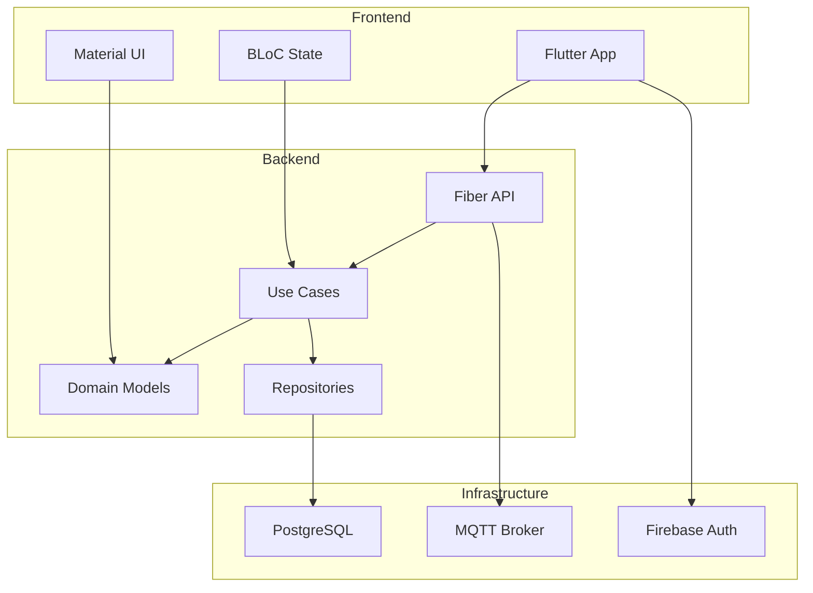

# Introduction to PM IoT System

ยินดีต้อนรับสู่เอกสารประกอบระบบ Project Management IoT (PM IoT) - ระบบบริหารจัดการอุปกรณ์ IoT แบบครบวงจร

Welcome to the comprehensive documentation for the Project Management IoT (PM IoT) System - a complete IoT device management platform.

## 🌟 System Overview

ระบบ PM IoT เป็นแพลตฟอร์มที่ออกแบบมาเพื่อจัดการอุปกรณ์ IoT ในบ้านหรืออาคารผ่านอินเทอร์เฟซที่ใช้งานง่าย

The PM IoT System is designed to manage IoT devices in homes or buildings through an easy-to-use interface.

### 📱 **Frontend (Flutter Mobile App)**
- **BLoC State Management**: Reactive state management pattern
- **Firebase Authentication**: Google Sign-In integration
- **Real-time Updates**: Polling strategy for live device data
- **Material Design 3**: Modern, beautiful UI

### 🔧 **Backend (Go API)**
- **Clean Architecture**: DDD (Domain-Driven Design)
- **Fiber Framework**: High-performance web framework
- **MQTT Integration**: Real-time IoT device communication
- **PostgreSQL + GORM**: Reliable data persistence
- **JWT Authentication**: Secure API access

## 🎯 Key Features

### Device Management
- ✅ Auto-registration via MQTT
- ✅ Pair/unpair devices to rooms
- ✅ Real-time status monitoring
- ✅ Device heartbeat tracking

### Widget System
- ✅ Customizable widget display
- ✅ Include/exclude widgets per room
- ✅ Drag-and-drop reordering
- ✅ Multiple widget types (toggle, slider, mode, text, sensor)

### Real-time Communication
- ✅ MQTT-based device control
- ✅ Sensor data streaming
- ✅ Command acknowledgment
- ✅ Pending value tracking

### User Management
- ✅ Firebase Google Sign-In
- ✅ JWT token-based API auth
- ✅ Multi-room support
- ✅ Profile management

## 🏗️ Architecture Overview



## 📊 Data Flows

The system implements 12 major data flows:

1. **Authentication Flow** - Firebase + JWT integration
2. **Device Registration** - MQTT auto-discovery
3. **Sensor Data Flow** - Real-time data streaming
4. **Command Flow** - User commands to devices
5. **Widget Management** - Display customization
6. **State Management** - BLoC pattern implementation
7. **Clean Architecture** - Layer-based design
8. **Repository Pattern** - Data access abstraction
9. **Dependency Injection** - Wire-based DI
10. **Database Schema** - Complete data model
11. **REST API** - All endpoints documented
12. **MQTT Protocol** - IoT communication

## 🚀 Quick Start

### Prerequisites

- **Flutter SDK** ≥ 3.7.0
- **Go** ≥ 1.25
- **PostgreSQL** ≥ 13
- **MQTT Broker** (Mosquitto or compatible)

### Installation

```bash
# Clone the repository
git clone https://github.com/your-org/project-management-iot.git
cd project-management-iot

# Setup Backend
cd project-management-backend
go mod download
cp .env.example .env
# Edit .env with your configuration

# Setup Frontend
cd ../PM_Mobile_Frontend
flutter pub get
cp .env.example .env
# Edit .env with your backend URL
```

## 📚 Documentation Structure

- **[Getting Started](./installation)** - Setup and installation
- **[Architecture](../architecture/overview)** - System design and data flows
- **[Frontend](../frontend/intro)** - Flutter app documentation
- **[Backend](../backend/intro)** - Go API documentation
- **[API Reference](../api/overview)** - Complete API docs
- **[MQTT Protocol](../mqtt/topics)** - IoT communication
- **[Deployment](../deployment/docker)** - Production setup

## 🤝 Contributing

We welcome contributions! Please see our [Contributing Guide](../development/contributing) for details.

## 📄 License

This project is licensed under the MIT License - see the LICENSE file for details.

---

**Next**: [Installation Guide](./installation) →
