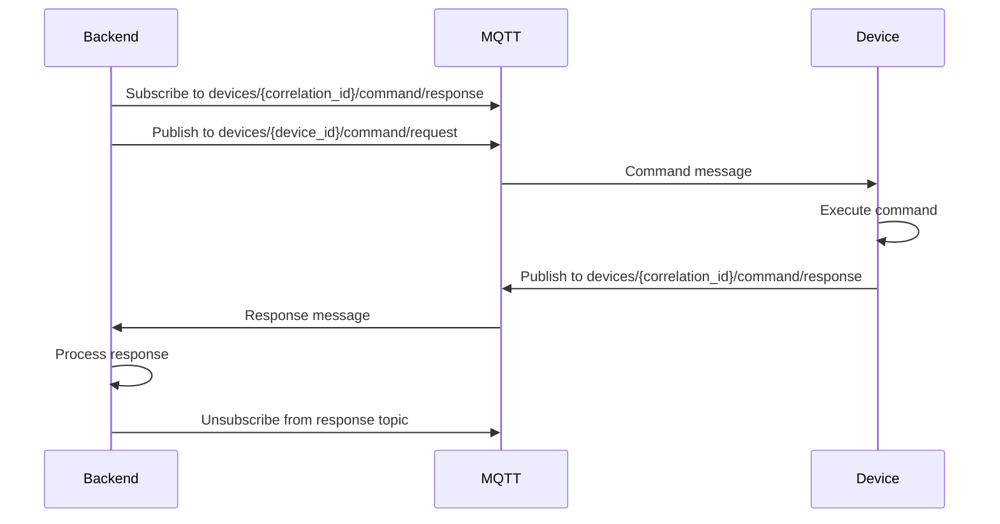

# MQTT Commands

Device command protocol and format.

## Command Request Topic
```
devices/{device_id}/command/request
```

## Command Request Payload

```json
{
  "capability_type": "power",
  "control_type": "toggle",
  "value": "ON",
  "reply_topic": "devices/{correlation_id}/command/response"
}
```

**Required Fields**:
- `capability_type`: Type of capability (power, brightness, temperature, etc.)
- `control_type`: Control action (toggle, slider, mode, text, button)
- `value`: Command value (ON, OFF, 0-100, mode name, text command)
- `reply_topic`: Topic for device to send response (contains correlation ID)

**Backend Processing**:
```go
// internal/infrastructure/mqtt/device_commander.go
// 1. Generates unique correlation ID
// 2. Subscribes to reply topic with correlation ID
// 3. Publishes command to devices/{device_id}/command/request
// 4. Waits for response on reply topic (60 second timeout)
```

## Command Response Topic
```
devices/{correlation_id}/command/response
```

**Note**: The response topic includes a correlation ID generated by the backend, not the device ID. This allows proper command-response matching.

## Command Response Payload

```json
{
  "status": "success"
}
```

**Status Values**:
- `success`: Command executed successfully
- `error`: Command failed

## Command Flow



## Control Types

### Toggle
```json
{
  "capability_type": "power",
  "control_type": "toggle",
  "value": "ON",
  "reply_topic": "devices/abc123/command/response"
}
```

### Slider
```json
{
  "capability_type": "brightness",
  "control_type": "slider",
  "value": "75",
  "reply_topic": "devices/def456/command/response"
}
```

### Mode
```json
{
  "capability_type": "mode",
  "control_type": "mode",
  "value": "auto",
  "reply_topic": "devices/ghi789/command/response"
}
```

### Text
```json
{
  "capability_type": "command",
  "control_type": "text",
  "value": "custom command",
  "reply_topic": "devices/jkl012/command/response"
}
```

## Timeout & Error Handling

- **Command Timeout**: 60 seconds
- **Timeout Action**: Unsubscribe from reply topic and return error
- **Error Handling**: Returns error if publish or subscribe fails

## QoS & Reliability

- **QoS**: 1 (At least once)
- **Retained**: false
- **Correlation ID**: Generated by backend for each command
- **Response Matching**: Uses correlation ID to match responses

---

**Previous**: [MQTT Overview](./overview) | **Next**: [Pairing](./pairing) →
