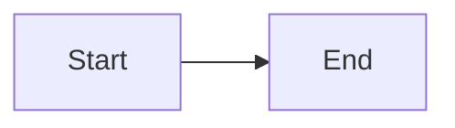

# Test Page

This is a **bold** text and this is *italic* text.

## List

- Item 1
- Item 2
- Item 3

## Code Block

```javascript
function hello() {
  console.log("Hello World");
}
```

## Mermaid Diagram



## Done!

This should render properly.
